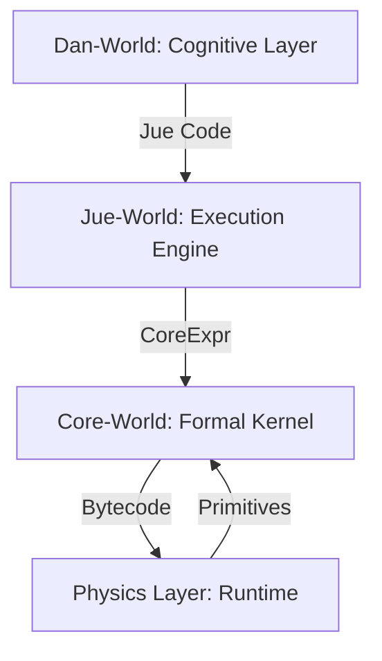
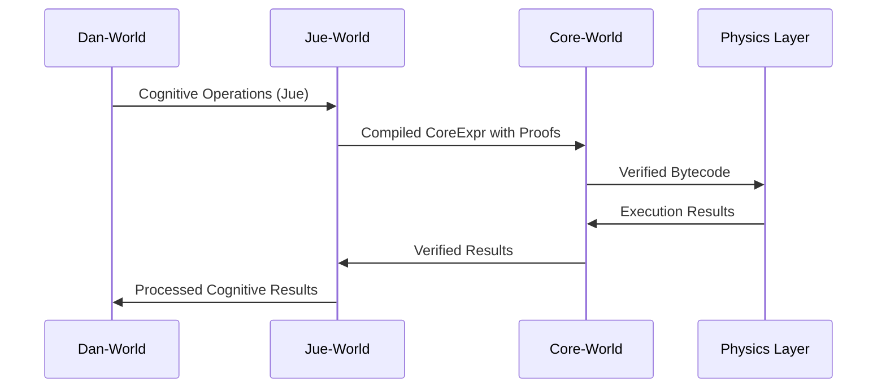

# Project Jue: System Architecture

## Overall Architecture

Project Jue implements a layered AGI system with clear separation of concerns between four main layers:



## Layer-by-Layer Architecture

### 1. Core-World Architecture

**Purpose**: Formal λ-calculus kernel with mathematical guarantees

**Key Components**:
- `core_expr.rs`: Core expression types (Var, Lam, App) with De Bruijn indices
- `core_kernel.rs`: β-reduction, α-equivalence, normalization algorithms
- `eval_relation.rs`: Evaluation relation with proof obligations
- `proof_checker.rs`: Formal verification of all transformations

**Data Flow**:
```
CoreExpr → β-reduction → Normalization → Proof Verification
```

**Critical Paths**:
- `beta_reduce()`: Performs single-step β-reduction with substitution
- `normalize()`: Recursive normalization to normal form
- `alpha_equiv()`: Checks α-equivalence for semantic preservation
- `prove_consistency()`: Verifies kernel mathematical consistency

### 2. Jue-World Architecture

**Purpose**: Optimized execution engine with proof-carrying code

**Key Components**:
- `compiler.jue`: Jue-to-CoreExpr compilation with proof generation
- `evaluator.jue`: Optimized evaluation with proof obligations
- `concurrency.jue`: Event-driven concurrency runtime
- `macros.jue`: Macro system for code generation

**Compilation Pipeline**:
```
Jue AST → compile-to-core() → CoreExpr → compile-to-bytecode() → Bytecode
          ↓
    generate-compilation-proof()
```

**Optimization Pipeline**:
```
Jue AST → constant-fold() → inline-functions() → Optimized AST
          ↓
    attach-optimization-proof()
```

### 3. Dan-World Architecture

**Purpose**: Event-driven cognitive layer with safe self-modification

**Key Components**:
- `event_loop.jue`: Module event processing with mailbox system
- `module_kernel.jue`: Module management and lifecycle
- `mutation_protocol.jue`: Trust-level mutation validation
- `global_workspace.jue`: Inter-module communication

**Event Flow**:
```
Event → receive_event() → process_event() → deliver-to-module()
       ↓
   Mailbox System → Module Event Loop → Cognitive Processing
```

**Mutation Protocol**:
```
Mutation Proposal → Micro-Kernel Validation → Trust-Level Assignment → Safe Application
```

### 4. Physics Layer Architecture

**Purpose**: Minimal runtime with atomic primitives

**Key Components**:
- `atomic_ops.rs`: 12 atomic operations for concurrency
- `memory_manager.rs`: Memory allocation and garbage collection
- `primitives.rs`: Core execution primitives

**Execution Model**:
```
Bytecode → VM Execution → Atomic Operations → Memory Management
```

## Cross-Layer Integration

### Compilation and Execution Flow



### Proof-Carrying Architecture

```
Dan-World Operations
    ↓
Jue Compilation + Proof Generation
    ↓
CoreExpr + Semantic Preservation Proofs
    ↓
Bytecode + Equivalence Proofs
    ↓
Execution + Runtime Verification
```

## Key Technical Decisions

### 1. De Bruijn Indices
- **Decision**: Use De Bruijn indices instead of named variables
- **Rationale**: Eliminates variable capture issues, simplifies substitution
- **Impact**: More robust λ-calculus implementation, easier formal verification

### 2. Proof-Carrying Code
- **Decision**: Attach formal proofs to all transformations
- **Rationale**: Maintains mathematical guarantees throughout execution
- **Impact**: Slower execution but verifiable correctness

### 3. Event-Driven Cognitive Architecture
- **Decision**: Mailbox-based event system for cognitive modules
- **Rationale**: Enables modular, isolated cognitive processing
- **Impact**: Better scalability, safer self-modification

### 4. Layered Security Model
- **Decision**: Trust-level mutation protocols
- **Rationale**: Prevents unsafe self-modification
- **Impact**: Controlled evolution with formal guarantees

## Design Patterns

### 1. Core-World Patterns
- **Pure Functional**: Immutable expressions, no side effects
- **Recursive Processing**: Normalization via recursive β-reduction
- **Formal Verification**: Proof obligations for all operations

### 2. Jue-World Patterns
- **Compiler Pipeline**: Multi-stage compilation with proof generation
- **Optimization Passes**: Separate constant folding and inlining
- **Proof Attachment**: Decorator pattern for proof annotation

### 3. Dan-World Patterns
- **Event Loop**: Continuous processing with error recovery
- **Mailbox System**: Queue-based inter-module communication
- **Micro-Kernels**: Lightweight validation for mutations

### 4. Physics Layer Patterns
- **Atomic Operations**: Thread-safe primitives
- **Memory Pooling**: Efficient memory management
- **Bytecode Interpretation**: Stack-based execution

## Critical Implementation Paths

### Core-World Critical Path
```
core_kernel.rs:beta_reduce() → substitute() → shift_indices()
↓
eval_relation.rs:evaluate() → normalize()
↓
proof_checker.rs:verify_proof() → attach_proof()
```

### Jue-World Critical Path
```
compiler.jue:compile-to-core() → to-core-expr() → generate-compilation-proof()
↓
optimize-expr() → constant-fold() → inline-functions()
↓
compile-to-bytecode() → generate-bytecode() → attach-bytecode-proof()
```

### Dan-World Critical Path
```
event_loop.jue:module_loop() → receive_event() → process_event()
↓
deliver-to-module() → execute-command() → broadcast-notification()
↓
mutation_protocol.jue:validate-mutation() → apply-mutation()
```

## Source Code Organization

```
project_jue/
├── core_world/          # Formal kernel implementation
│   ├── src/core_expr.rs  # Core expression types
│   ├── src/core_kernel.rs # β-reduction, normalization
│   └── src/proof_checker.rs # Formal verification
├── jue_world/           # Execution engine (Jue language)
│   ├── compiler.jue     # Compilation pipeline
│   ├── evaluator.jue     # Optimized evaluation
│   └── concurrency.jue   # Event-driven runtime
├── dan_world/           # Cognitive layer (Jue language)
│   ├── event_loop.jue   # Module event processing
│   ├── module_kernel.jue # Module management
│   └── mutation_protocol.jue # Safe self-modification
└── physics_layer/       # Runtime primitives
    ├── src/atomic_ops.rs # Atomic operations
    └── src/memory_manager.rs # Memory management
```

## Integration Points

1. **Jue-World → Core-World**: `compile-to-core()` generates CoreExpr with proofs
2. **Core-World → Physics Layer**: `compile-to-bytecode()` generates verified bytecode
3. **Physics Layer → Core-World**: Execution results with runtime verification
4. **Dan-World → Jue-World**: Cognitive operations compiled to Jue expressions
5. **Cross-Layer Proof Verification**: Proof obligations validated at each transition

## Testing Strategy

### Core-World Testing
- **Unit Tests**: Individual algorithm verification (β-reduction, α-equivalence)
- **Property-Based Tests**: Mathematical property validation using proptest
- **Integration Tests**: Cross-component interaction verification
- **Stress Tests**: Performance under large expression loads

### Jue-World Testing
- **Compiler Tests**: Semantic preservation verification
- **Optimization Tests**: Proof-carrying optimization validation
- **Concurrency Tests**: Event-driven runtime verification
- **Integration Tests**: Jue-to-CoreExpr compilation pipeline

### Dan-World Testing
- **Event Loop Tests**: Module communication validation
- **Mutation Protocol Tests**: Trust-level validation verification
- **Integration Tests**: Cognitive module interaction testing
- **Stress Tests**: High-volume event processing

### Physics Layer Testing
- **Atomic Operation Tests**: Thread-safety verification
- **Memory Management Tests**: Garbage collection validation
- **VM Tests**: Bytecode execution correctness
- **Integration Tests**: Cross-layer execution verification

## Performance Considerations

### Optimization Strategies
1. **Core-World**: Efficient β-reduction with minimal allocations
2. **Jue-World**: Aggressive inlining and constant folding
3. **Dan-World**: Batch event processing
4. **Physics Layer**: Memory pooling and reuse

### Bottleneck Analysis
- **Current Bottlenecks**: Complex nested expressions in Core-World
- **Future Bottlenecks**: Large-scale cognitive module coordination
- **Mitigation Strategies**: Caching, parallel processing, JIT compilation

## Future Architecture Evolution

### Planned Enhancements
1. **Core-World**: Formal proof checker completion
2. **Jue-World**: Full optimization pipeline implementation
3. **Dan-World**: Complete cognitive module suite
4. **Physics Layer**: Full VM with all atomic operations

### Research Directions
- Advanced λ-calculus optimizations
- Distributed cognitive processing
- Enhanced proof-carrying code
- Safe self-modification protocols

## Architecture Validation

### Verification Methods
- **Formal Verification**: Mathematical proof of correctness
- **Property-Based Testing**: Automated property validation
- **Integration Testing**: Cross-layer interaction verification
- **Performance Benchmarking**: Baseline metric establishment

### Validation Metrics
- **Correctness**: All transformations preserve semantics
- **Safety**: No unsafe operations or memory violations
- **Performance**: Meets established baseline metrics
- **Scalability**: Handles increasing workload gracefully

## Conclusion

Project Jue's layered architecture provides a robust foundation for building safe, verifiable AGI systems. The clear separation of concerns between Core-World (formal guarantees), Jue-World (optimized execution), Dan-World (cognitive processing), and Physics Layer (runtime primitives) enables controlled evolution while maintaining mathematical correctness throughout the system.
