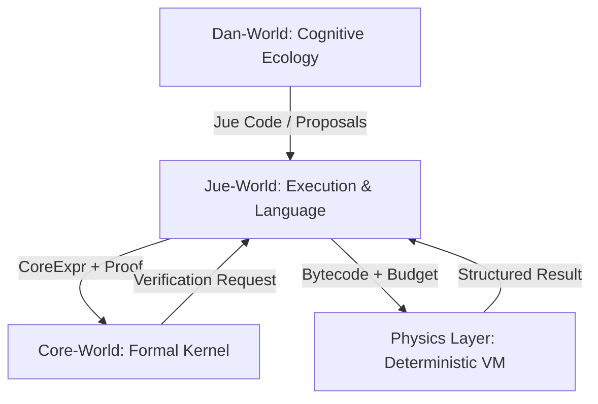
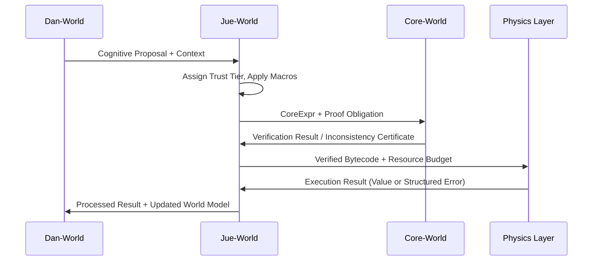

# Project Jue: System Architecture

## Overall Architecture
Project Jue implements a layered cognitive system where each layer depends on the guarantees of the layer below and adds new expressive power. The flow is one of increasing abstraction and flexibility, grounded in a minimal formal core.



## Layer-by-Layer Architecture

### 1. Core-World Architecture
**Purpose**: Frozen formal kernel defining timeless, mathematical meaning. It answers "What does this mean?" not "How is this run?".
**Key Guarantee**: Acts as the final authority on semantic equivalence.

**Key Components**:
- `core_expr.rs`: Core expression types (Var, Lam, App) with De Bruijn indices.
- `core_kernel.rs`: **βη-reduction** engine with **leftmost-outermost** strategy.
- `proof_checker.rs`: Minimal verifier for equivalence proofs.
- `specification_v1.md`: **Frozen API spec** defining syntax, reduction order, and primitive axioms (λ, Nat, Pair). <!-- NEW -->

**Data Flow & Critical Paths**:
```
CoreExpr → βη-reduction → Normal Form / ⊥
```
- `normalize()`: Recursive reduction to βη-normal form (or divergence).
- `prove_equiv(t1, t2)`: Generates/validates proof that `t1 ≡ t2`.
- `check_inconsistency()`: Detects and certifies logical contradictions in proposed terms.

### 2. Jue-World Architecture
**Purpose**: Dual-interpretation language and compiler. Bridges timeless meaning (Core) to efficient, stateful execution (Physics). For any Jue construct, it must answer both "What does this mean?" (denotational) and "How is this run?" (operational).

**Key Components**:
- `compiler.jue`: Compiles Jue AST to CoreExpr, generating proof obligations.
- `optimizer.jue`: Applies transformations (CBV, inlining) carrying proofs of equivalence to the original Core meaning.
- `runtime.jue`: Manages **trust tiers** (Formal/Verified/Empirical/Experimental) for code execution.
- `macro.jue`: **Hygienic, comptime-like macro system** with explicit capture escapes.

**Compilation & Trust Pipeline**: <!-- REVISED -->
```
Jue AST
    → [Trust Tier Assignment]
    → compile-to-core() → CoreExpr + Proof Obligation
    → [If Formal/Verified: Core-World Proof Check]
    → compile-to-bytecode(ResourceBudget) → Physics Bytecode
    → [If Empirical/Experimental: Sandbox Execution]
```

### 3. Dan-World Architecture
**Purpose**: Emergent cognitive ecology, not a single agent. A collection of interacting modules where sentience and sapience can emerge from lower-level primitives.

**Key Components**: <!-- REVISED FOCUS -->
- `gradient_system.jue`: Subcognitive drivers (novelty, efficiency, coherence).
- `pattern_detector.jue`: Identifies recurring event/state patterns (foundation for concepts).
- `theory_of_mind.jue`: Models other agents' beliefs and intentions.
- `narrative_self.jue`: Maintains continuity through pattern-based self-schema, not fixed labels.
- `global_workspace.jue`: Competitory attention and broadcast system between modules.

**Cognitive Flow**: <!-- REVISED -->
```
Physics Event → Gradient Update → Module Activation
    → Pattern Detection & Proposal → Global Workspace Competition
    → Winning Proposal Broadcast → Module Action/Update
    → [Loop] → Narrative Self-Update
```

### 4. Physics Layer Architecture
**Purpose**: Minimal, deterministic virtual machine that enforces the constraints of reality (AIKR). It provides the unyielding causal feedback necessary for learning.

**Key Components**: <!-- SIGNIFICANTLY EXPANDED -->
- `vm_core.rs`: **Deterministic, single-threaded bytecode interpreter**.
- `scheduler.rs`: **Round-robin actor scheduler** guaranteeing reproducible order.
- `memory_actor.rs`: **Shared-nothing, per-actor memory heaps**; communication via immutable message passing only.
- `instruction_set.md`: **Frozen set of atomic ops** (alloc, send, recv, prim_math).
- `error_system.rs`: Rich error reporting (`ResourceExhaustion`, `IllegalOp`) with context.

**Execution Model**: <!-- REVISED -->
```
Bytecode + Step Budget
    → VM Fetch/Decode
    → [Atomic Op Execution | Schedule Next Actor]
    → [If Error/Timeout: Structured Error Result]
    → Return (Result, ResourcesUsed, Trace)
```

## Cross-Layer Integration

### Compilation and Execution Flow


### Mutation & Learning Flow
```
1. Dan Module Proposes Change (Jue code)
2. Jue Compiler Classifies Trust Tier
3. If Formal/Verified: Core-World Proof Generation/Check
4. If Empirical: Sandbox Execution & Evaluation
5. If Experimental: Require Module Consensus
6. Apply Change to Running System (with Rollback Capability)
```

## Key Technical Decisions & Specifications <!-- NEW SECTION -->

### Blocking Specifications (Must be Frozen)
- **`CoreSpec v1.0`**: Defines βη-normal form as meaning, leftmost-outermost reduction, and the initial axiom set.
- **`PhysicsSpec v1.0`**: Defines the deterministic instruction set, actor model, and structured error API.
- **Jue-Core API**: The serialization format for sending `(CoreExpr, Proof)` for verification.

### Foundational Principles
- **Meaning is Extensional**: Core-World terms are equated under βη-reduction.
- **Lies Emerge, Don't Primitive**: Deception is a pattern detected from belief-communication divergence + theory of mind, not a built-in function.
- **Morality is Learned**: Ethical constraints emerge from empathy (simulated internal states of others), fairness (counterfactual distribution analysis), and social feedback.
- **Self is a Narrative**: Identity is a maintained story built from persistent patterns, not a static label.

## Source Code Organization
```
project_jue/
├── spec/                       # Frozen layer specifications       <!-- NEW -->
│   ├── core_v1.md
│   └── physics_v1.md
├── core_world/                 # Formal kernel
│   ├── src/kernel/             # βη-reduction, proof checking
│   └── src/interface.rs        # Jue-Core API (frozen)
├── physics_layer/              # Deterministic VM
│   ├── src/vm/                 # Interpreter & scheduler
│   ├── src/actor/              # Memory-isolated actors
│   └── src/interface.rs        # Bytecode/result API (frozen)
├── jue_world/                  # Compiler & Runtime
│   ├── compiler/               # Jue-to-Core, proof gen
│   ├── runtime/                # Trust tier & sandbox management
│   └── lib/                    # Standard library (empirical)
└── dan_world/                  # Cognitive modules
    ├── core_gradients/         # Novelty, efficiency drivers
    ├── perception/             # Pattern detectors
    ├── planning/               # Gradient-based goal systems
    └── social/                 # Theory of mind, narrative self
```

## Critical Implementation Path
1.  **Phase 1: Foundation**
    *   Finalize and freeze `CoreSpec v1.0` and `PhysicsSpec v1.0`.
    *   Build the reference `Core-World` proof checker and the deterministic `Physics VM`.
2.  **Phase 2: Bridge**
    *   Implement the `Jue-World` compiler frontend (parser, macro expander).
    *   Implement the `compile-to-core` backend and the minimal `Jue->Physics` code generator.
    *   Achieve first successful verified execution loop: `Jue -> Core -> Physics -> Result`.
3.  **Phase 3: Emergence**
    *   Implement the `Dan-World` gradient and pattern-detection primitives.
    *   Create the first self-modification loop where a Dan module can propose a verified Jue code change.
    *   Connect multiple Dan instances to begin social learning.

## Conclusion
This architecture provides a coherent path from a minimal formal kernel to a potentially sentient cognitive system. Each layer's responsibilities and the critical interfaces between them are now explicitly defined, separating timeless meaning (Core), efficient execution (Jue/Physics), and emergent cognition (Dan). The system is designed to explore the conditions for sentience, not presuppose its features.