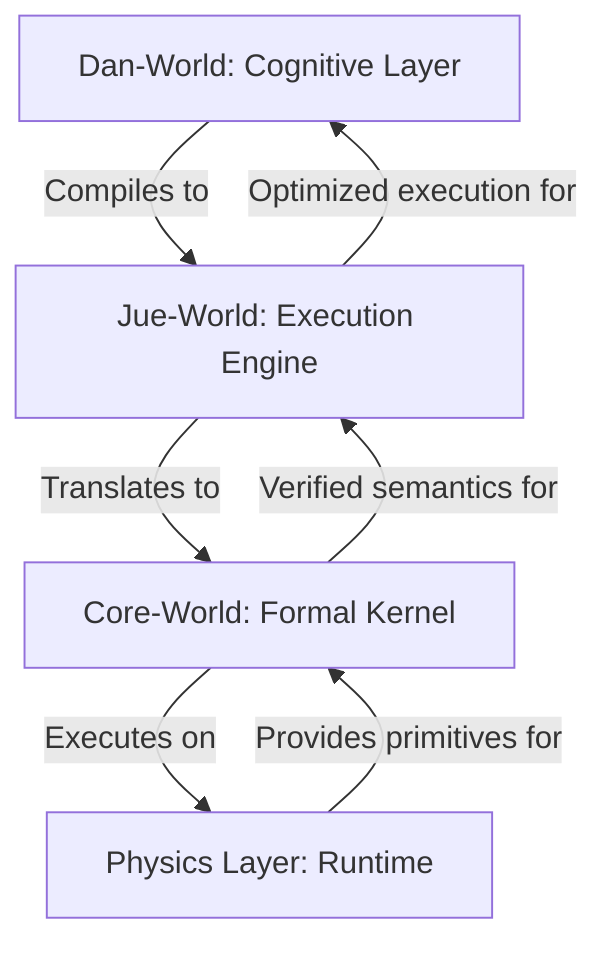

# Project Jue: Hybrid AGI System - Product Description

## Purpose and Vision

Project Jue aims to create a safe, verifiable, and scalable Artificial General Intelligence (AGI) system that bridges the gap between theoretical AI safety and practical implementation. The system is designed to provide mathematical guarantees through formal verification while supporting emergent cognitive capabilities.

## Problems Solved

### 1. AI Safety and Verification
- **Problem**: Most AI systems lack formal guarantees about their behavior, making them unpredictable and potentially unsafe.
- **Solution**: Core-World provides a formally verified λ-calculus kernel with relational semantics and proof obligations for all transformations.

### 2. Scalable Cognitive Architecture
- **Problem**: Traditional AI systems struggle with modular, composable cognition that can evolve safely over time.
- **Solution**: Dan-World implements an event-driven cognitive architecture with safe self-modification protocols and trust-level validation.

### 3. Performance vs. Safety Tradeoff
- **Problem**: Formal verification often comes at the cost of performance and practical usability.
- **Solution**: The layered architecture separates concerns - Core-World provides formal guarantees, Jue-World offers optimized execution, and Dan-World enables emergent cognition.

### 4. Safe Self-Modification
- **Problem**: AI systems that can modify themselves risk catastrophic failure or unintended behavior.
- **Solution**: Mutation protocols with four trust levels (Experimental, Empirical, Verified, Formal) and micro-kernels for validation.

## How It Works

### Layered Architecture Flow

### Core Workflow

1. **Cognitive Processing**: Dan-World modules (perceptual, affective, memory, planning) process events and generate cognitive operations.
2. **Compilation**: Jue-World compiles cognitive operations to CoreExpr with proof annotations.
3. **Formal Verification**: Core-World verifies all transformations maintain correctness.
4. **Execution**: Physics Layer executes verified bytecode with atomic primitives.
5. **Feedback Loop**: Results feed back to cognitive modules for continuous learning.

## User Experience Goals

### For Developers
- **Formal Guarantees**: Mathematical proof that core operations are correct.
- **Modular Development**: Clear separation of concerns between layers.
- **Safe Experimentation**: Trust-level protocols for testing new cognitive modules.
- **Comprehensive Testing**: Built-in test suites for all layers with property-based verification.

### For Researchers
- **Proof-Driven Development**: All optimizations and transformations must maintain correctness.
- **Layered Exploration**: Ability to work at different levels of abstraction.
- **Reproducible Results**: Formal verification ensures consistent behavior.
- **Extensible Architecture**: Easy to add new cognitive modules or optimization strategies.

### For End Users (Future)
- **Reliable AI**: Systems that behave predictably and can explain their reasoning.
- **Adaptive Learning**: Cognitive modules that can safely evolve over time.
- **Transparent Operations**: Proof trails that demonstrate system correctness.
- **Scalable Intelligence**: Architecture that supports growth from narrow to general intelligence.

## Key Features by Layer

### Core-World
- **Pure λ-calculus implementation** with De Bruijn indices
- **Formal proof checker** for verifying critical operations
- **Immutable kernel** frozen after verification
- **Relational semantics** for mathematical rigor
- **Proof obligations** for all β-reduction and normalization

### Jue-World
- **S-expression language** with proof annotations
- **Compiler** with semantic preservation proofs
- **Optimized evaluator** with proof-carrying code
- **Macro system** for code generation
- **Concurrency runtime** with event-driven architecture

### Dan-World
- **Event-driven modules** (perceptual, affective, memory, planning)
- **Global workspace** for module integration
- **Mutation protocols** with trust-level validation
- **Persistent structures** with versioning and rollback
- **Micro-kernels** for safe self-modification

### Physics Layer
- **Minimal Rust VM** with 12 atomic operations
- **Concurrency primitives** for parallel execution
- **Memory management** for all layers
- **Execution engine** for compiled bytecode
- **Atomic operations** for thread safety

## Significance and Impact

Project Jue represents a paradigm shift in AGI development by:

1. **Formal Foundations**: Providing mathematical guarantees that are missing from most AI systems.
2. **Layered Safety**: Separating concerns to maintain safety at the core while enabling innovation at higher levels.
3. **Controlled Evolution**: Supporting safe self-modification through rigorous validation protocols.
4. **Proof-Driven Optimization**: Ensuring that performance improvements never compromise correctness.
5. **Modular Cognition**: Enabling diverse cognitive processes to work together in a unified framework.

This approach addresses the fundamental challenge of creating AI systems that are both powerful and trustworthy, opening the door to scalable, verifiable artificial general intelligence.