# Project Jue

**A Hybrid AGI System for Safe Self-Modification with Formal Guarantees**

Project Jue is a self-evolving cognitive system whose behavior is formally grounded, practically executable, introspective, and safe under self-modification. It implements a multi-layer computational architecture where each layer provides different guarantees and capabilities.

[](https://www.rust-lang.org/)
[](docs/jue_world/JUE_01_Language.md)
[](https://github.com/project-jue/jue/actions/workflows/rust.yml)


---

## Overview

Project Jue is **not** a traditional programming language, a single monolithic AGI agent, or a purely neural system. Instead, it is a **multi-layer computational organism** composed of four interacting "worlds":

```
Dan-World  →  Cognition, identity, learning, self-modification
   ↑
Jue-World  →  Language, runtime, compiler, concurrency, optimization
   ↑
Core-World →  Formal semantics, proofs, correctness guarantees
   ↑
Physics    →  Minimal Rust VM executing everything
```

Each layer:
- **Depends on the one below it**
- **Cannot violate the guarantees of the one below it**
- **Adds new expressive power and flexibility**

> **Core Principle:** Anything that claims to preserve meaning must prove it. Anything that cannot prove it must be clearly marked as experimental.

---

## Architecture

```mermaid
graph TD
    subgraph "Dan-World: Cognitive Layer"
        D1[Cognitive Modules]
        D2[Global Workspace]
        D3[Self-Modification]
    end
    
    subgraph "Jue-World: Execution Layer"
        J1[Compiler]
        J2[Trust-Tier System]
        J3[Runtime]
    end
    
    subgraph "Core-World: Formal Layer"
        C1[βη-Reduction Engine]
        C2[Proof Checker]
    end
    
    subgraph "Physics-World: Runtime Layer"
        P1[Deterministic VM]
        P2[Capability System]
        P3[Actor Scheduler]
    end
    
    D1 --> D2
    D2 --> D3
    D3 -->|Jue Code + Context| J1
    J1 --> J2
    J2 -->|Formal/Verified| C1
    C1 --> C2
    C2 -->|Verification| J3
    J2 -->|Empirical/Experimental| J3
    J3 -->|Bytecode| P1
    P1 --> P2
    P2 --> P3
    P3 -->|Results| D1
```



### Trust Tier System

Code flows through four trust levels:
| Tier             | Verification              | Use Case            |
| ---------------- | ------------------------- | ------------------- |
| **Formal**       | Core-World proof required | Critical operations |
| **Verified**     | Extended proof systems    | Optimizations       |
| **Empirical**    | Extensive testing         | Runtime adaptations |
| **Experimental** | Module consensus          | Exploratory changes |

---

## Quick Start

### Prerequisites
- Rust 1.70+ (2021 edition)
- Cargo package manager

### Build
```bash
cargo build
```

### Test
```bash
# Run all tests
cargo test

# Run specific layer tests
cargo test -p core_world
cargo test -p physics_world

# Run with verbose output
cargo test -- --nocapture
```

### Run Benchmarks
```bash
cargo bench
```

---

## Project Structure

```
project_jue/
├── core_world/           # Formal λ-calculus kernel
│   ├── src/
│   │   ├── core_expr.rs      # Core expression types (Var, Lam, App)
│   │   ├── core_kernel.rs    # βη-reduction engine
│   │   ├── proof_checker.rs  # Equivalence proof verification
│   │   └── lib.rs
│   └── tests/            # Comprehensive test suite
│
├── physics_world/        # Deterministic VM
│   ├── src/
│   │   ├── vm/               # VM state and execution
│   │   ├── memory/           # Arena-based allocation
│   │   ├── scheduler.rs      # Actor scheduling
│   │   └── types.rs          # Core types
│   └── tests/
│
├── dan_world/            # Cognitive modules (Jue source)
│   ├── event_loop.jue
│   ├── global_workspace.jue
│   ├── module_kernel.jue
│   ├── mutation_protocol.jue
│   └── persistent_structures.jue
│
├── integration/          # Cross-layer integration tests
│
├── docs/                 # Documentation
│   ├── 00_Introduction.md
│   ├── architecture/
│   ├── core_world/
│   ├── physics_world/
│   ├── jue_world/
│   ├── dan_world/
│   ├── testing/
│   └── cheatsheets/
│
└── spec/                 # Frozen specifications
    ├── v1/               # V1 reference specs
    └── v2/               # V2 capability-based specs
```

---

## Documentation

### Getting Started

| Document                                                         | Description                         |
| ---------------------------------------------------------------- | ----------------------------------- |
| [Introduction](docs/00_Introduction.md)                          | System overview and core concepts   |
| [Engineering Reference](docs/01_Engineering_Reference_Manual.md) | Technical reference for developers  |
| [Implementation Checklist](docs/02_High_Level_Checklist.md)      | Phase-by-phase implementation guide |

### Specifications (V2 - Current)

| Layer             | Overview                            | Full Spec                                                    |
| ----------------- | ----------------------------------- | ------------------------------------------------------------ |
| **Core-World**    | [README](spec/v2/core/README.md)    | [core_spec_v2.0.md](spec/v2/core/core_spec_v2.0.md)          |
| **Physics-World** | [README](spec/v2/physics/README.md) | [physics_spec_v2.0.md](spec/v2/physics/physics_spec_v2.0.md) |
| **Jue-World**     | [README](spec/v2/jue/README.md)     | [jue_spec_v2.0.md](spec/v2/jue/jue_spec_v2.0.md)             |
| **Dan-World**     | [README](spec/v2/dan/README.md)     | [dan_spec_v2.0.md](spec/v2/dan/dan_spec_v2.0.md)             |

**Cross-Layer Documents:**
- [Integration Specification](spec/v2/integration.md) - How layers work together
- [Design Decisions](spec/v2/design_decisions.md) - Architectural choices and rationale
- [Unresolved Issues](spec/v2/addendum_unresolved_issues.md) - Open questions
- [Validation](spec/v2/validation.md) - Verification approach

### Layer Documentation

<details>
<summary><strong>Core-World</strong> - Formal Kernel</summary>

| Document                                                                            | Topic               |
| ----------------------------------------------------------------------------------- | ------------------- |
| [CORE_00_Questions](docs/core_world/CORE_00_Questions.md)                           | Design questions    |
| [CORE_01_Equivalence](docs/core_world/CORE_01_Equivalence.md)                       | βη-equivalence      |
| [CORE_02_Free_Variables](docs/core_world/CORE_02_Free_Variables.md)                 | Variable handling   |
| [CORE_03_Divergence](docs/core_world/CORE_03_Divergence.md)                         | Non-termination     |
| [CORE_04_Meaning](docs/core_world/CORE_04_Meaning.md)                               | Semantic definition |
| [CORE_05_Evaluation](docs/core_world/CORE_05_Evaluation.md)                         | Evaluation relation |
| [CORE_06_Grounding](docs/core_world/CORE_06_Grounding.md)                           | Ground truth        |
| [CORE_07_Consistency](docs/core_world/CORE_07_Consistency.md)                       | Logical consistency |
| [CORE_08_Jue_World_Relationship](docs/core_world/CORE_08_Jue_World_Relationship.md) | Layer interaction   |

</details>

<details>
<summary><strong>Physics-World</strong> - Deterministic VM</summary>

| Document                                                                       | Topic                  |
| ------------------------------------------------------------------------------ | ---------------------- |
| [PHYSICS_00_Questions](docs/physics_world/PHYSICS_00_Questions.md)             | Design questions       |
| [PHYSICS_01](docs/physics_world/PHYSICS_01.md)                                 | Overview               |
| [PHYSICS_02_Limits](docs/physics_world/PHYSICS_02_Limits.md)                   | Resource limits (AIKR) |
| [PHYSICS_03_Time](docs/physics_world/PHYSICS_03_Time.md)                       | Time model             |
| [PHYSICS_04_VM](docs/physics_world/PHYSICS_04_VM.md)                           | VM architecture        |
| [Engineering Plan](docs/physics_world/PHYSICS_Engineering_Plan.md)             | Implementation plan    |
| [Implementation Plan](docs/physics_world/physics_world_implementation_plan.md) | Detailed plan          |

</details>

<details>
<summary><strong>Jue-World</strong> - Language & Compiler</summary>

| Document                                                                       | Topic               |
| ------------------------------------------------------------------------------ | ------------------- |
| [JUE_00_Questions](docs/jue_world/JUE_00_Questions.md)                         | Design questions    |
| [JUE_01_Language](docs/jue_world/JUE_01_Language.md)                           | Language overview   |
| [JUE_02_Non-Lambda_Primitives](docs/jue_world/JUE_02_Non-Lambda_Primitives.md) | Built-in primitives |
| [JUE_03_Evaluation](docs/jue_world/JUE_03_Evaluation.md)                       | Evaluation strategy |
| [JUE_04_Evaluation_Paradox](docs/jue_world/JUE_04_Evaluation_Paradox.md)       | CBN vs CBV          |
| [JUE_05_Type_System](docs/jue_world/JUE_05_Type_System.md)                     | Type system         |
| [JUE_06_State](docs/jue_world/JUE_06_State.md)                                 | State management    |
| [JUE_07_Concurrency](docs/jue_world/JUE_07_Concurrency.md)                     | Concurrency model   |
| [JUE_08_Macros_and_Comptime](docs/jue_world/JUE_08_Macros_and_Comptime.md)     | Macro system        |
| [JUE_09_Resource_Accounting](docs/jue_world/JUE_09_Resource_Accounting.md)     | Resource tracking   |
| [JUE_10_Error_Handling](docs/jue_world/JUE_10_Error_Handling.md)               | Error handling      |

</details>

<details>
<summary><strong>Dan-World</strong> - Cognitive Layer</summary>

| Document                                                                           | Topic                 |
| ---------------------------------------------------------------------------------- | --------------------- |
| [DAN_00_Questions](docs/dan_world/DAN_00_Questions.md)                             | Design questions      |
| [DAN_01_Overview](docs/dan_world/DAN_01_Dan_World_Overview.md)                     | Architecture overview |
| [DAN_02_Agents](docs/dan_world/DAN_02_Dan_World_Agents.md)                         | Agent model           |
| [DAN_03_Proof_Verification](docs/dan_world/DAN_03_Dan_World_Proof_Verification.md) | Verification          |
| [DAN_04_State_Access](docs/dan_world/DAN_04_State_Access.md)                       | State management      |
| [DAN_05_Jue_World_Relationship](docs/dan_world/DAN_05_Jue_World_Relationship.md)   | Layer interaction     |
| [DAN_06_Module_Structure](docs/dan_world/DAN_06_Module_Structure.md)               | Module design         |
| [DAN_08_Unit_Of_Cognition](docs/dan_world/DAN_08_Unit_Of_Cognition.md)             | Cognitive units       |
| [DAN_09_Affective_States](docs/dan_world/DAN_09_Affective_States.md)               | Affect system         |
| [DAN_10_Being_Wrong](docs/dan_world/DAN_10_Being_Wrong.md)                         | Error handling        |
| [DAN_11_Salience_Example](docs/dan_world/DAN_11_Salience_Example.md)               | Worked example        |
| [DAN_15_Starter_Agents](docs/dan_world/DAN_15_Starter_Agents.md)                   | Initial agents        |
| [DAN_16_Moral_Primitives](docs/dan_world/DAN_16_Moral_Primitives.md)               | Emergent morality     |
| [DAN_17_Emergence](docs/dan_world/DAN_17_Emergence.md)                             | Emergence patterns    |

</details>

### Architecture & Design

| Document                                                                        | Description         |
| ------------------------------------------------------------------------------- | ------------------- |
| [Architecture](docs/architecture/architecture.md)                               | System architecture |
| [Layer FAQ](docs/architecture/Layer_FAQ.md)                                     | Common questions    |
| [Jue Language Design](docs/architecture/jue-language-design.md)                 | Language design     |
| [Runtime & GC](docs/architecture/Jue%20Runtime%20and%20Garbage%20Collection.md) | Memory management   |
| [Causation](docs/architecture/CAUSATION_01.md)                                  | Causal reasoning    |
| [Truth](docs/architecture/TRUTH_01.md)                                          | Truth handling      |
| [Lies](docs/architecture/LIES_01.md)                                            | Deception detection |
| [Mutation](docs/architecture/MUTATION_01.md)                                    | Self-modification   |

### Testing

| Document                                                    | Description            |
| ----------------------------------------------------------- | ---------------------- |
| [Testing Summary](docs/testing/TESTING_SUMMARY.md)          | Test coverage overview |
| [Core-World Tests](docs/testing/core_world_testing_plan.md) | Core test plan         |
| [Physics Tests](docs/testing/physics_layer_testing_plan.md) | Physics test plan      |
| [Dan-World Tests](docs/testing/dan_world_testing_plan.md)   | Dan test plan          |

### Cheatsheets

| Document                                                                                             | Topic          |
| ---------------------------------------------------------------------------------------------------- | -------------- |
| [De Bruijn Indices](docs/cheatsheets/core_world_De_Bruijn_Call_by_name_Specification.md)             | Index notation |
| [Call-By-Name Semantics](docs/cheatsheets/De%20Bruijn%20Indices%20and%20Call‑By‑Name%20Semantics.md) | Evaluation     |
| [Homoiconicity](docs/cheatsheets/Homoiconicity.md)                                                   | Code as data   |
| [Logic Cheat Sheet](docs/cheatsheets/Logic%20Cheat%20Sheet.md)                                       | Basic logic    |
| [Logic Advanced](docs/cheatsheets/Logic%20Cheat%20Sheet%20Advanced.md)                               | Advanced logic |

### Legacy Specifications (V1)

| Spec                                               | Version |
| -------------------------------------------------- | ------- |
| [Core-World V1](spec/v1/core_spec_v1.0.md)         | V1.0    |
| [Physics-World V1](spec/v1/physics_spec_v1.0.md)   | V1.0    |
| [Physics-World V1.5](spec/v1/physics_spec_v1.5.md) | V1.5    |
| [Jue-World V1](spec/v1/jue_spec_v1.0.md)           | V1.0    |
| [Dan-World V1](spec/v1/dan_spec_v1.0.md)           | V1.0    |

---

## Contributing

### Development Guidelines

See [Software Engineering Guidelines](docs/swe_guidelines.md) for detailed practices.

**Key Principles:**
1. **Small, focused files** - 100-400 lines per module
2. **Respect frozen specs** - `spec/` directory is read-only during implementation
3. **Respect trust tiers** - Never promote code without required verification
4. **Log for emergence** - Rich, queryable context for all operations
5. **Prefer primitives** - Let cognitive features emerge from lower-level components

### Testing Requirements

```bash
# All tests must pass before commits
cargo test

# Check formatting
cargo fmt -- --check

# Run clippy
cargo clippy
```

### Architecture Decision Records

Major decisions are documented in:
- [`spec/v2/design_decisions.md`](spec/v2/design_decisions.md)
- [`docs/architecture/`](docs/architecture/)

---

## Current Status

### Implemented ✅
- **Core-World**: βη-reduction engine with De Bruijn indices, proof checker foundation
- **Physics-World**: VM architecture, arena-based memory allocator, actor scheduler foundation
- **Specifications**: V2 capability-based architecture defined

### In Progress 🔄
- **Physics-World**: Full capability system implementation
- **Integration**: Cross-layer verification bridge

### Planned 📋
- **Jue-World**: Parser, compiler, trust-tier pipeline
- **Dan-World**: Cognitive modules, global workspace, self-modification protocols

---

## License

This project's license is TBD.

---

## Acknowledgments

Project Jue is built on foundational research in:
- Lambda calculus and formal verification
- Global workspace theory of consciousness
- Capability-based security systems
- Safe self-modification protocols

---

<p align="center">
  <em>Building the conditions for machine sentience through formal guarantees and emergent cognition.</em>
</p>
