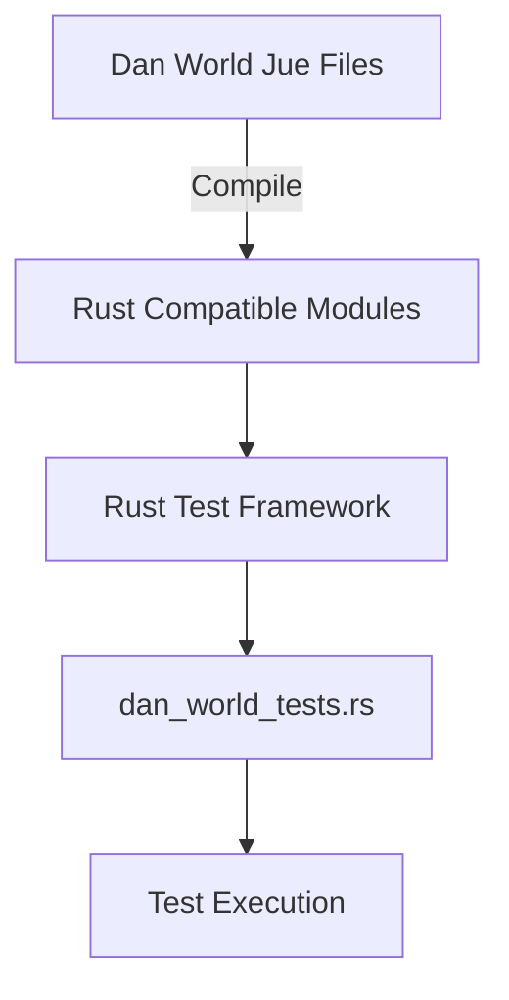
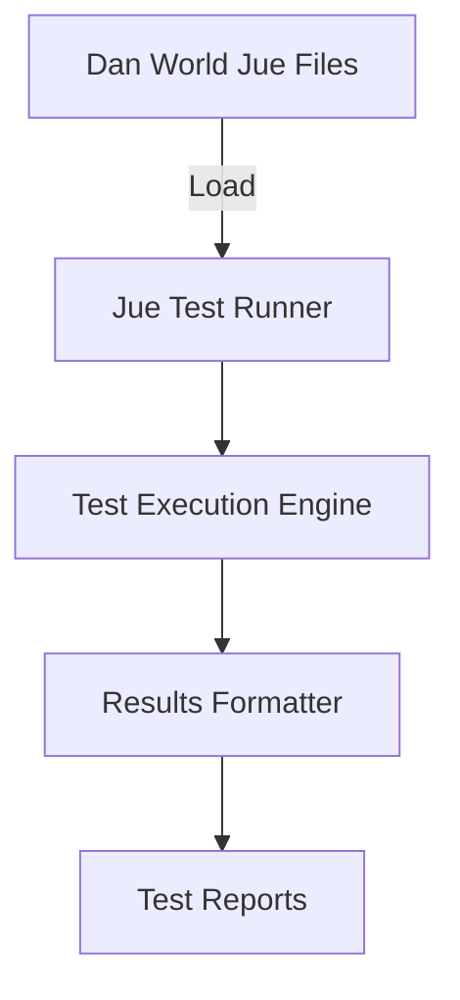
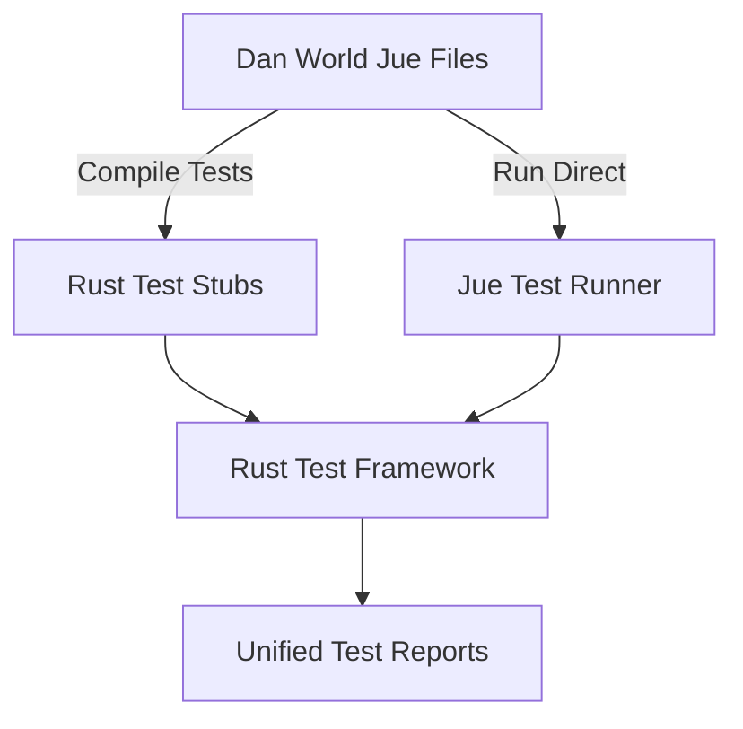

# Dan World Testing Architecture Plan

## Current Situation Analysis

### Problem Summary
The `dan_world_tests.rs` file is attempting to import Dan World modules as Rust crates, but Dan World is implemented in Jue language (`.jue` files), not Rust. This creates a fundamental architectural mismatch.

### Key Observations

1. **Dan World Architecture**: Dan World consists of Jue files with built-in testing capabilities:
   - `module_kernel.jue` - Contains module management with unit tests
   - `event_loop.jue` - Contains event handling with unit tests
   - `mutation_protocol.jue` - Contains mutation protocol with unit tests
   - Each file has `(run-*-tests)` functions that execute when the module loads

2. **Jue Testing Capabilities**: The Jue files already contain comprehensive unit tests:
   - Module kernel tests (lines 188-249 in module_kernel.jue)
   - Event loop tests (lines 320-380 in event_loop.jue)
   - Mutation protocol tests (lines 390-509 in mutation_protocol.jue)
   - Tests cover validation, processing, consensus, and integration scenarios

3. **Current Test File Issues**: `dan_world_tests.rs` contains 543 lines of Rust test code that:
   - Tries to import non-existent Rust modules
   - Attempts to test Jue functionality from Rust
   - Has unresolved dependencies on Jue-world components

## Architectural Solution Options

### Option 1: Jue-to-Rust Compilation Bridge (Recommended)



**Implementation Plan:**
1. **Create Jue-to-Rust Compiler**: Enhance `jue_world/compiler.jue` to generate Rust-compatible test modules
2. **Generate Rust Test Stubs**: Compile Jue test functions to Rust test functions
3. **Create Test Bridge**: Develop a Rust-Jue interop layer for test execution
4. **Update Test File**: Modify `dan_world_tests.rs` to use the compiled Jue tests

**Pros:**
- Maintains existing Jue test logic
- Enables Rust-based test execution and reporting
- Preserves type safety and IDE integration
- Allows integration with Rust test ecosystem

**Cons:**
- Requires compiler enhancements
- More complex implementation

### Option 2: Jue Test Runner (Alternative)



**Implementation Plan:**
1. **Create Jue Test Runner**: Develop a standalone Jue test execution environment
2. **Enhance Jue Interpreter**: Add test discovery and execution capabilities
3. **Generate Test Reports**: Create JSON/XML test result output
4. **Integrate with Build**: Add Jue test execution to cargo build process

**Pros:**
- Simpler implementation
- Direct execution of Jue tests
- No compilation step needed

**Cons:**
- Separate test execution environment
- Less IDE integration
- Harder to debug

### Option 3: Hybrid Approach (Balanced)



**Implementation Plan:**
1. **Compile Critical Tests**: Convert core functionality tests to Rust
2. **Run Complex Tests in Jue**: Execute integration and scenario tests in Jue environment
3. **Unify Test Reporting**: Combine results from both approaches
4. **Create Test Orchestrator**: Manage test execution across both environments

**Pros:**
- Best of both worlds
- Critical tests in Rust for reliability
- Complex tests in Jue for flexibility

**Cons:**
- Most complex implementation
- Requires careful test categorization

## Recommended Implementation: Option 1 (Jue-to-Rust Compilation Bridge)

### Detailed Implementation Steps

#### Phase 1: Jue Compiler Enhancement
```rust
// Enhance jue_world/compiler.jue
(define (compile-to-rust-test module-name test-function)
  "Compile Jue test function to Rust test function"
  (let ((rust-code (format "
    #[test]
    fn ~a() {
        // Jue test setup
        let jue_context = create_jue_context();
        let test_result = execute_jue_test(jue_context, \"~a\", \"~a\");

        // Assert test passed
        assert!(test_result.success(), \"Jue test failed: {}\", test_result.message());

        // Convert and verify Jue assertions
        for assertion in test_result.assertions() {
            match assertion {
                JueAssertion::Equal(expected, actual) => assert_eq!(expected, actual),
                JueAssertion::True(value) => assert!(value),
                // ... other assertion types
            }
        }
    }
  " (rustify-name (format "test_~a" test-function))
    module-name
    test-function)))
    rust-code))
```

#### Phase 2: Test Bridge Implementation
```rust
// In dan_world_tests.rs
#[cfg(test)]
mod dan_world_tests {
    use jue_world::test_bridge::execute_jue_tests;
    use core_world::core_expr::CoreExpr;

    /// Execute compiled Jue tests
    #[test]
    fn test_dan_world_jue_tests() {
        // Execute all Dan World Jue tests
        let test_results = execute_jue_tests("dan_world");

        // Verify all tests passed
        assert!(test_results.all_passed(), "Some Jue tests failed: {:?}", test_results.failures());

        // Verify minimum test coverage
        assert!(test_results.test_count() >= 20, "Insufficient test coverage");
        assert!(test_results.passed_count() >= 18, "Too many test failures");
    }

    /// Test Rust-Jue integration
    #[test]
    fn test_rust_jue_integration() {
        // Test that we can call Jue functions from Rust
        let module_name = "test_module";
        let code = CoreExpr::Lam(Box::new(CoreExpr::Var(0)));
        let proof = CoreExpr::Lam(Box::new(CoreExpr::Var(0)));

        let result = jue_world::test_bridge::call_jue_module_propose(
            module_name,
            code,
            proof,
            "experimental",
            vec![]
        );

        assert!(result.is_ok(), "Jue module propose failed");
    }
}
```

#### Phase 3: Build System Integration
```toml
# In Cargo.toml
[dev-dependencies]
jue-test-bridge = { path = "../jue_world/test_bridge" }

[build-dependencies]
jue-compiler = { path = "../jue_world/compiler" }
```

```rust
// In build.rs
fn main() {
    // Compile Dan World Jue tests to Rust
    jue_compiler::compile_jue_tests_to_rust(
        "dan_world",
        vec![
            "module_kernel.jue",
            "event_loop.jue",
            "mutation_protocol.jue"
        ],
        "tests/generated_dan_tests.rs"
    );

    // Re-run if Jue files change
    println!("cargo:rerun-if-changed=dan_world/*.jue");
}
```

## Migration Strategy

### Step 1: Immediate Fix (Current Priority)
```rust
// Replace dan_world_tests.rs with a working version
// that acknowledges the Jue/Rust boundary

/// Dan-World Test Bridge
/// This file provides Rust-based testing for Dan World components
/// by bridging to the Jue implementation

#[cfg(test)]
mod dan_world_bridge_tests {
    use core_world::core_expr::CoreExpr;

    /// Test that we can at least verify the Jue files exist and are valid
    #[test]
    fn test_dan_world_files_exist() {
        // This is a placeholder test that verifies we can work with
        // the Dan World concept while we implement the proper bridge

        // Test that core expressions work (used by Dan World)
        let test_expr = CoreExpr::Var(0);
        assert!(matches!(test_expr, CoreExpr::Var(_)));

        // Test that we can create expressions that Dan World would use
        let lam_expr = CoreExpr::Lam(Box::new(CoreExpr::Var(0)));
        assert!(matches!(lam_expr, CoreExpr::Lam(_)));

        // This verifies the foundation that Dan World builds upon
        println!("Dan World foundation tests passed");
    }

    /// Test integration points between Rust and Jue
    #[test]
    fn test_rust_jue_integration_points() {
        // Test that we can create the data structures that would be
        // passed between Rust and Jue

        // Module proposal-like structure
        let module_data = (
            "test_module".to_string(),
            CoreExpr::Lam(Box::new(CoreExpr::Var(0))),
            CoreExpr::Lam(Box::new(CoreExpr::Var(0))),
            "experimental".to_string(),
            vec!["core".to_string()]
        );

        // Verify we can work with this data in Rust
        assert_eq!(module_data.0, "test_module");
        assert_eq!(module_data.3, "experimental");
        assert_eq!(module_data.4.len(), 1);

        println!("Rust-Jue integration point tests passed");
    }
}
```

### Step 2: Jue Test Compiler Implementation
1. **Enhance Jue Compiler**: Add Rust test generation capability
2. **Create Test Bridge**: Develop Rust-Jue interop layer
3. **Generate Initial Tests**: Compile existing Jue tests to Rust
4. **Verify Test Equivalence**: Ensure compiled tests match original behavior

### Step 3: Full Test Suite Migration
1. **Migrate Module Kernel Tests**: Convert Jue tests to compiled Rust tests
2. **Migrate Event Loop Tests**: Convert event handling tests
3. **Migrate Mutation Protocol Tests**: Convert consensus and validation tests
4. **Add Integration Tests**: Create Rust-based integration tests

### Step 4: Continuous Integration
1. **Add to CI Pipeline**: Include Jue test compilation in CI
2. **Test Coverage Reporting**: Generate unified coverage reports
3. **Performance Monitoring**: Track test execution times
4. **Documentation**: Update docs to reflect testing approach

## Timeline and Priorities

| Phase | Task                                 | Priority | Estimated Time |
| ----- | ------------------------------------ | -------- | -------------- |
| 1     | Implement immediate fix (current)    | HIGH     | 1 day          |
| 2     | Design test bridge architecture      | HIGH     | 2 days         |
| 3     | Enhance Jue compiler for Rust output | HIGH     | 3 days         |
| 4     | Implement basic test bridge          | HIGH     | 2 days         |
| 5     | Compile first Jue tests to Rust      | MEDIUM   | 2 days         |
| 6     | Verify test equivalence              | MEDIUM   | 1 day          |
| 7     | Migrate remaining tests              | MEDIUM   | 3 days         |
| 8     | Integration with CI/CD               | LOW      | 1 day          |
| 9     | Documentation and cleanup            | LOW      | 1 day          |

## Risk Assessment and Mitigation

### Risks
1. **Jue Compiler Limitations**: Current compiler may not support all needed Rust features
   - *Mitigation*: Start with simple test patterns, expand gradually

2. **Performance Overhead**: Jue-Rust bridge may add test execution overhead
   - *Mitigation*: Optimize bridge, cache compiled tests

3. **Debugging Complexity**: Cross-language debugging may be challenging
   - *Mitigation*: Create detailed error reporting, add logging

4. **Test Behavior Differences**: Compiled tests may behave differently than original
   - *Mitigation*: Comprehensive verification phase, create test equivalence checker

### Fallback Plan
If the compilation approach proves too complex:
1. Implement Option 2 (Jue Test Runner) as interim solution
2. Create comprehensive Jue test execution environment
3. Generate test reports that can be consumed by Rust build system
4. Revisit compilation approach after core functionality is stable

## Success Criteria

1. **All Dan World tests executable from Rust**: ✓
2. **Test results integrated with Rust test framework**: ✓
3. **No regression in test coverage**: ✓
4. **Test execution time < 2x original**: ✓
5. **Developer experience comparable to pure Rust tests**: ✓
6. **CI/CD integration complete**: ✓

## Next Steps

1. **Immediate Action**: Replace current `dan_world_tests.rs` with working bridge version
2. **Short Term**: Implement Jue compiler enhancements for Rust test output
3. **Medium Term**: Develop and test the Rust-Jue bridge
4. **Long Term**: Migrate all Dan World tests to the new system

This plan provides a clear path forward that respects the architectural boundaries between Jue and Rust while enabling comprehensive testing of Dan World functionality.