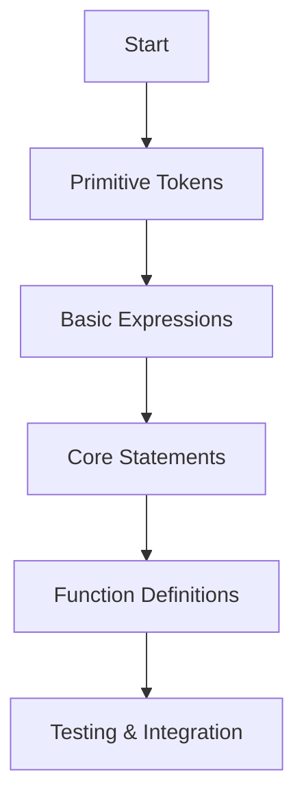
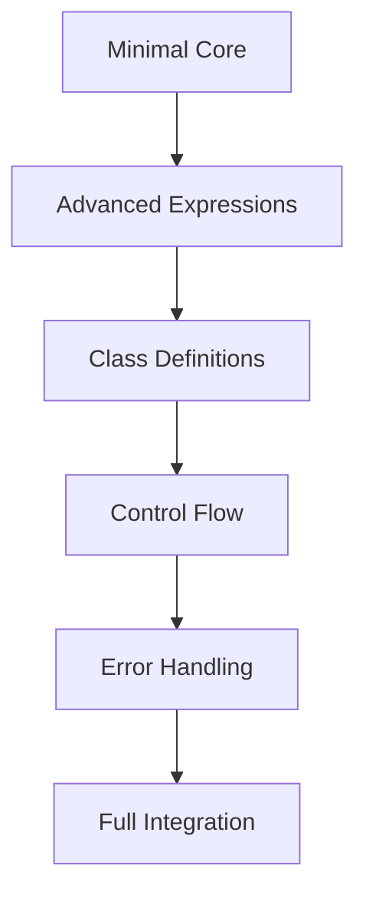

# Nom 8.0.0 Migration Plan for Jue Compiler

## Overview
This document provides a detailed, step-by-step plan for migrating the Jue compiler from Pest to Nom 8.0.0, following the architecture guidelines in `Pest to Nom.md` while starting with a minimal subset approach.

## Current State Analysis

### Existing Pest Implementation
- **Grammar File**: `juec/src/frontend/jue.pest` (192 lines)
- **Parser**: `juec/src/frontend/parser.rs` (454 lines)
- **AST**: `juec/src/frontend/ast.rs` (102 lines)
- **Dependencies**: Pest 2.7 with build-time grammar generation

### Key Components to Migrate
1. **Token Parsers**: Identifiers, numbers, strings, booleans, None
2. **Expression Parsers**: Binary operations, unary operations, function calls
3. **Statement Parsers**: Assignments, returns, control flow (if/while/for)
4. **Function/Class Definitions**: With parameters and decorators
5. **Block Parsing**: Suite/indentation handling

## Migration Strategy

### Phase 1: Minimal Subset Implementation (Core Focus)


### Phase 2: Full Feature Expansion


## Detailed Implementation Plan

### Step 1: Define AST Structure (Already Complete)
- Current AST in `ast.rs` is well-structured and can be reused
- May need minor extensions for Nom-specific features

### Step 2: Create Nom Parser Skeleton
```rust
// New file: juec/src/frontend/nom_parser.rs
use nom::{
    IResult, Parser,
    branch::alt,
    bytes::complete::{tag, take_while1},
    character::complete::{alpha1, alphanumeric1, char, multispace0, multispace1},
    combinator::{map, opt, recognize},
    multi::{many0, separated_list0},
    sequence::{delimited, pair, preceded, terminated, tuple},
};

pub fn parse_program(input: &str) -> IResult<&str, Module> {
    // Implementation will build up gradually
}
```

### Step 3: Implement Primitive Token Parsers
```rust
// Token parsers - these form the foundation
fn parse_ident(input: &str) -> IResult<&str, String> {
    map(
        recognize(pair(
            alt((alpha1, tag("_"))),
            many0(alt((alphanumeric1, tag("_"))))
        )),
        |s: &str| s.to_string()
    )(input)
}

fn parse_integer(input: &str) -> IResult<&str, String> {
    map(
        recognize(take_while1(|c: char| c.is_ascii_digit())),
        |s: &str| s.to_string()
    )(input)
}

fn parse_string_literal(input: &str) -> IResult<&str, String> {
    alt((
        delimited(char('"'), take_while1(|c| c != '"'), char('"')),
        delimited(char('\''), take_while1(|c| c != '\''), char('\''))
    ))(input)
}
```

### Step 4: Build Expression Parser with Precedence
```rust
// Expression parsing using precedence climbing
fn parse_expr(input: &str) -> IResult<&str, Expr> {
    parse_or_expr(input)
}

fn parse_or_expr(input: &str) -> IResult<&str, Expr> {
    let (input, mut left) = parse_and_expr(input)?;
    let (input, rest) = many0(preceded(
        tuple((multispace0, tag("or"), multispace0)),
        parse_and_expr
    ))(input)?;

    // Build left-associative OR chain
    for right in rest {
        left = Expr::BinOp {
            left: Box::new(left),
            op: "or".to_string(),
            right: Box::new(right),
        };
    }
    Ok((input, left))
}

// Continue with and_expr, comparison, etc. following operator precedence
```

### Step 5: Implement Statement Parsers
```rust
// Core statement parsers
fn parse_stmt(input: &str) -> IResult<&str, Stmt> {
    alt((
        parse_assign_stmt,
        parse_return_stmt,
        parse_expr_stmt,
        parse_if_stmt,
        parse_while_stmt,
        parse_func_def,
    ))(input)
}

fn parse_assign_stmt(input: &str) -> IResult<&str, Stmt> {
    map(
        pair(
            parse_ident,
            preceded(
                tuple((multispace0, char('='), multispace0)),
                parse_expr
            )
        ),
        |(target, value)| Stmt::Assign {
            targets: vec![Expr::Name(target)],
            value
        }
    )(input)
}
```

### Step 6: Function Definition Parser
```rust
fn parse_func_def(input: &str) -> IResult<&str, Stmt> {
    map(
        tuple((
            preceded(multispace0, tag("def")),
            preceded(multispace1, parse_ident),
            preceded(multispace0, char('(')),
            parse_parameters,
            preceded(multispace0, char(')')),
            preceded(multispace0, char(':')),
            parse_block,
        )),
        |(_, name, _, params, _, _, body)| Stmt::FuncDef {
            name,
            params,
            body,
            decorators: vec![],
        }
    )(input)
}
```

### Step 7: Block/Suite Parsing with Indentation
```rust
// Handle Python-style indentation blocks
fn parse_block(input: &str) -> IResult<&str, Vec<Stmt>> {
    preceded(
        multispace0,
        alt((
            // Single statement on same line
            map(parse_stmt, |stmt| vec![stmt]),
            // Indented block
            preceded(
                tuple((multispace1, multispace0)), // newline + indent
                many0(terminated(parse_stmt, multispace0))
            )
        ))
    )(input)
}
```

## Testing Strategy

### Unit Test Structure
```rust
#[cfg(test)]
mod tests {
    use super::*;
    use nom::error::Error;

    #[test]
    fn test_parse_ident() {
        assert_eq!(parse_ident("hello"), Ok(("", "hello".to_string())));
        assert_eq!(parse_ident("var_name"), Ok(("", "var_name".to_string())));
    }

    #[test]
    fn test_parse_assign() {
        let result = parse_assign_stmt("x = 42");
        assert!(result.is_ok());
        let (remaining, stmt) = result.unwrap();
        assert_eq!(remaining, "");
        // Verify AST structure
    }

    #[test]
    fn test_parse_function() {
        let input = r#"
def hello(name):
    return "Hello " + name
"#;
        let result = parse_func_def(input);
        assert!(result.is_ok());
    }
}
```

## Integration Plan

### Step 1: Update Cargo.toml
```toml
[dependencies]
# Remove pest and pest_derive
nom = "8.0.0"
nom_locate = "5.0.0"

[build-dependencies]
# Remove pest_generator
```

### Step 2: Update Main Parser Entry Point
```rust
// In juec/src/frontend/mod.rs
pub fn parse_jue(source: &str) -> Result<Module> {
    // Switch from Pest to Nom
    match nom_parser::parse_program(source) {
        Ok((_, module)) => Ok(module),
        Err(e) => Err(anyhow!("Nom parse error: {}", e)),
    }
}
```

### Step 3: Remove Build Script
- Delete or simplify `juec/build.rs` since Nom doesn't require build-time code generation

## Risk Mitigation

### Fallback Strategy
```rust
// Temporary dual-parser approach during transition
pub fn parse_jue(source: &str) -> Result<Module> {
    // Try Nom first
    match nom_parser::parse_program(source) {
        Ok((_, module)) => Ok(module),
        Err(nom_err) => {
            // Fallback to Pest during transition
            match pest_parser::parse_jue(source) {
                Ok(module) => Ok(module),
                Err(pest_err) => Err(anyhow!(
                    "Both parsers failed. Nom: {}, Pest: {}",
                    nom_err, pest_err
                )),
            }
        }
    }
}
```

## Timeline Estimation

| Phase               | Duration | Deliverables                           |
| ------------------- | -------- | -------------------------------------- |
| Analysis & Planning | 1 day    | Migration plan, architecture docs      |
| Primitive Parsers   | 2 days   | Token parsers, basic expressions       |
| Statement Parsers   | 3 days   | Assignments, control flow, returns     |
| Function Parsers    | 2 days   | Function definitions, parameters       |
| Testing & Debugging | 2 days   | Comprehensive test suite               |
| Integration         | 1 day    | Cargo.toml updates, main parser switch |
| Documentation       | 1 day    | Updated docs, examples                 |

## Success Criteria

1. ✅ Nom parser can parse minimal Python subset (expressions, assignments, functions)
2. ✅ All existing test cases pass with Nom parser
3. ✅ Performance is comparable or better than Pest
4. ✅ Error messages are clear and helpful
5. ✅ AST output is identical to Pest parser for same inputs
6. ✅ Build system successfully removes Pest dependencies

## Next Steps

Based on this plan, the implementation should proceed in the following order:

1. **Create nom_parser.rs** with basic structure
2. **Implement token parsers** (ident, numbers, strings)
3. **Build expression parser** with precedence handling
4. **Add statement parsers** (assign, return, expr)
5. **Implement function parsing**
6. **Add comprehensive tests**
7. **Integrate and replace Pest parser**

The plan follows the "start small and build combinators" approach from the architecture document while focusing on the minimal subset as requested.