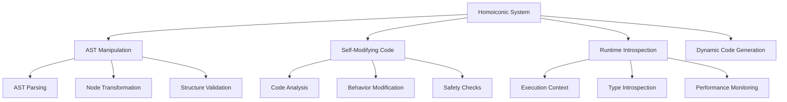
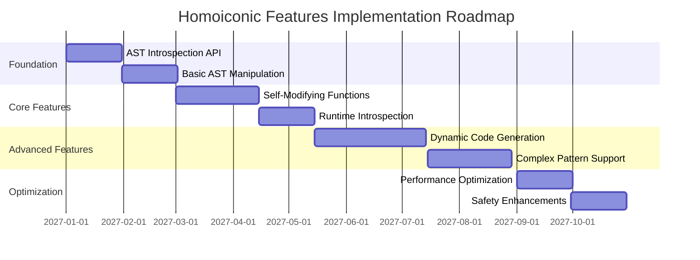

# Jue Homoiconic Features - Comprehensive Documentation

## Overview

This document provides comprehensive documentation for Jue's future homoiconic features, including AST manipulation, self-modifying code, and runtime introspection capabilities. It serves as both a specification and implementation guide for when these advanced features are developed.

## 1. Homoiconic Architecture

### 1.1 Core Principles

Homoiconicity in Jue follows these principles:
- **Code as Data**: Programs can manipulate their own structure
- **Runtime Reflection**: Code can inspect and modify its execution
- **Dynamic Evolution**: Programs can evolve their behavior at runtime
- **Safe Introspection**: Controlled access to program structure

### 1.2 Architecture Components



## 2. AST Manipulation Features

### 2.1 AST Structure

Jue's AST follows this basic structure:
```rust
enum AstNode {
    Program(Vec<Statement>),
    Statement(StatementKind),
    Expression(ExpressionKind),
    // ... other node types
}

enum StatementKind {
    FunctionDef { name: String, params: Vec<String>, body: Vec<Statement> },
    If { condition: Expression, then_branch: Vec<Statement>, else_branch: Option<Vec<Statement>> },
    // ... other statement types
}
```

### 2.2 AST Manipulation API

**Future API Design:**
```rust
// AST Node Access
fn get_ast(node: &AstNode) -> AstNode;
fn get_children(node: &AstNode) -> Vec<AstNode>;

// AST Transformation
fn transform_ast(node: AstNode, transformer: &dyn AstTransformer) -> AstNode;
fn replace_node(original: AstNode, replacement: AstNode) -> AstNode;

// AST Validation
fn validate_ast(node: &AstNode) -> Result<(), AstError>;
fn check_ast_invariants(node: &AstNode) -> bool;
```

### 2.3 Example Use Cases

```jue
// Future: AST manipulation example
function modify_function_ast(original_function) {
    ast = get_ast(original_function)

    // Modify function parameters
    new_ast = transform_ast(ast, {
        type: "FunctionModification",
        changes: {
            add_param: "new_param",
            modify_body: "add logging"
        }
    })

    return create_function_from_ast(new_ast)
}
```

## 3. Self-Modifying Code Features

### 3.1 Self-Modification Patterns

**Supported Patterns:**
1. **Function Replacement**: Replace function implementations
2. **Behavior Injection**: Add behavior to existing functions
3. **Conditional Modification**: Modify based on runtime conditions
4. **Structural Evolution**: Change code structure dynamically

### 3.2 Self-Modification API

```rust
// Function Modification
fn modify_function(name: &str, modification: FunctionModification) -> Result<(), ModificationError>;
fn replace_function_implementation(name: &str, new_impl: FunctionImpl) -> Result<(), ModificationError>;

// Behavior Injection
fn inject_behavior(target: &str, behavior: BehaviorImpl, position: InjectionPosition) -> Result<(), ModificationError>;

// Safety Controls
fn validate_modification(modification: &Modification) -> Result<(), SafetyError>;
fn check_modification_safety(modification: &Modification) -> SafetyLevel;
```

### 3.3 Example Patterns

```jue
// Future: Self-modifying function example
function adaptive_algorithm(input) {
    // Base implementation
    result = input * 2

    // Self-modification based on input
    if result > 1000 {
        this.implementation = function(new_input) {
            // Optimized version for large inputs
            return new_input * 2 + 100
        }
    }

    return result
}
```

## 4. Runtime Introspection Features

### 4.1 Introspection Capabilities

**Available Introspection:**
- Execution context analysis
- Variable state inspection
- Function call tracing
- Performance monitoring
- Memory usage analysis

### 4.2 Introspection API

```rust
// Context Introspection
fn get_execution_context() -> ExecutionContext;
fn get_call_stack() -> Vec<FunctionCall>;
fn get_current_variables() -> HashMap<String, VariableState>;

// Performance Monitoring
fn get_performance_metrics() -> PerformanceMetrics;
fn get_memory_usage() -> MemoryUsage;

// Type System Introspection
fn get_type_info(value: &Value) -> TypeInformation;
fn analyze_type_compatibility(a: &Value, b: &Value) -> CompatibilityResult;
```

### 4.3 Example Usage

```jue
// Future: Runtime introspection example
function debug_execution() {
    context = get_execution_context()
    stack = get_call_stack()

    log("Current execution context:", context)
    log("Call stack depth:", stack.length)

    if stack.length > 10 {
        warn("Deep recursion detected")
    }

    variables = get_current_variables()
    for var_name, var_state in variables {
        log("Variable", var_name, "=", var_state.value)
    }
}
```

## 5. Safety and Security

### 5.1 Safety Mechanisms

**Implemented Safeguards:**
1. **Modification Validation**: All modifications are validated
2. **Sandboxing**: Self-modifying code runs in controlled environments
3. **Resource Limits**: Prevent infinite modification loops
4. **Type Safety**: Maintain type system integrity
5. **Memory Safety**: Prevent memory corruption

### 5.2 Security Controls

```rust
// Security Policy Example
struct SecurityPolicy {
    max_modification_depth: usize,
    allowed_modification_types: Vec<ModificationType>,
    resource_limits: ResourceLimits,
    validation_rules: Vec<ValidationRule>,
}

// Safety Validation
fn validate_modification_safety(
    modification: &Modification,
    policy: &SecurityPolicy
) -> Result<(), SafetyViolation> {
    // Check resource limits
    // Validate modification depth
    // Ensure type safety
    // Verify memory safety
}
```

## 6. Implementation Roadmap

### 6.1 Development Phases



### 6.2 Test Implementation Plan

**Test Development Strategy:**
1. **AST Manipulation Tests**: Basic node access and transformation
2. **Self-Modifying Tests**: Simple function replacement patterns
3. **Introspection Tests**: Context analysis and variable inspection
4. **Integration Tests**: Cross-feature validation
5. **Safety Tests**: Security and validation testing

## 7. Future Enhancements

### 7.1 Advanced Features Roadmap

1. **Pattern Matching**: Advanced AST pattern matching
2. **Macro System**: Hygienic macro expansion
3. **Compiler Plugins**: Extensible compilation pipeline
4. **Domain-Specific Optimizations**: Specialized code generation
5. **Cross-Language Interoperability**: Integration with other languages

### 7.2 Research Directions

- **Type System Evolution**: Dynamic type system enhancements
- **Performance Optimization**: JIT compilation for modified code
- **Debugging Tools**: Advanced debugging for self-modifying code
- **Formal Verification**: Mathematical verification of modifications
- **AI-Assisted Modification**: Machine learning for code optimization

## 8. Documentation and Examples

### 8.1 Example Patterns

**Basic AST Manipulation:**
```jue
// Get and modify function AST
function_ast = get_ast(my_function)
modified_ast = transform_ast(function_ast, {
    type: "ParameterAddition",
    new_param: "debug_mode"
})
new_function = create_from_ast(modified_ast)
```

**Self-Optimizing Code:**
```jue
// Future: Self-optimizing code example
function adaptive_sort(data) {
    // Start with simple algorithm
    result = bubble_sort(data)

    // Self-optimize based on data size
    if data.length > 1000 {
        this.implementation = function(large_data) {
            return quick_sort(large_data)
        }
    }

    return result
}
```

**Runtime Debugging:**
```jue
// Future: Runtime debugging example
function debug_complex_operation() {
    // Get current execution context
    context = get_execution_context()

    // Analyze performance
    metrics = get_performance_metrics()
    if metrics.cpu_usage > 0.8 {
        optimize_operation()
    }

    // Inspect variables
    variables = get_current_variables()
    validate_variable_states(variables)
}
```

## 9. Maintenance and Evolution

### 9.1 Versioning Strategy

**Version Management:**
- Semantic versioning for homoiconic features
- Backward compatibility guarantees
- Deprecation policies for modified APIs
- Migration guides for breaking changes

### 9.2 Community Guidelines

**Contribution Standards:**
1. **Test Coverage**: 100% test coverage for all modifications
2. **Documentation**: Comprehensive documentation for all features
3. **Safety First**: All modifications must include safety validation
4. **Performance**: Benchmark all performance-critical modifications
5. **Review Process**: Peer review for all homoiconic feature changes

## 10. Conclusion

This comprehensive documentation provides a complete specification for Jue's future homoiconic features. The architecture supports:

- **Incremental Implementation**: Features can be added progressively
- **Safety by Design**: Security and validation built into the core
- **Extensibility**: Clear pathways for future enhancements
- **Maintainability**: Well-documented patterns and practices

The homoiconic features will enable Jue to support advanced metacognitive programming patterns while maintaining safety, performance, and developer productivity.