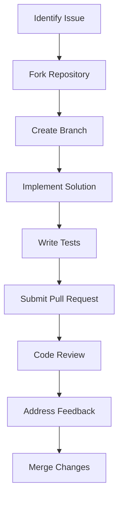

# Contributing to Jue Compiler

This directory contains guidelines and resources for contributors to the Jue compiler project.

## Contribution Guidelines

### Getting Started
- **Prerequisites**: Rust toolchain, Git, basic compiler knowledge
- **Setup**: Clone repository, install dependencies, build project
- **Workflow**: Fork repository, create feature branch, submit pull request

### Code Standards
- **Coding Style**: Follow Rust conventions and project-specific guidelines
- **Documentation**: Comprehensive code comments and documentation
- **Testing**: All contributions must include appropriate tests

### Development Process
1. **Issue Creation**: Document proposed changes or new features
2. **Design Review**: Discuss architecture and approach
3. **Implementation**: Write code following TDD principles
4. **Testing**: Ensure comprehensive test coverage
5. **Review**: Submit for code review and feedback
6. **Merge**: Approve and integrate changes

## Contributor Resources

### Learning Materials
- **Architecture Documentation**: Study compiler architecture
- **Codebase Tour**: Understand major components and their interactions
- **Development Environment**: Set up efficient development tools

### Communication
- **Discussion Forums**: Participate in design discussions
- **Code Reviews**: Provide and receive constructive feedback
- **Community Events**: Join development meetings and workshops

## Contribution Areas

### Current Priorities
- **Compiler Development**: Parser, semantic analyzer, code generator
- **Runtime Development**: VM, GC, standard library
- **Testing Infrastructure**: Test suite expansion and automation
- **Documentation**: Improve existing and create new documentation

### Skill Requirements
- **Rust Programming**: Core implementation language
- **Compiler Design**: Understanding of compiler architecture
- **Testing**: Experience with test-driven development
- **Documentation**: Technical writing and documentation skills

## Getting Help

### Support Channels
- **Issue Tracker**: Report bugs and request features
- **Discussion Board**: Ask questions and propose ideas
- **Documentation**: Reference comprehensive project documentation

### Mentorship
- **Onboarding**: Guidance for new contributors
- **Code Reviews**: Detailed feedback on contributions
- **Pair Programming**: Collaborative development sessions

## Contribution Workflow

## Code of Conduct

### Community Standards
- **Respect**: Treat all contributors with respect
- **Collaboration**: Work together constructively
- **Quality**: Maintain high standards for all contributions
- **Learning**: Foster knowledge sharing and growth

### Conflict Resolution
- **Discussion**: Resolve differences through dialogue
- **Mediation**: Involve maintainers for complex issues
- **Escalation**: Follow established escalation procedures

## Recognition

### Contribution Acknowledgement
- **Commit Credits**: Recognition in commit history
- **Release Notes**: Mention in project releases
- **Contributor List**: Public acknowledgment of contributions

### Rewards
- **Merit-Based**: Recognition for significant contributions
- **Leadership Opportunities**: Paths to greater responsibility
- **Community Recognition**: Visibility within developer community

## Continuous Improvement

### Feedback Loops
- **Contributor Surveys**: Regular feedback on contribution experience
- **Process Reviews**: Periodic evaluation of contribution workflow
- **Tooling Improvements**: Enhancements to development tools

### Growth Paths
- **Skill Development**: Opportunities to learn new technologies
- **Mentorship Programs**: Experienced developers guide newcomers
- **Leadership Roles**: Paths to technical leadership positions

## Conclusion

This contributing guide provides the information needed to participate effectively in the Jue compiler project. By following these guidelines, contributors can help build a high-quality, well-documented compiler that advances AGI research while maintaining a positive, collaborative development environment.