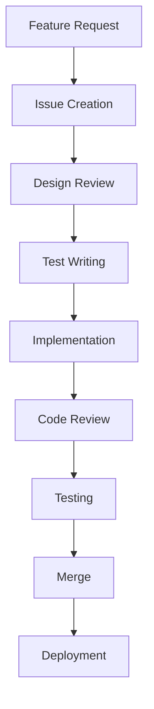

# Development Process Documentation

This directory contains comprehensive documentation related to development processes and methodologies for the Jue compiler project. The documentation covers all aspects of the development lifecycle, from initial planning to final deployment.

## Table of Contents

1. [Development Methodologies](#development-methodologies)
2. [Development Workflow](#development-workflow)
3. [Quality Assurance Processes](#quality-assurance-processes)
4. [Tooling and Environment Setup](#tooling-and-environment-setup)
5. [Version Control and Branching Strategy](#version-control-and-branching-strategy)
6. [Continuous Integration and Deployment](#continuous-integration-and-deployment)
7. [Documentation and Knowledge Sharing](#documentation-and-knowledge-sharing)
8. [Team Collaboration and Communication](#team-collaboration-and-communication)
9. [Development Phases and Milestones](#development-phases-and-milestones)

## Development Methodologies

### Agile Development Approach

The Jue compiler project follows an Agile development methodology with the following characteristics:

- **Iterative Development**: Work is divided into 2-week sprints
- **Continuous Feedback**: Regular sprint reviews and retrospectives
- **Adaptive Planning**: Flexible response to changing requirements
- **Cross-functional Teams**: Collaborative work across different expertise areas

### Test-Driven Development (TDD)

The project strictly adheres to Test-Driven Development principles:

1. **Red Phase**: Write failing tests that define desired functionality
2. **Green Phase**: Implement minimum code to make tests pass
3. **Refactor Phase**: Improve code quality while maintaining test coverage
4. **Continuous Validation**: All tests must pass before code is committed

### Code Quality Standards

- **Clean Code Principles**: Follow SOLID principles and DRY methodology
- **Consistent Style**: Adhere to Rust coding conventions and project-specific guidelines
- **Comprehensive Documentation**: All code must be well-documented
- **Automated Formatting**: Use `rustfmt` for consistent code formatting

## Development Workflow

### Standard Development Process



### Detailed Workflow Steps

1. **Issue Creation**
   - Document requirements and acceptance criteria
   - Assign priority and estimate effort
   - Link to relevant documentation and discussions

2. **Design Review**
   - Architectural discussion and approval
   - API and interface design
   - Performance considerations
   - Security and error handling strategies

3. **Test Writing**
   - Implement comprehensive test coverage
   - Follow TDD principles (Red-Green-Refactor)
   - Include edge cases and error scenarios
   - Document test expectations and assumptions

4. **Implementation**
   - Write clean, maintainable code
   - Follow established patterns and conventions
   - Implement proper error handling
   - Add comprehensive logging and debugging support

5. **Code Review**
   - Peer review process with checklist
   - Automated code quality checks
   - Performance and security analysis
   - Documentation completeness verification

6. **Testing**
   - Unit, integration, and performance testing
   - Regression testing suite execution
   - Test coverage validation
   - Manual testing for complex scenarios

7. **Merge and Deployment**
   - CI/CD pipeline validation
   - Staging environment testing
   - Production deployment procedures
   - Monitoring and rollback planning

## Quality Assurance Processes

### Code Review Guidelines

- **Review Checklist**:
  - Functionality correctness
  - Code style and consistency
  - Error handling completeness
  - Performance considerations
  - Security implications
  - Documentation completeness

- **Review Process**:
  - Minimum 2 approvers required
  - 24-hour review window
  - Mandatory feedback response
  - Iterative improvement cycles

### Testing Strategy

- **Test Coverage Requirements**:
  - 90% statement coverage minimum
  - 85% branch coverage minimum
  - 95% function coverage minimum
  - 90% performance coverage minimum

- **Test Types**:
  - Unit tests for individual components
  - Integration tests for component interactions
  - Performance tests for critical paths
  - Regression tests for existing functionality
  - Edge case tests for boundary conditions

### Quality Metrics

- **Code Quality Indicators**:
  - Cyclomatic complexity limits
  - Function length restrictions
  - Documentation coverage
  - Test coverage metrics

- **Performance Metrics**:
  - Compilation speed benchmarks
  - Runtime execution metrics
  - Memory usage profiling
  - Response time measurements

## Tooling and Environment Setup

### Development Environment

- **Required Tools**:
  - Rust toolchain (stable version)
  - Git version control
  - Cargo build system
  - Visual Studio Code or equivalent IDE
  - Docker for containerized development

- **Recommended Extensions**:
  - Rust Analyzer for IDE support
  - Code formatting tools
  - Linter and static analysis plugins
  - Debugging and profiling tools

### Build and Dependency Management

- **Build System**: Cargo-based build configuration
- **Dependency Management**: Cargo.toml for Rust dependencies
- **Environment Configuration**: Standardized development environment setup
- **Containerization**: Docker support for consistent environments

## Version Control and Branching Strategy

### Git Workflow

- **Branching Model**:
  - `main`: Production-ready code
  - `develop`: Integration branch for features
  - `feature/*`: Individual feature branches
  - `release/*`: Release preparation branches
  - `hotfix/*`: Critical bug fix branches

- **Commit Guidelines**:
  - Atomic commits with clear messages
  - Commit message format: `<type>(<scope>): <description>`
  - Types: feat, fix, docs, style, refactor, perf, test, chore
  - Scope: Component or module affected

### Branch Management

- **Feature Development**:
  - Create branch from `develop`
  - Regular rebase to stay current
  - Merge via pull request to `develop`

- **Release Process**:
  - Create release branch from `develop`
  - Version bump and changelog update
  - Merge to `main` and tag release
  - Merge back to `develop`

## Continuous Integration and Deployment

### CI/CD Pipeline

- **Build Pipeline**:
  - Automated build validation
  - Dependency checking
  - Code formatting verification
  - Static analysis execution

- **Test Pipeline**:
  - Unit test execution
  - Integration test execution
  - Performance test execution
  - Coverage reporting

- **Deployment Pipeline**:
  - Staging environment deployment
  - Production deployment procedures
  - Rollback mechanisms
  - Monitoring setup

### CI Configuration

```yaml
# Example GitHub Actions CI Configuration
name: Jue Compiler CI

on:
  push:
    branches: [ main, develop ]
  pull_request:
    branches: [ main, develop ]

jobs:
  build:
    runs-on: ubuntu-latest
    steps:
      - uses: actions/checkout@v2
      - name: Install Rust
        uses: actions-rs/toolchain@v1
        with:
          toolchain: stable
      - name: Build
        run: cargo build --all
      - name: Format Check
        run: cargo fmt --all -- --check
      - name: Clippy Analysis
        run: cargo clippy --all

  test:
    needs: build
    runs-on: ubuntu-latest
    steps:
      - uses: actions/checkout@v2
      - name: Install Rust
        uses: actions-rs/toolchain@v1
        with:
          toolchain: stable
      - name: Run Tests
        run: cargo test --all
      - name: Coverage Report
        run: cargo tarpaulin --out Xml

  deploy:
    needs: test
    if: github.ref == 'refs/heads/main'
    runs-on: ubuntu-latest
    steps:
      - uses: actions/checkout@v2
      - name: Build Release
        run: cargo build --release
      - name: Create Release
        uses: actions/create-release@v1
        with:
          tag_name: v${{ github.run_number }}
          release_name: Release ${{ github.run_number }}
```

## Documentation and Knowledge Sharing

### Documentation Standards

- **Code Documentation**:
  - Comprehensive Rustdoc comments
  - Module-level documentation
  - Function and method documentation
  - Example usage documentation

- **Architecture Documentation**:
  - System architecture diagrams
  - Component interaction documentation
  - Data flow documentation
  - Decision records for major design choices

### Knowledge Sharing Practices

- **Regular Documentation Updates**:
  - Documentation sprints
  - Documentation review process
  - Documentation coverage metrics

- **Knowledge Transfer**:
  - Pair programming sessions
  - Code walkthroughs
  - Architecture review meetings
  - Technical brown bag sessions

## Team Collaboration and Communication

### Communication Channels

- **Synchronous Communication**:
  - Daily standup meetings
  - Pair programming sessions
  - Ad-hoc discussion channels

- **Asynchronous Communication**:
  - Issue tracking system
  - Pull request discussions
  - Documentation comments
  - Architecture decision records

### Collaboration Practices

- **Code Ownership**:
  - Component ownership model
  - Reviewer assignment process
  - Knowledge sharing responsibilities

- **Conflict Resolution**:
  - Technical disagreement resolution process
  - Code review conflict handling
  - Architecture decision making

## Development Phases and Milestones

### Project Phases

1. **Phase 1: Core Compiler Development**
   - Parser implementation
   - Semantic analyzer development
   - IR generation capabilities
   - Basic code generation

2. **Phase 2: Runtime and Standard Library**
   - Virtual machine implementation
   - Garbage collection system
   - Standard library development
   - Runtime optimization

3. **Phase 3: Advanced Features**
   - Homoiconic capabilities
   - Self-modifying code support
   - Introspection features
   - Advanced optimization passes

4. **Phase 4: Testing and Polish**
   - Comprehensive test suite
   - Performance optimization
   - Documentation completion
   - Release preparation

### Milestone Tracking

- **Milestone Definition**:
  - Clear deliverables and success criteria
  - Time-bound objectives
  - Resource allocation planning

- **Progress Monitoring**:
  - Regular status updates
  - Burndown charts
  - Risk assessment and mitigation
  - Stakeholder reporting

## Best Practices and Recommendations

### Development Best Practices

- **Incremental Development**: Break features into smallest testable units
- **Frequent Commits**: Commit after each passing test
- **Continuous Integration**: Run full test suite before each commit
- **Code Reviews**: Submit all changes for peer review
- **Documentation**: Update documentation with code changes

### Performance Optimization

- **Profiling**: Regular performance profiling
- **Benchmarking**: Establish performance baselines
- **Optimization**: Target critical code paths
- **Monitoring**: Continuous performance monitoring

### Security Practices

- **Secure Coding**: Follow secure coding guidelines
- **Dependency Management**: Regular dependency updates
- **Vulnerability Scanning**: Automated security scanning
- **Incident Response**: Security incident procedures

## Conclusion

This comprehensive development process documentation provides a complete framework for the Jue compiler project's development lifecycle. By following these established processes, methodologies, and best practices, the development team can systematically build a high-quality, well-documented compiler that meets all functional, performance, and security requirements.

The documentation serves as both a reference guide for current developers and an onboarding resource for new contributors, ensuring consistent quality and maintainability throughout the project's evolution.