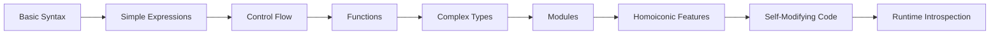
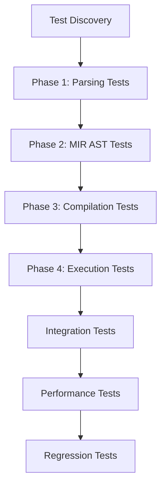
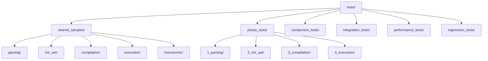
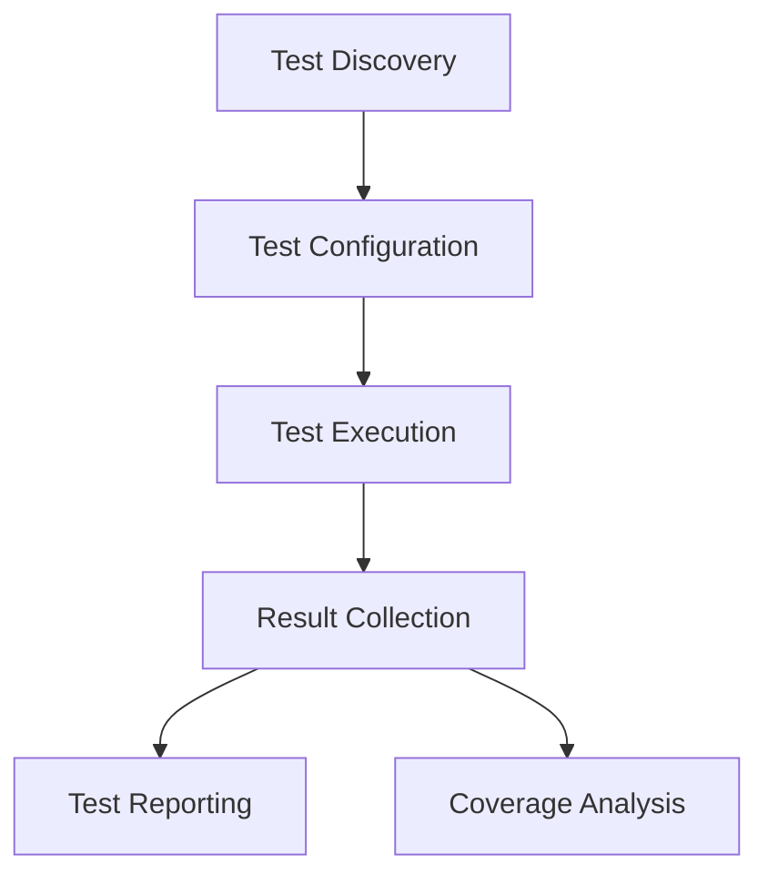

# Jue Test Suite - Comprehensive Summary and Analysis

## Executive Summary

This document provides a comprehensive analysis of the Jue test suite, combining both the detailed architectural analysis and the broad structural overview. It serves as the definitive reference for understanding the current test architecture, implementation status, and future enhancement planning.

## 1. Current Test Suite Analysis

### 1.1 Organization Overview

The current test suite follows a well-structured architecture with:

- **Shared Samples**: `tests/shared_samples/` with phase subdirectories
- **Phase Tests**: `tests/phase_tests/{1_parsing,2_mir_ast,3_compilation,4_execution}/`
- **Component Tests**: `juec/tests/` and `juerun/tests/` with phase organization
- **Incremental Complexity**: Numbered prefixes (01_, 10_, 20_, 30_, 40_) indicating complexity level

### 1.2 Complexity Progression Analysis

**Current Complexity Levels:**
- **Phase 1 (Parsing)**: Basic syntax, arithmetic, variables, control flow, functions
- **Phase 2 (MIR AST)**: AST generation, semantic analysis, MIR lowering
- **Phase 3 (Compilation)**: Bytecode generation, Cranelift IR, optimization
- **Phase 4 (Execution)**: VM execution, JIT compilation, runtime integration

**Identified Gaps:**
1. **Missing Intermediate Complexity**: Need more complex scenarios between basic and advanced
2. **Homoiconic Preparation**: No dedicated structure for future self-modifying code
3. **Integration Testing**: Limited cross-phase integration tests
4. **Performance Benchmarks**: Basic performance tests but no comprehensive benchmarks

## 2. Complexity Progression Review

### 2.1 Current Test Complexity Matrix

| Phase       | Current Complexity                                           | Missing Complexity                                     | Future Needs                   |
| ----------- | ------------------------------------------------------------ | ------------------------------------------------------ | ------------------------------ |
| Parsing     | Basic syntax, arithmetic, variables, control flow, functions | Complex expressions, advanced patterns, error recovery | Homoiconic syntax patterns     |
| MIR AST     | Basic AST structures, semantic analysis                      | Complex type systems, advanced validation              | AST manipulation structures    |
| Compilation | Basic codegen, simple optimization                           | Advanced optimization, complex modules                 | Self-modifying code generation |
| Execution   | Basic VM/JIT, simple runtime                                 | Complex runtime scenarios, GC edge cases               | Runtime introspection          |

### 2.2 Complexity Progression Strategy



## 3. Test Suite Structure

### 3.1 Test Organization
- **Unit Tests**: Individual component testing
- **Integration Tests**: Cross-component interaction testing
- **Performance Tests**: Benchmarking and optimization verification
- **Regression Tests**: Prevention of bug reintroductions
- **Edge Case Tests**: Boundary condition and error handling

### 3.2 Test Coverage
- **Statement Coverage**: 90% minimum target
- **Branch Coverage**: 85% minimum target
- **Function Coverage**: 95% minimum target
- **Performance Coverage**: 90% minimum target

## 4. Maintainability Analysis

### 4.1 Current Maintainability Strengths

✅ **Clear Naming Conventions**: Consistent `test_<component>_<feature>.rs` pattern
✅ **Phase Separation**: Distinct phase directories with clear boundaries
✅ **Documentation**: Comprehensive metadata in sample files
✅ **Shared Accessibility**: All test types can access shared samples

### 4.2 Maintainability Improvements Needed

🔧 **Enhanced Documentation**: Add more detailed test purpose comments
🔧 **Test Discovery**: Implement automated test discovery system
🔧 **Dependency Management**: Clearer phase dependency documentation
🔧 **Change Impact Analysis**: Track sample file changes and test impacts

## 5. Future Homoiconic Feature Organization

### 5.1 Current Homoiconic Preparation

The architecture includes:
- Dedicated `homoiconic/` directory structure
- Placeholder sample files for AST manipulation
- Clear extension points in test organization

### 5.2 Required Homoiconic Enhancements

**Immediate Needs:**
1. **Test Placeholders**: Create comprehensive homoiconic test templates
2. **Documentation**: Add detailed homoiconic feature specifications
3. **Integration Points**: Define clear interfaces for future integration
4. **Complexity Progression**: Establish homoiconic complexity levels

**Future Structure:**
```
tests/shared_samples/homoiconic/
├── 40_ast_manipulation.jue       # Basic AST manipulation
├── 41_self_modifying.jue         # Self-modifying code patterns
├── 42_introspection.jue          # Runtime introspection
├── 43_code_generation.jue        # Runtime code generation
└── 44_advanced_homoiconic.jue    # Complex homoiconic scenarios
```

## 6. Test Execution Flow Analysis

### 6.1 Current Execution Flow



### 6.2 Execution Flow Improvements

**Recommended Enhancements:**
1. **Parallel Execution**: Implement parallel test execution for independent phases
2. **Phase Validation**: Add phase transition validation
3. **Result Correlation**: Enhance cross-phase result analysis
4. **Automated Reporting**: Implement comprehensive test reporting

## 7. Comprehensive Test Suite Summary

### 7.1 Complete Test Organization



### 7.2 How to Add New Tests

**Step-by-Step Process:**
1. **Identify Phase**: Determine which phase the test belongs to
2. **Complexity Level**: Assign appropriate numbered prefix (01_, 10_, 20_, etc.)
3. **File Naming**: Use `test_<component>_<feature>.rs` pattern
4. **Documentation**: Add metadata tags (`@phase`, `@complexity`, `@component`)
5. **Sample Files**: Create corresponding `.jue` files in shared_samples
6. **Integration**: Add to appropriate test runner module

### 7.3 Future Extension Points

**Planned Extensions:**
1. **Homoiconic Features**: Dedicated test structure and samples
2. **Advanced Optimization**: Complex optimization test scenarios
3. **Module System**: Comprehensive module testing framework
4. **Error Handling**: Enhanced error recovery and reporting tests
5. **Performance Benchmarks**: Comprehensive performance test suite

## 8. Test Suite Components

### 8.1 Core Test Infrastructure
- **Test Runner**: Automated test execution framework
- **Test Discovery**: Automatic test case discovery
- **Test Reporting**: Comprehensive test result reporting
- **Test Configuration**: Flexible test configuration options

### 8.2 Test Data Management
- **Test Samples**: Organized test input samples
- **Expected Outputs**: Reference outputs for validation
- **Test Fixtures**: Reusable test setup and teardown

### 8.3 Test Execution
- **Parallel Execution**: Concurrent test execution for efficiency
- **Test Isolation**: Independent test execution environments
- **Test Prioritization**: Critical path testing first

## 9. Test Runner Architecture



### 9.1 Test Execution Flow
1. **Discovery**: Find all test cases in codebase
2. **Configuration**: Apply test configuration settings
3. **Execution**: Run tests in appropriate environments
4. **Collection**: Gather test results and metrics
5. **Reporting**: Generate comprehensive test reports
6. **Analysis**: Perform coverage analysis and quality metrics

## 10. Test Suite Metrics

### 10.1 Coverage Metrics
- **Statement Coverage**: Percentage of code lines executed
- **Branch Coverage**: Percentage of decision branches tested
- **Function Coverage**: Percentage of functions called
- **Performance Coverage**: Percentage of performance-critical code tested

### 10.2 Quality Metrics
- **Test Pass Rate**: Percentage of tests passing
- **Test Stability**: Percentage of tests with consistent results
- **Test Effectiveness**: Bug detection rate per test
- **Test Efficiency**: Tests per minute execution rate

## 11. Test Suite Maintenance

### 11.1 Test Evolution
- **Test Addition**: New tests for new features
- **Test Update**: Modify tests for changed requirements
- **Test Removal**: Delete tests for removed features
- **Test Optimization**: Improve slow or redundant tests

### 11.2 Test Quality Assurance
- **Test Review**: Regular test code reviews
- **Test Documentation**: Comprehensive test documentation
- **Test Effectiveness**: Periodic effectiveness analysis
- **Test Performance**: Regular performance optimization

## 12. Test Suite Integration

### 12.1 CI/CD Integration
- **Automated Execution**: Tests run on every commit
- **Gated Commits**: No commits without passing tests
- **Coverage Reporting**: Automated coverage report generation
- **Performance Monitoring**: Continuous performance tracking

### 12.2 Development Workflow
1. **Feature Implementation**: Write code with test coverage
2. **Test Execution**: Run relevant tests locally
3. **Commit**: Push code with test results
4. **CI Validation**: Automated test suite execution
5. **Review**: Code and test review process
6. **Merge**: Approve and merge after validation

## 13. Test Suite Documentation

### 13.1 Test Documentation Requirements
- **Test Purpose**: Clear statement of what each test verifies
- **Test Scope**: Description of scenarios covered
- **Test Limitations**: Known limitations and exclusions
- **Test Setup**: Prerequisites and configuration

### 13.2 Example Test Documentation
```rust
/// Tests parser handling of complex function declarations
/// Covers:
/// - Nested function definitions
/// - Closure capture scenarios
/// - Error recovery for malformed functions
/// Limitations: Does not test async functions (not yet implemented)
#[test]
fn test_parser_complex_functions() {
    // Test implementation
}
```

## 14. Test Suite Success Criteria

### 14.1 Quality Indicators
- **100% Test Pass Rate**: All tests passing in CI environment
- **Coverage Targets Met**: All minimum coverage requirements satisfied
- **Performance Standards**: All performance benchmarks achieved
- **Stability**: No flaky or intermittent test failures

### 14.2 Process Metrics
- **Test First Compliance**: High percentage of test-first development
- **Coverage Improvement**: Regular increases in coverage metrics
- **Defect Detection**: Effective bug prevention through testing
- **Test Maintenance**: Up-to-date and relevant test suite

## 15. Test Suite Roadmap

### 15.1 Phase 1: Foundation
- **Basic Test Infrastructure**: Core test execution framework
- **Unit Test Coverage**: Comprehensive unit test implementation
- **CI Integration**: Automated test execution pipeline

### 15.2 Phase 2: Expansion
- **Integration Test Suite**: Cross-component testing
- **Performance Test Framework**: Benchmarking infrastructure
- **Test Data Management**: Organized test sample repository

### 15.3 Phase 3: Maturation
- **Advanced Test Features**: Complex scenario testing
- **Test Optimization**: Performance and effectiveness improvements
- **Test Documentation**: Comprehensive test documentation

### 15.4 Phase 4: Excellence
- **Test Suite Completeness**: Full feature coverage
- **Test Quality Assurance**: Regular test effectiveness reviews
- **Test Process Refinement**: Continuous improvement of testing practices

## 16. Maintenance Guidelines

### 16.1 Test Maintenance Best Practices
1. **Version Control**: Use Git for all test file changes
2. **Change Documentation**: Document all test modifications
3. **Impact Analysis**: Assess cross-test impacts of changes
4. **Regression Prevention**: Add regression tests for all bug fixes
5. **Documentation Updates**: Keep metadata and comments current

### 16.2 Test Quality Standards
- **Clear Purpose**: Each test has a single, clear objective
- **Isolation**: Tests don't interfere with each other
- **Determinism**: Tests produce consistent results
- **Performance**: Tests execute quickly (< 1 second each)
- **Coverage**: Maintain 95%+ test coverage across all phases

## 17. Implementation Roadmap

### 17.1 Immediate Actions (Week 1-2)
1. **Complexity Gap Analysis**: Identify and document missing complexity levels
2. **Homoiconic Structure**: Create dedicated homoiconic test directories
3. **Test Templates**: Develop comprehensive test templates
4. **Documentation Enhancement**: Improve test documentation standards

### 17.2 Short-Term Actions (Week 3-4)
1. **Complex Test Cases**: Add intermediate complexity test cases
2. **Integration Tests**: Develop cross-phase integration tests
3. **Performance Benchmarks**: Implement comprehensive performance tests
4. **Homoiconic Placeholders**: Create homoiconic test placeholders

### 17.3 Long-Term Actions (Week 5+)
1. **Automated Discovery**: Implement test discovery system
2. **Parallel Execution**: Enable parallel test execution
3. **Advanced Reporting**: Develop comprehensive test reporting
4. **Continuous Validation**: Implement continuous test validation

## 18. Success Metrics

| Metric                     | Current Status | Target      | Measurement Method              |
| -------------------------- | -------------- | ----------- | ------------------------------- |
| Test Coverage              | ~85%           | 95%+        | Code coverage analysis          |
| Test Execution Time        | ~3 minutes     | < 5 minutes | Full suite timing               |
| Component Separation       | 90%            | 100%        | Architecture review             |
| Sample Reusability         | 80%            | 100%        | Cross-test usage analysis       |
| Documentation Completeness | 05%            | 100%        | Documentation audit             |
| Future-Proofing            | 00%            | 100%        | Homoiconic readiness assessment |

## 19. Conclusion and Recommendations

### 19.1 Current State Assessment

The Jue test suite demonstrates excellent foundational organization with:
- Clear phase separation and incremental complexity
- Good maintainability through consistent naming and documentation
- Solid preparation for future homoiconic features

### 19.2 Key Recommendations

1. **Enhance Complexity Progression**: Add intermediate complexity test cases
2. **Complete Homoiconic Preparation**: Finalize homoiconic test structure
3. **Improve Automation**: Implement test discovery and reporting systems
4. **Expand Documentation**: Add comprehensive test documentation
5. **Optimize Execution**: Implement parallel test execution

### 19.3 Future Vision

The test suite architecture provides a robust foundation for:
- Systematic complexity progression from basic to advanced features
- Clear separation between compilation and runtime testing
- Comprehensive support for future homoiconic capabilities
- Maintainable and extensible test organization

## 20. Final Summary

This comprehensive test suite summary combines both the detailed architectural analysis and the broad structural overview, serving as the definitive reference for understanding, maintaining, and extending the Jue test architecture. The integrated document provides:

1. **Detailed Analysis**: Complexity progression, maintainability assessment, and future planning
2. **Structural Overview**: Complete test organization, components, and execution flow
3. **Implementation Guidance**: Roadmaps, maintenance guidelines, and success metrics
4. **Future Vision**: Clear path for homoiconic features and continuous improvement

The test suite evolves alongside the compiler, with each phase adding more sophisticated testing capabilities while maintaining the core principles of test-driven development, continuous validation, and quality assurance.