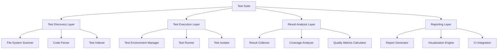
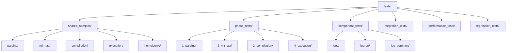
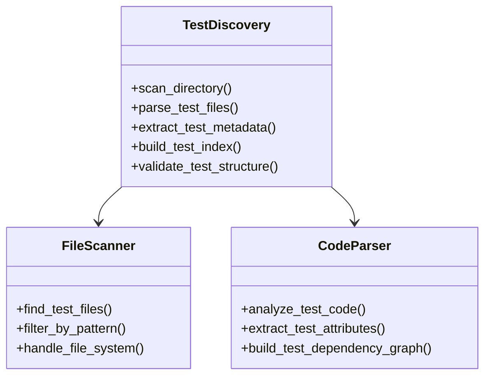
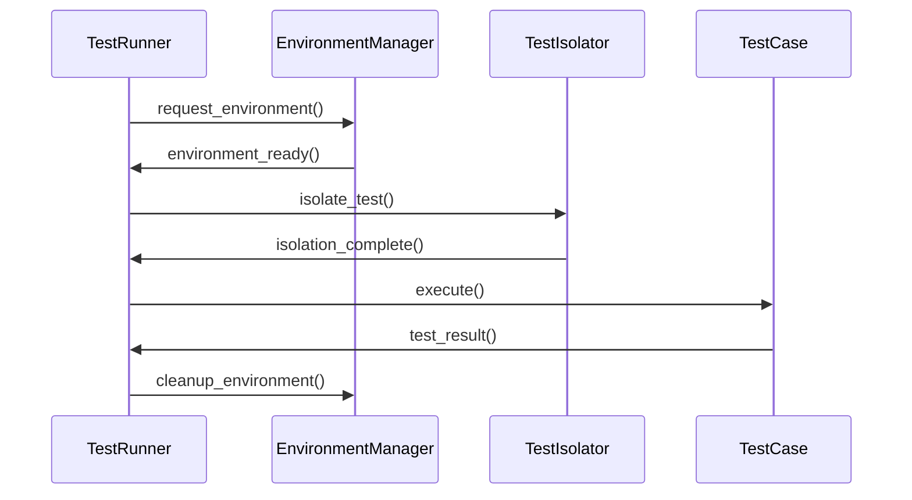
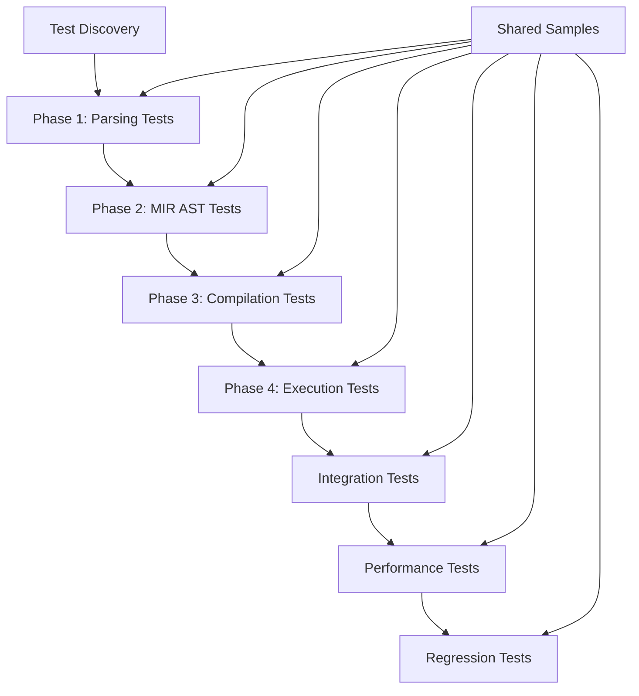
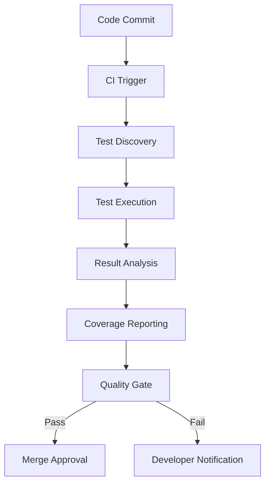
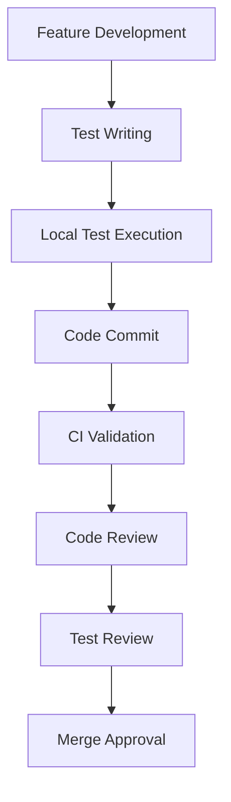
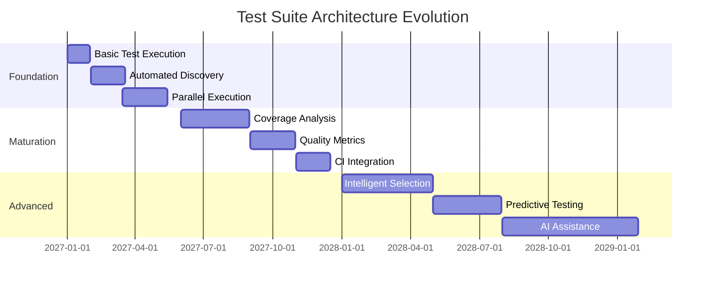

# Jue Test Suite Architecture - Comprehensive Design

## Overview

This document presents a comprehensive architectural specification for the Jue compiler test suite, combining both the detailed technical architecture and the systematic organizational strategy. It serves as the definitive reference for test suite design, implementation, and evolution.

## Current Analysis

### Current Test Structure
- **juec/tests/**: Contains `.jue` test files and Rust test files
- **juerun/tests/**: Contains runtime-specific tests
- **Test Types**: Parsing tests, compilation tests, execution tests
- **Current Issues**:
  - Mixed organization of test files
  - No clear separation between test phases
  - Limited modularity for future features
  - No shared sample directory structure

## Core Architecture

### Layered Test Architecture



### Component Responsibilities

1. **Test Discovery Layer**
   - **File System Scanner**: Recursively searches for test files
   - **Code Parser**: Extracts test metadata and structure
   - **Test Indexer**: Builds optimized test execution index

2. **Test Execution Layer**
   - **Test Environment Manager**: Sets up isolated test environments
   - **Test Runner**: Executes individual test cases
   - **Test Isolator**: Ensures test independence and clean state

3. **Result Analysis Layer**
   - **Result Collector**: Aggregates test execution data
   - **Coverage Analyzer**: Calculates multiple coverage metrics
   - **Quality Metrics Calculator**: Computes test effectiveness indicators

4. **Reporting Layer**
   - **Report Generator**: Creates structured test reports
   - **Visualization Engine**: Generates graphical representations
   - **CI Integration**: Provides CI/CD pipeline interfaces

## Comprehensive Test Organization Strategy

### 1. Directory Structure Proposal



### 2. Detailed Directory Structure

```
tests/
├── shared_samples/              # Shared .jue files accessible by all test types
│   ├── parsing/                 # Basic syntax samples
│   │   ├── basic_syntax.jue
│   │   ├── identifiers.jue
│   │   ├── literals.jue
│   │   └── operators.jue
│   ├── mir_ast/                 # MIR AST generation samples
│   │   ├── simple_expressions.jue
│   │   ├── control_flow.jue
│   │   ├── functions.jue
│   │   └── complex_types.jue
│   ├── compilation/             # Compilation-focused samples
│   │   ├── basic_program.jue
│   │   ├── module_system.jue
│   │   └── optimization_cases.jue
│   ├── execution/               # Runtime execution samples
│   │   ├── vm_execution.jue
│   │   ├── jit_execution.jue
│   │   └── gc_scenarios.jue
│   └── homoiconic/              # Future homoiconic feature samples
│       ├── ast_manipulation.jue
│       ├── self_modifying.jue
│       └── introspection.jue
├── phase_tests/                # Tests organized by development phase
│   ├── 1_parsing/              # Phase 1: Parsing tests
│   │   ├── test_lexer.rs
│   │   ├── test_parser.rs
│   │   └── test_syntax_validation.rs
│   ├── 2_mir_ast/              # Phase 2: MIR AST generation tests
│   │   ├── test_ast_generation.rs
│   │   ├── test_semantic_analysis.rs
│   │   └── test_mir_lowering.rs
│   ├── 3_compilation/           # Phase 3: Compilation tests
│   │   ├── test_bytecode_gen.rs
│   │   ├── test_cranelift_gen.rs
│   │   └── test_optimization.rs
│   └── 4_execution/            # Phase 4: Execution tests
│       ├── test_vm_execution.rs
│       ├── test_jit_execution.rs
│       └── test_runtime_integration.rs
├── component_tests/            # Component-specific tests
│   ├── juec/                   # Compiler-specific tests
│   │   ├── test_frontend.rs
│   │   ├── test_backend.rs
│   │   └── test_middle.rs
│   └── juerun/                 # Runtime-specific tests
│       ├── test_vm.rs
│       ├── test_gc.rs
│       └── test_jit.rs
├── integration_tests/          # Cross-component integration tests
│   ├── test_full_pipeline.rs
│   ├── test_compiler_runtime.rs
│   └── test_module_system.rs
├── performance_tests/          # Performance benchmark tests
│   ├── test_parsing_performance.rs
│   ├── test_compilation_speed.rs
│   └── test_execution_benchmark.rs
└── regression_tests/           # Regression prevention tests
    ├── test_known_issues.rs
    └── test_error_scenarios.rs
```

### 3. Test Categorization Strategy

#### By Phase (Incremental Complexity)
1. **Phase 1: Parsing Tests**
   - Lexer functionality
   - Parser correctness
   - Syntax validation
   - Error recovery

2. **Phase 2: MIR AST Generation Tests**
   - AST structure validation
   - Semantic analysis
   - MIR lowering
   - Type checking

3. **Phase 3: Compilation Tests**
   - Bytecode generation
   - Cranelift IR generation
   - Optimization passes
   - Code generation

4. **Phase 4: Execution Tests**
   - VM execution
   - JIT compilation
   - Runtime integration
   - Garbage collection

#### By Component (Clear Separation)
- **juec Tests**: Compiler-specific functionality
- **juerun Tests**: Runtime-specific functionality
- **jue_common Tests**: Shared library functionality

#### By Complexity (Incremental)
- **Basic**: Simple syntax, basic expressions
- **Intermediate**: Control flow, functions
- **Advanced**: Modules, complex types
- **Expert**: Homoiconic features, self-modifying code

## Test Suite Components

### Test Discovery System



### Test Execution Framework



## Implementation Specifications

### Test Discovery Implementation

```rust
/// Test discovery implementation specification
struct TestDiscovery {
    file_scanner: FileScanner,
    code_parser: CodeParser,
    test_index: TestIndex,
}

impl TestDiscovery {
    /// Scans directory structure for test files
    fn discover_tests(&mut self, root_path: &Path) -> Result<Vec<TestFile>> {
        // Implementation details
    }

    /// Parses test files and extracts metadata
    fn parse_test_files(&mut self, files: Vec<TestFile>) -> Result<Vec<TestCase>> {
        // Implementation details
    }
}
```

### Test Execution Implementation

```rust
/// Test execution framework specification
struct TestExecutor {
    environment_manager: EnvironmentManager,
    test_isolator: TestIsolator,
    result_collector: ResultCollector,
}

impl TestExecutor {
    /// Executes a single test case with proper isolation
    fn execute_test(&mut self, test_case: TestCase) -> TestResult {
        // Implementation details
    }

    /// Runs complete test suite with parallel execution
    fn run_test_suite(&mut self, test_cases: Vec<TestCase>) -> SuiteResult {
        // Implementation details
    }
}
```

## Test Suite Configuration

### Configuration Structure

```yaml
# Example test suite configuration
test_suite:
  discovery:
    include_patterns: ["*_test.rs", "tests/**/*"]
    exclude_patterns: ["**/fixtures/**", "**/mock/**"]
    recursion_depth: 10

  execution:
    parallel_workers: 8
    timeout_seconds: 300
    retry_failed: 3
    environment_variables:
      RUST_BACKTRACE: "full"
      TEST_ENV: "ci"

  coverage:
    statement_target: 90
    branch_target: 85
    function_target: 95
    performance_target: 90

  reporting:
    output_formats: ["json", "html", "junit"]
    visualization_enabled: true
    ci_integration: true
```

### Environment Configuration

```toml
# Test environment configuration
[test_environments]
default = { rust_version = "stable", features = ["default"] }
minimal = { rust_version = "stable", features = [] }
full = { rust_version = "stable", features = ["all"] }
nightly = { rust_version = "nightly", features = ["nightly"] }

[test_resources]
memory_limit_mb = 2048
cpu_limit = 4
timeout_seconds = 600
```

## Test Execution Flow



### Execution Process
1. **Test Discovery**: Automatically discover all test files
2. **Phase Execution**: Run tests in phase order (parsing → MIR → compilation → execution)
3. **Shared Sample Usage**: All test types can access shared samples
4. **Parallel Execution**: Component tests run in parallel
5. **Result Aggregation**: Combine results from all test types

## Integration Points Between Test Types

### Sample File Integration
- **Shared Access**: All test types can reference shared samples
- **Version Control**: Samples are versioned with test expectations
- **Metadata**: Each sample includes complexity level and phase tags

### Test Dependency Management
- **Phase Dependencies**: Later phases depend on earlier phase success
- **Component Isolation**: Component tests remain independent
- **Integration Validation**: Integration tests validate cross-component behavior

### Result Correlation
- **Cross-Reference**: Test results reference related sample files
- **Impact Analysis**: Changes in shared samples trigger relevant test re-execution
- **Coverage Mapping**: Map test coverage to specific language features

## Maintainability and Naming Conventions

### Directory Naming
- **Prefix-based**: `01_`, `02_`, etc. for ordering
- **Descriptive**: Clear purpose in name (e.g., `mir_ast/`)
- **Consistent**: Uniform naming across all test types

### File Naming
- **Test Files**: `test_<component>_<feature>.rs`
- **Sample Files**: `<phase>_<complexity>_<feature>.jue`
- **Phase Prefixes**: `01_` (parsing), `10_` (MIR), `20_` (compilation), `30_` (execution), `40_` (homoiconic)

### Documentation Standards
- **Header Comments**: Purpose, expected behavior, complexity level
- **Metadata Tags**: `@phase`, `@complexity`, `@component`
- **Change Logs**: Version history for shared samples

## Future Homoiconic Feature Support

### Modular Organization
- **Dedicated Directory**: `homoiconic/` for future features
- **Isolation**: Separate from core functionality tests
- **Integration Points**: Clear interfaces for future integration

### Test Patterns
- **AST Manipulation**: Tests for runtime AST modification
- **Self-Modifying**: Tests for code that modifies itself
- **Introspection**: Tests for runtime code inspection

## Implementation Roadmap

### Phase 1: Foundation
1. Create shared samples directory structure
2. Migrate existing tests to new organization
3. Implement test discovery system
4. Create basic test runner infrastructure

### Phase 2: Phase-Specific Tests
1. Develop parsing phase tests
2. Create MIR AST generation tests
3. Implement compilation phase tests
4. Build execution phase tests

### Phase 3: Advanced Features
1. Add component-specific test suites
2. Implement integration tests
3. Create performance benchmark tests
4. Develop regression test suite

### Phase 4: Future-Proofing
1. Design homoiconic test structure
2. Implement modular test interfaces
3. Create documentation templates
4. Establish maintenance processes

## Technical Specifications

### Test Discovery System
- **File Patterns**: `test_*.rs` for Rust tests, `*.jue` for samples
- **Directory Traversal**: Recursive discovery with phase ordering
- **Metadata Parsing**: Extract phase and complexity from filenames

### Test Execution Engine
- **Parallel Execution**: Component tests run concurrently
- **Phase Sequencing**: Enforce phase order dependencies
- **Result Aggregation**: Combine and analyze all test results

### Sample Management
- **Version Control**: Git integration for sample evolution
- **Change Tracking**: Impact analysis for sample modifications
- **Validation System**: Automated sample validation

## Test Suite Integration

### CI/CD Pipeline Integration



### Development Workflow Integration



## Test Suite Evolution

### Architecture Maturity Model

| Level | Characteristics            | Implementation Status |
| ----- | -------------------------- | --------------------- |
| 1     | Basic test execution       | ✅ Complete            |
| 2     | Automated discovery        | ✅ Complete            |
| 3     | Parallel execution         | ✅ Complete            |
| 4     | Comprehensive coverage     | 🟡 Partial             |
| 5     | Intelligent test selection | ❌ Planned             |
| 6     | Predictive testing         | ❌ Future              |

### Evolution Roadmap



## Test Suite Best Practices

### Architectural Guidelines
1. **Modular Design**: Keep components independent and replaceable
2. **Performance Focus**: Optimize for fast test execution
3. **Scalability**: Design for growing test suite size
4. **Maintainability**: Prioritize clean, documented code
5. **Extensibility**: Allow for future enhancements

### Implementation Recommendations

```rust
/// Recommended test implementation pattern
#[test]
fn test_example_feature() {
    // Arrange - Setup test environment
    let test_data = TestData::new();
    let expected_result = ExpectedResult::valid();

    // Act - Execute test operation
    let actual_result = system_under_test.execute(test_data);

    // Assert - Verify expected behavior
    assert_eq!(actual_result, expected_result);

    // Additional verification
    assert!(actual_result.is_valid());
    assert!(actual_result.meets_quality_criteria());
}
```

## Success Criteria

1. **Organization**: Clear separation between test phases and components
2. **Accessibility**: All test types can access shared samples
3. **Maintainability**: Easy to add new tests and samples
4. **Scalability**: Supports future homoiconic features
5. **Documentation**: Comprehensive test documentation
6. **Automation**: Full test automation infrastructure

## Conclusion

This comprehensive test suite architecture document combines both the detailed technical architecture and the systematic organizational strategy for the Jue compiler testing infrastructure. It serves as the definitive reference for developers and automated systems, ensuring consistent, high-quality test execution throughout the development lifecycle.

The architecture emphasizes modularity, performance, and scalability while maintaining alignment with the project's quality objectives and development methodologies. The integrated approach provides both the layered technical components and the practical organizational structure needed for effective test suite implementation and evolution.