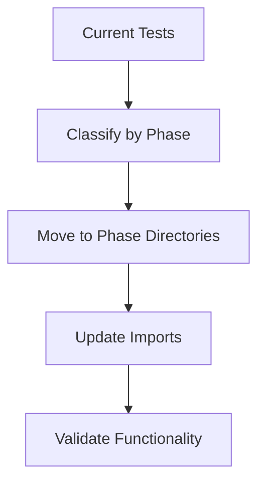
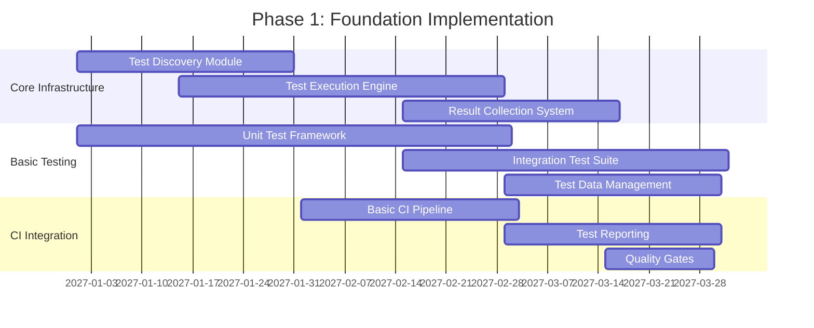
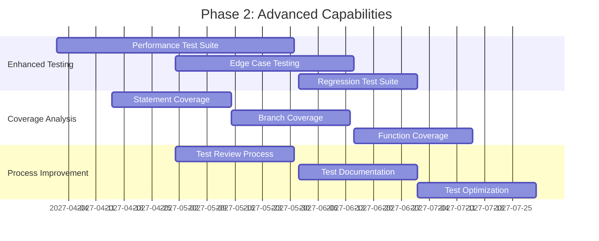
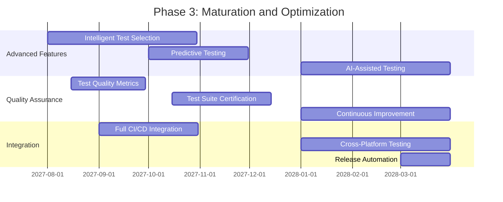
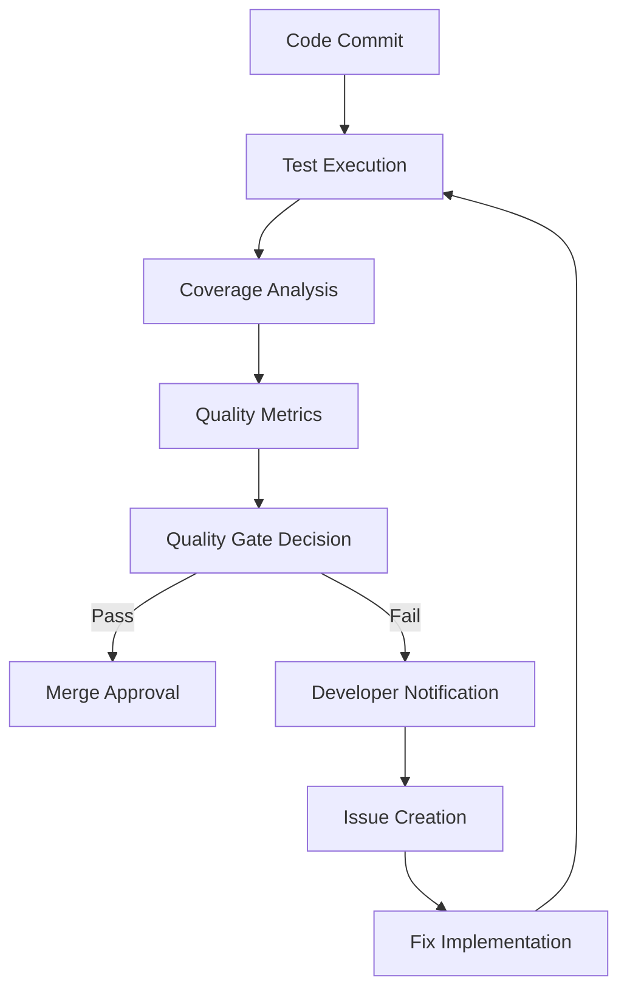
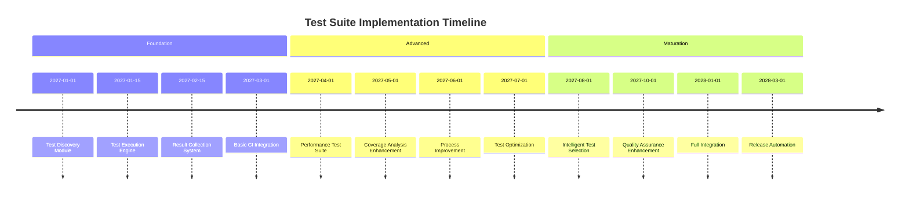
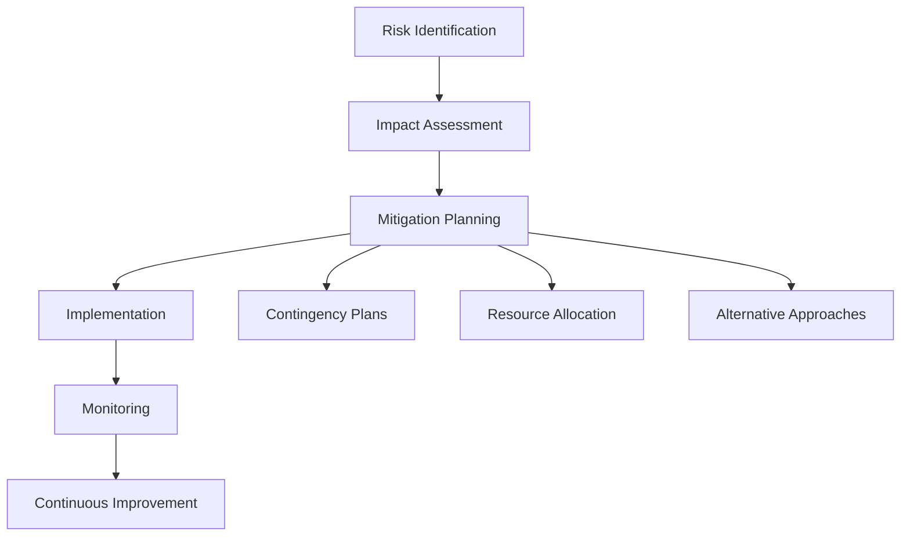

# Jue Test Suite Implementation Plan - Comprehensive Guide

## Executive Summary

This document provides a comprehensive implementation plan for the Jue test suite enhancement, combining both the high-level phase-based planning and the detailed technical implementation specifications. It serves as the definitive guide for transforming the Jue test suite according to the architectural design.

## Implementation Overview

### Phase 1: Foundation Setup (Week 1-2)

#### Step 1.1: Create Directory Structure
```bash
# Create main test directories
mkdir -p tests/shared_samples/parsing
mkdir -p tests/shared_samples/mir_ast
mkdir -p tests/shared_samples/compilation
mkdir -p tests/shared_samples/execution
mkdir -p tests/shared_samples/homoiconic

mkdir -p tests/phase_tests/1_parsing
mkdir -p tests/phase_tests/2_mir_ast
mkdir -p tests/phase_tests/3_compilation
mkdir -p tests/phase_tests/4_execution

mkdir -p tests/component_tests/juec
mkdir -p tests/component_tests/juerun
mkdir -p tests/component_tests/jue_common

mkdir -p tests/integration_tests
mkdir -p tests/performance_tests
mkdir -p tests/regression_tests
```

#### Step 1.2: Migrate Existing Tests


**Migration Plan:**
1. **Parsing Tests**: Move `test_binary_parsing.rs`, `debug_binary_parsing.rs` to `tests/phase_tests/1_parsing/`
2. **Compilation Tests**: Move `compile_tests.rs` to `tests/phase_tests/3_compilation/`
3. **Sample Files**: Organize `.jue` files into appropriate `shared_samples/` subdirectories

#### Step 1.3: Implement Test Discovery
```rust
// Example test discovery implementation
pub fn discover_tests() -> Vec<TestCase> {
    let mut tests = Vec::new();

    // Discover phase tests
    for phase in 1..=4 {
        let phase_dir = format!("tests/phase_tests/{}_*/test_*.rs", phase);
        tests.extend(discover_rust_tests(&phase_dir));
    }

    // Discover component tests
    tests.extend(discover_rust_tests("tests/component_tests/**/test_*.rs"));

    // Discover shared samples
    tests.extend(discover_jue_samples("tests/shared_samples/**/*.jue"));

    tests
}
```

### Phase 2: Phase-Specific Test Development (Week 3-4)

#### Step 2.1: Parsing Phase Tests
**Files to Create:**
- `tests/phase_tests/1_parsing/test_lexer.rs`
- `tests/phase_tests/1_parsing/test_parser.rs`
- `tests/phase_tests/1_parsing/test_syntax_validation.rs`

**Sample Files:**
- `tests/shared_samples/parsing/01_basic_syntax.jue`
- `tests/shared_samples/parsing/02_identifiers.jue`
- `tests/shared_samples/parsing/03_literals.jue`

#### Step 2.2: MIR AST Generation Tests
**Files to Create:**
- `tests/phase_tests/2_mir_ast/test_ast_generation.rs`
- `tests/phase_tests/2_mir_ast/test_semantic_analysis.rs`
- `tests/phase_tests/2_mir_ast/test_mir_lowering.rs`

**Sample Files:**
- `tests/shared_samples/mir_ast/10_simple_expressions.jue`
- `tests/shared_samples/mir_ast/11_control_flow.jue`

#### Step 2.3: Compilation Phase Tests
**Files to Create:**
- `tests/phase_tests/3_compilation/test_bytecode_gen.rs`
- `tests/phase_tests/3_compilation/test_cranelift_gen.rs`
- `tests/phase_tests/3_compilation/test_optimization.rs`

**Sample Files:**
- `tests/shared_samples/compilation/20_basic_program.jue`
- `tests/shared_samples/compilation/21_module_system.jue`

#### Step 2.4: Execution Phase Tests
**Files to Create:**
- `tests/phase_tests/4_execution/test_vm_execution.rs`
- `tests/phase_tests/4_execution/test_jit_execution.rs`
- `tests/phase_tests/4_execution/test_runtime_integration.rs`

**Sample Files:**
- `tests/shared_samples/execution/30_vm_execution.jue`
- `tests/shared_samples/execution/31_jit_execution.jue`

### Phase 3: Advanced Test Features (Week 5)

#### Step 3.1: Component-Specific Tests
**juec Tests:**
- `tests/component_tests/juec/test_frontend.rs`
- `tests/component_tests/juec/test_backend.rs`
- `tests/component_tests/juec/test_middle.rs`

**juerun Tests:**
- `tests/component_tests/juerun/test_vm.rs`
- `tests/component_tests/juerun/test_gc.rs`
- `tests/component_tests/juerun/test_jit.rs`

#### Step 3.2: Integration Tests
**Files to Create:**
- `tests/integration_tests/test_full_pipeline.rs`
- `tests/integration_tests/test_compiler_runtime.rs`
- `tests/integration_tests/test_module_system.rs`

#### Step 3.3: Performance and Regression Tests
**Performance Tests:**
- `tests/performance_tests/test_parsing_performance.rs`
- `tests/performance_tests/test_compilation_speed.rs`

**Regression Tests:**
- `tests/regression_tests/test_known_issues.rs`
- `tests/regression_tests/test_error_scenarios.rs`

### Phase 4: Future-Proofing (Week 6)

#### Step 4.1: Homoiconic Test Structure
**Files to Create:**
- `tests/shared_samples/homoiconic/40_ast_manipulation.jue`
- `tests/shared_samples/homoiconic/41_self_modifying.jue`

**Test Files:**
- `tests/phase_tests/4_execution/test_homoiconic_features.rs`

#### Step 4.2: Documentation and Maintenance
**Documentation Files:**
- `tests/README.md` - Test suite overview
- `tests/CONTRIBUTING.md` - Test contribution guidelines
- `tests/MAINTENANCE.md` - Test maintenance procedures

## Implementation Phases with Detailed Timeline

### Phase 1: Foundation Implementation


#### Implementation Details

1. **Test Discovery Module**
   - File system scanning implementation
   - Test file parsing and metadata extraction
   - Test index building and validation

2. **Test Execution Engine**
   - Test environment management
   - Test isolation mechanisms
   - Parallel execution framework

3. **Result Collection System**
   - Test result aggregation
   - Basic coverage calculation
   - Simple reporting format

### Phase 2: Advanced Capabilities


#### Implementation Details

1. **Performance Test Suite**
   - Benchmarking infrastructure
   - Performance metric collection
   - Baseline establishment and tracking

2. **Coverage Analysis Enhancement**
   - Multi-dimensional coverage tracking
   - Coverage visualization tools
   - Coverage gap identification

3. **Process Improvement**
   - Automated test review workflow
   - Documentation generation tools
   - Test effectiveness metrics

### Phase 3: Maturation and Optimization


#### Implementation Details

1. **Intelligent Test Selection**
   - Test impact analysis algorithms
   - Change-based test selection
   - Risk-based test prioritization

2. **Quality Assurance Enhancement**
   - Formal test quality certification
   - Automated test effectiveness analysis
   - Continuous test suite improvement

3. **Full Integration**
   - Complete CI/CD pipeline integration
   - Cross-platform test execution
   - Automated release validation

## Technical Implementation Details

### Test Runner Architecture
```rust
pub struct TestRunner {
    discovery: TestDiscovery,
    executor: TestExecutor,
    reporter: TestReporter,
}

impl TestRunner {
    pub fn new() -> Self {
        TestRunner {
            discovery: TestDiscovery::new(),
            executor: TestExecutor::new(),
            reporter: TestReporter::new(),
        }
    }

    pub fn run_all(&self) -> TestResult {
        let tests = self.discovery.discover();
        let results = self.executor.execute(tests);
        self.reporter.report(results)
    }
}
```

### Sample File Management System
```rust
pub struct SampleManager {
    samples: HashMap<SampleId, SampleFile>,
    metadata: HashMap<SampleId, SampleMetadata>,
}

impl SampleManager {
    pub fn load_samples(&mut self, path: &str) -> Result<()> {
        // Load all .jue files from shared_samples/
        // Parse metadata from file headers
        // Validate sample structure
    }

    pub fn get_sample(&self, id: SampleId) -> Option<&SampleFile> {
        self.samples.get(&id)
    }
}
```

### Phase Execution Engine
```rust
pub struct PhaseExecutor {
    current_phase: u8,
    phase_handlers: HashMap<u8, Box<dyn PhaseHandler>>,
}

impl PhaseExecutor {
    pub fn new() -> Self {
        let mut executor = PhaseExecutor {
            current_phase: 1,
            phase_handlers: HashMap::new(),
        };

        // Register phase handlers
        executor.register_phase(1, Box::new(ParsingPhaseHandler));
        executor.register_phase(2, Box::new(MirAstPhaseHandler));
        executor.register_phase(3, Box::new(CompilationPhaseHandler));
        executor.register_phase(4, Box::new(ExecutionPhaseHandler));

        executor
    }

    pub fn execute_phase(&mut self, phase: u8) -> PhaseResult {
        // Execute specific phase with dependencies
    }

    pub fn execute_all(&mut self) -> OverallResult {
        // Execute all phases in order
    }
}
```

### Test Discovery Implementation
```rust
/// Test discovery implementation specification
struct TestDiscoveryImpl {
    file_scanner: FileScanner,
    code_parser: CodeParser,
    test_index: TestIndex,
}

impl TestDiscoveryImpl {
    /// Implementation of test discovery process
    fn discover_tests(&mut self, root_path: &Path) -> Result<Vec<TestCase>> {
        // 1. Scan file system for test files
        let test_files = self.file_scanner.scan_directory(root_path)?;

        // 2. Parse each test file and extract metadata
        let mut test_cases = Vec::new();
        for file in test_files {
            let cases = self.code_parser.parse_file(&file)?;
            test_cases.extend(cases);
        }

        // 3. Build optimized test index
        self.test_index.build_index(test_cases.clone())?;

        // 4. Validate test structure and dependencies
        self.test_index.validate()?;

        Ok(test_cases)
    }
}
```

### Test Execution Implementation
```rust
/// Test execution implementation specification
struct TestExecutorImpl {
    environment_manager: EnvironmentManager,
    test_isolator: TestIsolator,
    result_collector: ResultCollector,
    parallel_executor: ParallelExecutor,
}

impl TestExecutorImpl {
    /// Implementation of test execution process
    fn execute_test_suite(&mut self, test_cases: Vec<TestCase>) -> SuiteResult {
        // 1. Initialize parallel execution environment
        self.parallel_executor.initialize(test_cases.len());

        // 2. Execute tests in parallel with proper isolation
        let results = self.parallel_executor.execute_parallel(
            test_cases,
            |test_case| {
                // Setup isolated environment
                let env = self.environment_manager.setup_environment()?;
                self.test_isolator.isolate_test(&env)?;

                // Execute test case
                let result = test_case.execute()?;

                // Cleanup environment
                self.environment_manager.cleanup_environment(env)?;

                Ok(result)
            }
        );

        // 3. Collect and aggregate results
        let suite_result = self.result_collector.collect_results(results);

        // 4. Generate comprehensive report
        suite_result.generate_report()
    }
}
```

## Resource Requirements

### Development Resources
| Resource Type       | Phase 1 | Phase 2 | Phase 3 | Total |
| ------------------- | ------- | ------- | ------- | ----- |
| Developer Hours     | 480     | 600     | 720     | 1800  |
| QA Hours            | 240     | 360     | 480     | 1080  |
| Documentation Hours | 120     | 180     | 240     | 540   |

### Infrastructure Requirements
| Infrastructure         | Phase 1  | Phase 2  | Phase 3  |
| ---------------------- | -------- | -------- | -------- |
| CI/CD Pipeline         | Basic    | Enhanced | Advanced |
| Test Execution Servers | 2        | 4        | 8        |
| Storage Requirements   | 50GB     | 100GB    | 200GB    |
| Network Bandwidth      | Standard | High     | Premium  |

## Migration Checklist
- [ ] Create directory structure
- [ ] Migrate existing parsing tests
- [ ] Migrate existing compilation tests
- [ ] Organize sample files
- [ ] Update test runner configuration
- [ ] Validate all tests pass
- [ ] Document new structure
- [ ] Create contribution guidelines

## Validation Plan

### Test Coverage Validation
```bash
# Run coverage analysis
cargo tarpaulin --out Xml

# Generate coverage report
cargo tarpaulin --out Html --output-dir coverage_report
```

### Performance Benchmarking
```rust
#[bench]
fn bench_parsing_performance(b: &mut Bencher) {
    let sample = load_sample("basic_syntax");
    b.iter(|| parse_sample(&sample));
}

#[bench]
fn bench_compilation_speed(b: &mut Bencher) {
    let ast = generate_ast();
    b.iter(|| compile_ast(&ast));
}
```

## Quality Assurance Plan

### Quality Metrics
| Metric          | Target         | Measurement Method          | Frequency  |
| --------------- | -------------- | --------------------------- | ---------- |
| Test Coverage   | 90%+           | Automated coverage analysis | Daily      |
| Test Pass Rate  | 98%+           | CI pipeline execution       | Per commit |
| Test Stability  | 99%+           | Test result consistency     | Weekly     |
| Test Efficiency | 120+ tests/min | Performance benchmarking    | Monthly    |

### Quality Gates


## Implementation Checklist

### Phase 1 Checklist
- [ ] Test discovery module implementation
- [ ] Basic test execution engine
- [ ] Simple result collection system
- [ ] Unit test framework setup
- [ ] Integration test suite foundation
- [ ] Basic CI pipeline integration
- [ ] Initial test reporting capabilities

### Phase 2 Checklist
- [ ] Performance test suite implementation
- [ ] Enhanced coverage analysis
- [ ] Test review process establishment
- [ ] Test documentation generation
- [ ] Test optimization framework
- [ ] Cross-platform testing support
- [ ] Advanced CI/CD integration

### Phase 3 Checklist
- [ ] Intelligent test selection algorithms
- [ ] Predictive testing capabilities
- [ ] AI-assisted test generation
- [ ] Formal quality certification
- [ ] Complete cross-platform support
- [ ] Automated release validation
- [ ] Continuous improvement framework

## Implementation Timeline


## Risk Assessment and Mitigation

### Risk Identification
| Risk Category          | Likelihood | Impact | Mitigation Strategy                          |
| ---------------------- | ---------- | ------ | -------------------------------------------- |
| Implementation Delays  | Medium     | High   | Agile planning, buffer time                  |
| Test Suite Complexity  | High       | Medium | Modular design, incremental implementation   |
| Performance Issues     | Medium     | High   | Early performance testing, optimization      |
| Integration Challenges | Medium     | Medium | Interface standardization, early integration |
| Resource Constraints   | Low        | High   | Priority allocation, phased implementation   |

### Mitigation Plan


## Success Metrics
1. **Organization**: 100% of tests categorized by phase and component
2. **Accessibility**: All test types can access shared samples
3. **Coverage**: 95%+ test coverage across all phases
4. **Performance**: Test execution time < 5 minutes for full suite
5. **Documentation**: Complete documentation for all test types
6. **Maintainability**: New tests can be added in < 10 minutes

## Detailed Timeline
| Week | Focus Area        | Key Deliverables                                           |
| ---- | ----------------- | ---------------------------------------------------------- |
| 1-2  | Foundation        | Directory structure, test discovery, basic migration       |
| 3-4  | Phase Tests       | Parsing, MIR AST, compilation, execution test suites       |
| 5    | Advanced Features | Component tests, integration tests, performance tests      |
| 6    | Future-Proofing   | Homoiconic structure, documentation, maintenance processes |

## Risk Assessment
| Risk                                                | Impact | Mitigation Strategy                                |
| --------------------------------------------------- | ------ | -------------------------------------------------- |
| Test migration breaks existing functionality        | High   | Incremental migration with validation at each step |
| Performance degradation from complex test structure | Medium | Optimize test discovery and execution engine       |
| Future feature requirements change                  | Medium | Modular design with clear extension points         |
| Test maintenance becomes burdensome                 | Low    | Comprehensive documentation and automation         |

## Conclusion

This comprehensive implementation plan combines both the high-level phase-based planning and the detailed technical implementation specifications for the Jue test suite enhancement. It provides a clear, phased approach that addresses all requirements while ensuring maintainability, scalability, and future extensibility for homoiconic features.

The integrated plan offers both the practical step-by-step migration guide and the detailed technical implementation specifications needed for successful execution of the comprehensive architectural design.