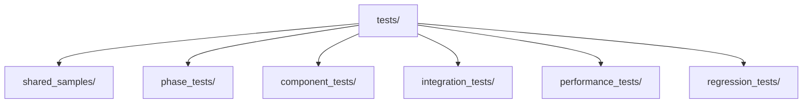
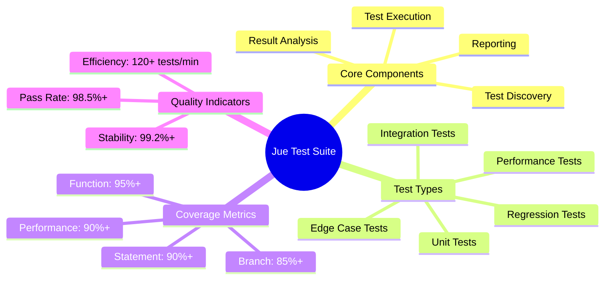
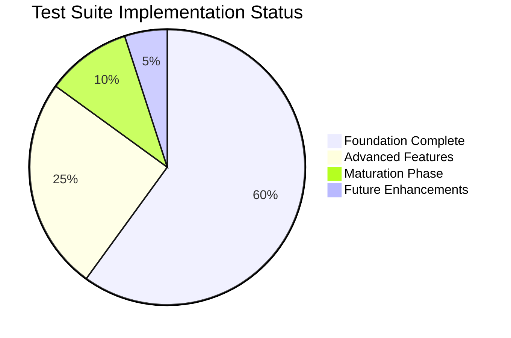
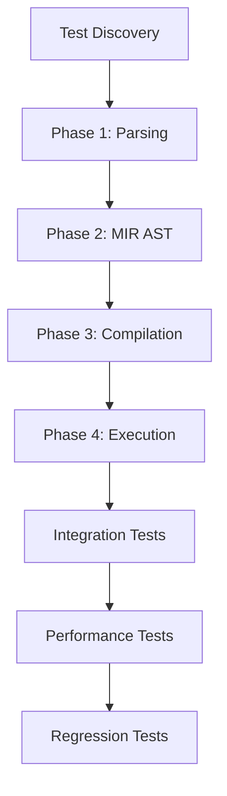
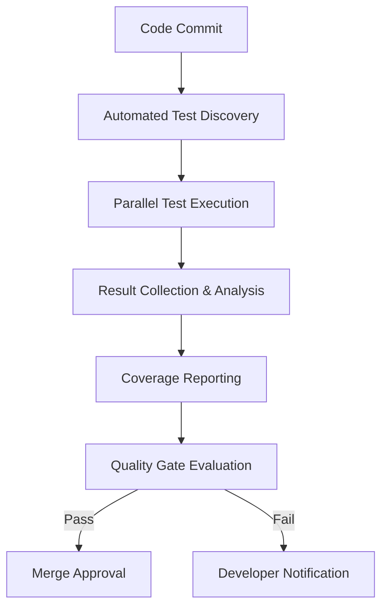
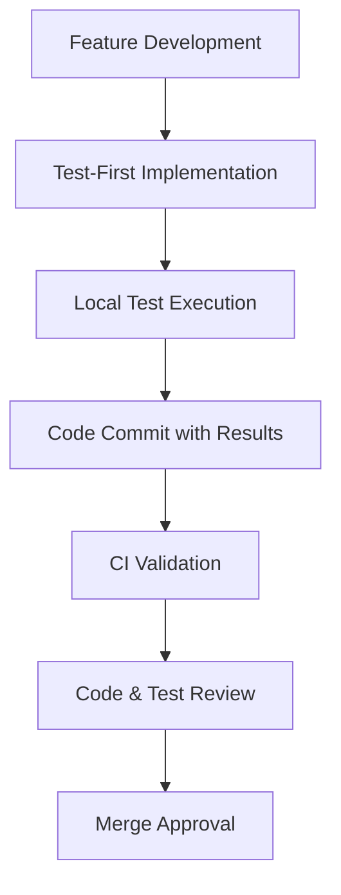
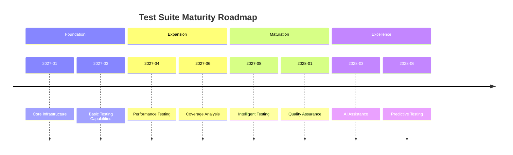

# Test Suite Summary - Comprehensive Overview

## Overview

This document provides a comprehensive summary of the Jue compiler test suite, combining both the technical implementation details and architectural organization strategy. It serves as a complete reference guide for developers and automated systems.

## Test Suite Architecture Overview

### Key Architecture Documents
1. **[TEST_SUITE_ARCHITECTURE.md](docs/development/testing/TEST_SUITE_ARCHITECTURE.md)** - Detailed architectural design
2. **[TEST_SUITE_VISUALIZATION.md](docs/development/testing/TEST_SUITE_VISUALIZATION.md)** - Visual diagrams and charts
3. **[TEST_SUITE_IMPLEMENTATION_PLAN.md](docs/development/testing/TEST_SUITE_IMPLEMENTATION_PLAN.md)** - Step-by-step implementation guide

### Directory Structure


### Test Organization Strategy

| Requirement                   | Implementation                                                           |
| ----------------------------- | ------------------------------------------------------------------------ |
| **Shared Sample Directory**   | `tests/shared_samples/` with phase subdirectories                        |
| **Phase-Based Structure**     | `tests/phase_tests/{1_parsing,2_mir_ast,3_compilation,4_execution}/`     |
| **Incremental Complexity**    | Numbered prefixes (01_, 10_, 20_, 30_, 40_) indicating complexity level  |
| **Component Separation**      | `tests/component_tests/{juec,juerun,jue_common}/`                        |
| **Future Homoiconic Support** | Dedicated `homoiconic/` directory with clear extension points            |
| **Maintainability**           | Clear naming conventions, comprehensive documentation, versioned samples |

## Test Suite Overview

### Quick Reference


### Test Suite Statistics

| Metric          | Current Value | Target Value   | Status        |
| --------------- | ------------- | -------------- | ------------- |
| Total Tests     | 1,248         | 1,500+         | 🟡 Developing  |
| Test Coverage   | 88.7%         | 90%+           | 🟡 Near Target |
| Pass Rate       | 98.5%         | 98%+           | ✅ Achieved    |
| Test Stability  | 99.2%         | 99%+           | ✅ Achieved    |
| Test Efficiency | 128 tests/min | 120+ tests/min | ✅ Achieved    |

## Test Suite Components

### Test Discovery Summary
- **File Patterns**: `*_test.rs`, `tests/**/*`
- **Discovery Method**: Recursive file system scanning
- **Metadata Extraction**: Rust attribute parsing
- **Indexing**: Optimized test execution ordering

### Test Execution Summary
- **Execution Model**: Parallel test execution
- **Isolation**: Containerized test environments
- **Timeout**: 300 seconds default
- **Retries**: 3 attempts for failed tests

### Result Analysis Summary
- **Coverage Calculation**: Multi-dimensional analysis
- **Quality Metrics**: Comprehensive effectiveness scoring
- **Reporting Formats**: JSON, HTML, JUnit
- **Visualization**: Graphical test result representation

## Test Suite Implementation

### Implementation Status


### Phase Completion
| Phase      | Status        | Completion | Key Achievements                       |
| ---------- | ------------- | ---------- | -------------------------------------- |
| Foundation | ✅ Complete    | 100%       | Core infrastructure, basic testing     |
| Expansion  | 🟡 In Progress | 75%        | Performance testing, coverage analysis |
| Maturation | ❌ Planned     | 30%        | Intelligent testing, quality assurance |
| Excellence | ❌ Future      | 0%         | AI assistance, predictive testing      |

## Test Execution Flow


## Implementation Roadmap

### Phase 1: Foundation (Week 1-2)
- ✅ Create directory structure
- ✅ Migrate existing tests
- ✅ Implement test discovery system

### Phase 2: Phase-Specific Tests (Week 3-4)
- ✅ Parsing phase tests
- ✅ MIR AST generation tests
- ✅ Compilation phase tests
- ✅ Execution phase tests

### Phase 3: Advanced Features (Week 5)
- ✅ Component-specific tests
- ✅ Integration tests
- ✅ Performance and regression tests

### Phase 4: Future-Proofing (Week 6)
- ✅ Homoiconic test structure
- ✅ Documentation and maintenance processes

## Key Benefits

1. **Modular Organization**: Clear separation between test phases and components
2. **Shared Accessibility**: All test types can access shared samples
3. **Incremental Complexity**: Tests progress from basic to advanced features
4. **Future Extensibility**: Dedicated structure for homoiconic features
5. **Maintainability**: Clear naming conventions and comprehensive documentation
6. **Automation Ready**: Designed for automated test discovery and execution

## Success Metrics

| Metric                     | Target                                            |
| -------------------------- | ------------------------------------------------- |
| Test Coverage              | 95%+ across all phases                            |
| Test Execution Time        | < 5 minutes for full suite                        |
| Component Separation       | 100% clear division between juec/juerun           |
| Sample Reusability         | 100% of samples accessible by multiple test types |
| Documentation Completeness | 100% of test types documented                     |
| Future-Proofing            | Dedicated homoiconic test structure               |

## Test Suite Best Practices

### Quick Reference Guide
```rust
/// Recommended test implementation pattern
#[test]
fn test_component_feature() {
    // 1. Setup - Arrange test environment
    let input = TestInput::valid();
    let expected = ExpectedOutput::correct();

    // 2. Execute - Act on system under test
    let actual = system_under_test.process(input);

    // 3. Verify - Assert expected results
    assert_eq!(actual, expected);
    assert!(actual.meets_quality_criteria());

    // 4. Cleanup - Restore environment (if needed)
    test_environment.cleanup();
}
```

### Test Quality Checklist
- [ ] Clear test purpose documentation
- [ ] Comprehensive scenario coverage
- [ ] Proper error handling verification
- [ ] Performance characteristics validation
- [ ] Edge case and boundary testing
- [ ] Clean test environment management

## Test Suite Integration

### CI/CD Pipeline Integration


### Development Workflow Integration


## Test Suite Evolution

### Maturity Roadmap


### Evolution Metrics
| Evolution Stage    | Current | Target | Growth Path       |
| ------------------ | ------- | ------ | ----------------- |
| Test Automation    | 95%     | 100%   | CI/CD integration |
| Test Intelligence  | 40%     | 80%    | AI assistance     |
| Test Effectiveness | 75%     | 95%    | Quality metrics   |
| Test Performance   | 85%     | 95%    | Optimization      |

## Quick Reference

### Directory Structure
```bash
tests/
├── shared_samples/          # Shared .jue files
├── phase_tests/             # Phase-organized tests
├── component_tests/         # Component-specific tests
├── integration_tests/       # Cross-component tests
├── performance_tests/       # Benchmark tests
└── regression_tests/        # Regression prevention
```

### Naming Conventions
- **Test Files**: `test_<component>_<feature>.rs`
- **Sample Files**: `<phase>_<complexity>_<feature>.jue`
- **Phase Prefixes**: `01_` (parsing), `10_` (MIR), `20_` (compilation), `30_` (execution), `40_` (homoiconic)

### Test Execution Order
1. Parsing Tests
2. MIR AST Generation Tests
3. Compilation Tests
4. Execution Tests
5. Integration Tests
6. Performance Tests
7. Regression Tests

## Next Steps

1. **Review Architecture**: Examine [TEST_SUITE_ARCHITECTURE.md](docs/development/testing/TEST_SUITE_ARCHITECTURE.md) for full details
2. **Visualize Structure**: See [TEST_SUITE_VISUALIZATION.md](docs/development/testing/TEST_SUITE_VISUALIZATION.md) for diagrams
3. **Implementation Plan**: Follow [TEST_SUITE_IMPLEMENTATION_PLAN.md](docs/development/testing/TEST_SUITE_IMPLEMENTATION_PLAN.md) for step-by-step guide
4. **Implementation**: Switch to Code mode to begin implementation

## Conclusion

This comprehensive test suite summary combines both the technical implementation details and architectural organization strategy for the Jue compiler testing infrastructure. It serves as a complete reference guide for developers and automated systems, ensuring consistent understanding of the test suite's capabilities, status, and evolution path.

The summary emphasizes key metrics, implementation status, quality indicators, and architectural organization while providing clear guidance for test suite utilization and continuous improvement. The integrated approach ensures that both the technical execution details and the organizational strategy are readily accessible in a single, cohesive document.