# Test Suite Visualization

## Overview

This document provides comprehensive visual representations of the Jue compiler test suite architecture, designed to serve as both a visual reference for developers and a structured guide for automated systems.

## Test Suite Architecture Visualization

### High-Level Architecture

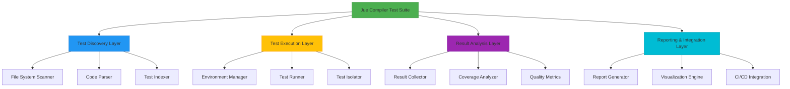

### Component Interaction Diagram

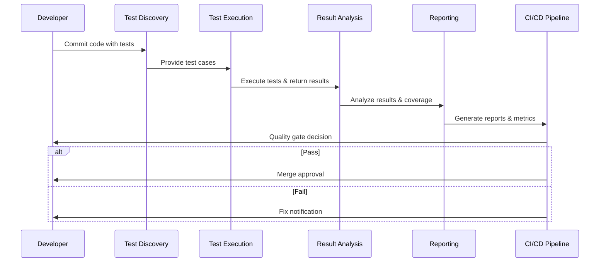

## Test Suite Data Flow

### Data Flow Architecture

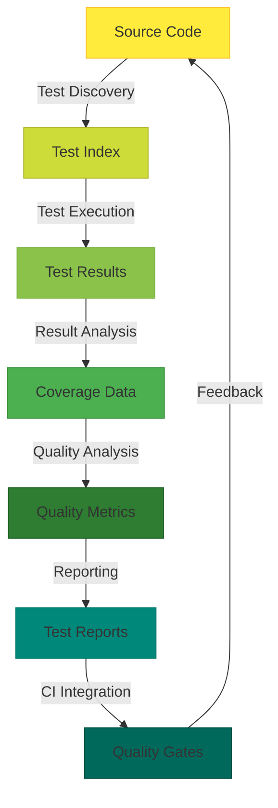

### Test Execution Flow

```mermaid
flowchart TD
    A[Test Discovery] --> B[Test Configuration]
    B --> C[Environment Setup]
    C --> D[Test Isolation]
    D --> E[Test Execution]
    E --> F[Result Collection]
    F --> G[Coverage Analysis]
    G --> H[Quality Metrics]
    H --> I[Report Generation]

    subgraph Parallel Execution
        E1[Test 1] --> F
        E2[Test 2] --> F
        E3[Test N] --> F
    end

    style A fill:#9E9E9E
    style B fill:#795548
    style C fill:#607D8B
    style D fill:#546E7A
    style E fill:#455A64
    style F fill:#37474F
    style G fill:#263238
    style H fill:#1A237E
    style I fill:#0D47A1
```

## Test Suite Metrics Visualization

### Coverage Metrics Dashboard

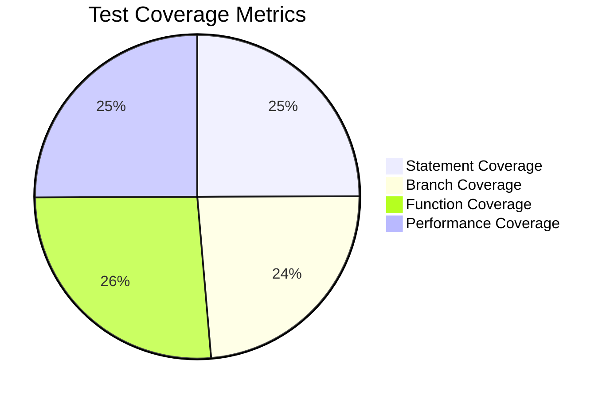

### Quality Metrics Dashboard

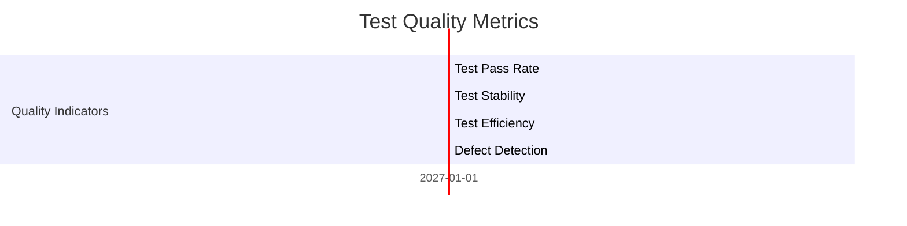

## Test Suite Evolution Visualization

### Maturity Timeline

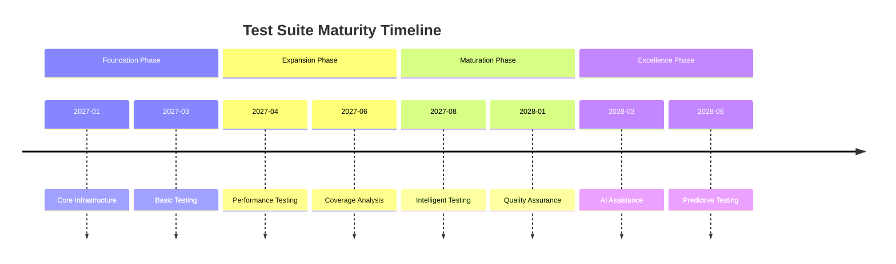

### Evolution Roadmap

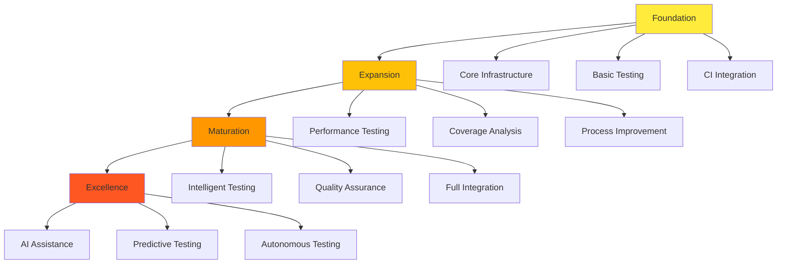

## Test Suite Integration Visualization

### CI/CD Pipeline Integration

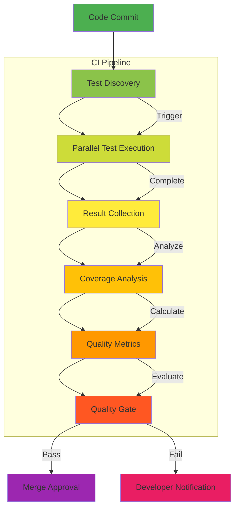

### Development Workflow Integration

```mermaid
graph TD
    A[Feature Development] --> B[Test-First Approach]
    B --> C[Local Test Execution]
    C --> D[Code Commit]
    D --> E[CI Validation]
    E --> F[Code Review]
    F --> G[Test Review]
    G --> H[Merge Approval]

    subgraph Development Cycle
        A -->|Implement| B
        B -->|Validate| C
        C -->|Verify| D
        D -->|Trigger| E
        E -->|Validate| F
        F -->|Review| G
        G -->|Approve| H
    end

    style A fill:#2196F3
    style B fill:#03A9F4
    style C fill:#00BCD4
    style D fill:#009688
    style E fill:#4CAF50
    style F fill:#8BC34A
    style G fill:#CDDC39
    style H fill:#FFC107
```

## Test Suite Quality Visualization

### Quality Metrics Dashboard

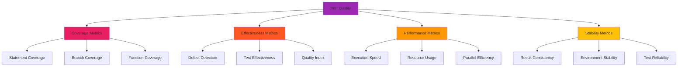

### Quality Assurance Process

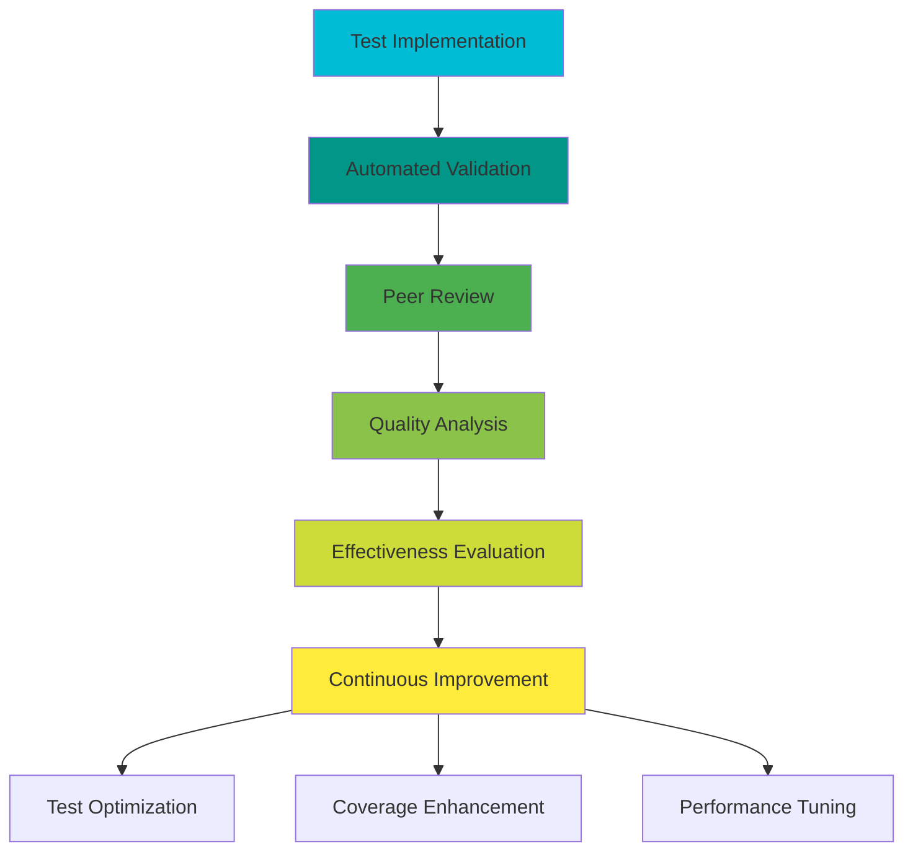

## Test Suite Best Practices Visualization

### Test Implementation Pattern

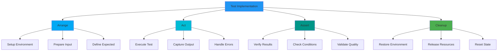

### Test Quality Checklist

```mermaid
graph TD
    A[Test Quality] --> B[Documentation]
    A --> C[Coverage]
    A --> D[Error Handling]
    A --> E[Performance]
    A --> F[Edge Cases]
    A --> G[Environment]

    B --> B1[Clear Purpose]
    B --> B2[Scope Definition]
    B --> B3[Limitations]

    C --> C1[Scenario Coverage]
    C --> C2[Boundary Testing]
    C --> C3[Error Conditions]

    D --> D1[Exception Handling]
    D --> D2[Error Recovery]
    D --> D3[Graceful Degradation]

    E --> E1[Execution Speed]
    E --> E2[Resource Usage]
    E --> E3[Scalability]

    F --> F1[Boundary Conditions]
    F --> F2[Invalid Inputs]
    F --> F3[Resource Limits]

    G --> G1[Clean Setup]
    G --> G2[Proper Cleanup]
    G --> G3[State Isolation]

    style A fill:#9C27B0
    style B fill:#E91E63
    style C fill:#FF5722
    style D fill:#FF9800
    style E fill:#FFC107
    style F fill:#CDDC39
    style G fill:#8BC34A
```

## Conclusion

This comprehensive test suite visualization document provides a complete set of visual representations for the Jue compiler testing infrastructure. The visualizations serve as both reference materials for developers and structured guides for automated systems, ensuring clear understanding of the test suite architecture, data flow, and evolution path.

The visualizations emphasize key architectural components, integration points, and quality metrics while providing intuitive representations of complex testing concepts and processes.