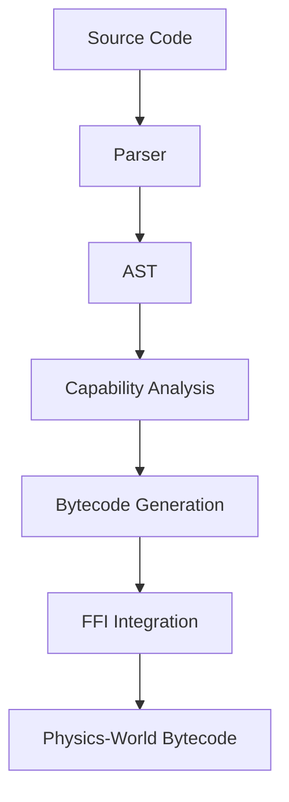

# Engineering Document: Integration Test Requirements

## Executive Summary

This document outlines the requirements for implementing the two failing integration tests in the Jue-World compiler. The tests are failing because they require advanced features that are not yet fully implemented in the compiler's capability system and FFI (Foreign Function Interface) handling.

## Analysis of Failing Tests

### 1. `test_capability_checking_integration`

**Test Code:**
```rust
let jue_code = "
    (:empirical
        (require-capability 'io-read-sensor)
        (let ((sensor-val (read-sensor)))
            (if (> sensor-val 50)
                \"high\"
                \"low\")))
";
```

**Requirements:**
- Parse and handle `require-capability` declarations
- Support FFI calls like `(read-sensor)`
- Generate capability checks in bytecode
- Create capability audit trails
- Handle trust tier annotations properly

### 2. `test_experimental_tier_sandboxed`

**Test Code:**
```rust
let jue_code = "
    (:experimental
        (require-capability 'macro-unsafe)
        (ffi-call 'some-function))
";
```

**Requirements:**
- Parse and handle `ffi-call` expressions
- Support Experimental tier sandboxing
- Generate capability checks for FFI calls
- Create capability audit trails for FFI operations

## Technical Requirements

### 1. Parser Enhancements

**Current State:**
- Parser can parse `require-capability` and `has-capability?` expressions
- Parser can parse trust tier annotations
- Parser does NOT handle `ffi-call` expressions

**Required Enhancements:**
- Add parsing support for `ffi-call` expressions
- Enhance AST to include FFI call nodes
- Update expression parser to handle FFI syntax

### 2. AST Enhancements

**Current State:**
- AST supports `RequireCapability` and `HasCapability` nodes
- AST supports `TrustTier` annotations
- AST does NOT have dedicated FFI call nodes

**Required Enhancements:**
- Add `FfiCall` node type to AST
- Update AST display formatting for FFI calls
- Ensure proper source location tracking

### 3. Capability Analysis Enhancements

**Current State:**
- Capability analysis can detect `require-capability` declarations
- Capability analysis can validate against trust tiers
- Capability analysis does NOT handle FFI calls

**Required Enhancements:**
- Add FFI call capability detection
- Map FFI function names to required capabilities
- Validate FFI calls against trust tier capabilities

### 4. Bytecode Generation Enhancements

**Current State:**
- Bytecode generation handles basic expressions
- Capability checking inserts `HasCap` opcodes
- Bytecode generation does NOT handle FFI calls

**Required Enhancements:**
- Add FFI call bytecode generation
- Generate `HostCall` opcodes with proper capability checks
- Handle argument marshaling for FFI calls

### 5. Capability FFI Integration

**Current State:**
- Capability FFI system exists with standard mappings
- FFI generator can create capability-mediated calls
- FFI system is NOT integrated with compiler

**Required Enhancements:**
- Integrate FFI generator with compiler pipeline
- Add FFI call validation during compilation
- Generate proper capability checks for FFI calls

## Architecture and Design Considerations

### Layered Architecture



### Key Design Decisions

1. **FFI Call Representation:**
   - Use dedicated `FfiCall` AST node type
   - Store function name and arguments separately
   - Include source location for error reporting

2. **Capability Mapping:**
   - Maintain mapping from FFI function names to capabilities
   - Use standard capability mapping from FFI generator
   - Allow custom capability mappings for extensibility

3. **Bytecode Generation:**
   - Generate `HostCall` opcode for FFI calls
   - Insert capability checks before FFI calls
   - Handle argument marshaling and stack setup

4. **Error Handling:**
   - Provide clear error messages for missing capabilities
   - Validate FFI calls at compile time
   - Generate capability audit trails for debugging

## Implementation Plan

### Phase 1: Parser and AST Enhancements (2-3 days)

**Tasks:**
1. Add `FfiCall` variant to `AstNode` enum
2. Implement parsing for `ffi-call` expressions
3. Update AST display formatting
4. Add test cases for FFI parsing

**Dependencies:**
- Existing parser infrastructure
- AST node structure

### Phase 2: Capability Analysis Integration (1-2 days)

**Tasks:**
1. Extend capability analysis to handle FFI calls
2. Add FFI function to capability mapping
3. Integrate with existing capability validation
4. Add test cases for FFI capability analysis

**Dependencies:**
- Capability analysis module
- Trust tier validation

### Phase 3: Bytecode Generation (2-3 days)

**Tasks:**
1. Add FFI call bytecode generation
2. Implement argument marshaling
3. Generate capability checks for FFI calls
4. Add test cases for FFI bytecode generation

**Dependencies:**
- Bytecode generation infrastructure
- Capability checking module

### Phase 4: FFI Integration (1-2 days)

**Tasks:**
1. Integrate FFI generator with compiler
2. Add FFI call validation
3. Generate capability audit trails
4. Add test cases for FFI integration

**Dependencies:**
- Capability FFI generator
- Compiler pipeline

### Phase 5: Testing and Validation (2 days)

**Tasks:**
1. Fix existing integration tests
2. Add comprehensive test coverage
3. Validate capability checking
4. Test sandboxing behavior

**Dependencies:**
- All previous phases

## Dependencies and Integration Points

### Internal Dependencies

1. **Parser Module:**
   - Must recognize `ffi-call` syntax
   - Must create proper AST nodes

2. **AST Module:**
   - Must support `FfiCall` node type
   - Must provide proper display formatting

3. **Capability Analysis:**
   - Must detect FFI call capabilities
   - Must validate against trust tiers

4. **Bytecode Generation:**
   - Must generate FFI call bytecode
   - Must insert capability checks

5. **FFI Generator:**
   - Must provide capability mappings
   - Must generate capability-mediated calls

### External Dependencies

1. **Physics-World:**
   - `HostCall` opcode support
   - Capability checking opcodes
   - Host function definitions

2. **Core-World:**
   - Trust tier definitions
   - Capability definitions

## Testing Strategy

### Unit Testing

1. **Parser Tests:**
   - Test FFI call parsing
   - Test capability declaration parsing
   - Test trust tier parsing

2. **AST Tests:**
   - Test FFI call node creation
   - Test AST display formatting
   - Test source location tracking

3. **Capability Analysis Tests:**
   - Test FFI capability detection
   - Test trust tier validation
   - Test capability mapping

4. **Bytecode Generation Tests:**
   - Test FFI call bytecode generation
   - Test capability check insertion
   - Test argument marshaling

### Integration Testing

1. **End-to-End Tests:**
   - Test complete compilation pipeline
   - Test capability checking integration
   - Test FFI call execution

2. **Trust Tier Tests:**
   - Test Formal tier (no FFI)
   - Test Empirical tier (limited FFI)
   - Test Experimental tier (full FFI)

3. **Error Handling Tests:**
   - Test missing capability errors
   - Test invalid FFI function errors
   - Test trust tier violation errors

### Regression Testing

1. **Existing Functionality:**
   - Ensure existing tests still pass
   - Test backward compatibility
   - Test performance impact

## Error Handling and Debugging

### Error Messages

1. **Missing Capability:**
   ```
   Capability {:?} not granted for trust tier {:?}
   ```

2. **Invalid FFI Function:**
   ```
   FFI function {} not found
   ```

3. **Trust Tier Violation:**
   ```
   FFI call to {} requires capability {:?} not granted for trust tier {:?}
   ```

### Debugging Support

1. **Capability Audit Trails:**
   - Track capability checks
   - Record check types (static/runtime)
   - Include source locations

2. **FFI Call Logging:**
   - Log FFI function calls
   - Record capability requirements
   - Track argument values

3. **Bytecode Inspection:**
   - Dump generated bytecode
   - Highlight capability checks
   - Show FFI call sequences

## Performance Considerations

### Compilation Performance

1. **Parsing Overhead:**
   - Minimal impact from FFI parsing
   - Use efficient token matching

2. **Capability Analysis:**
   - Cache capability mappings
   - Use hash-based lookups

3. **Bytecode Generation:**
   - Optimize argument marshaling
   - Minimize capability check overhead

### Runtime Performance

1. **Capability Checks:**
   - Use efficient `HasCap` opcode
   - Minimize runtime validation

2. **FFI Calls:**
   - Optimize argument passing
   - Reduce context switching

3. **Sandboxing:**
   - Efficient capability validation
   - Minimal overhead for trusted code

## Security Considerations

### Capability Safety

1. **Trust Tier Enforcement:**
   - Strict capability validation
   - No capability escalation

2. **FFI Call Safety:**
   - Validate all FFI calls
   - Prevent unauthorized access

3. **Sandboxing:**
   - Isolate experimental code
   - Prevent system access

### Error Handling Safety

1. **Fail-Secure:**
   - Deny by default
   - Explicit capability grants

2. **Audit Trails:**
   - Comprehensive logging
   - Capability check tracking

3. **Validation:**
   - Compile-time checks
   - Runtime verification

## Documentation Requirements

### Code Documentation

1. **API Documentation:**
   - Document new FFI functions
   - Update capability documentation

2. **Module Documentation:**
   - Document FFI integration
   - Update compiler documentation

3. **Example Code:**
   - Add FFI usage examples
   - Update capability examples

### User Documentation

1. **Language Reference:**
   - Document `ffi-call` syntax
   - Update capability documentation

2. **Tutorials:**
   - Add FFI usage tutorial
   - Update capability tutorial

3. **Error Reference:**
   - Document FFI error messages
   - Update capability error messages

## Implementation Timeline

| Phase                  | Duration      | Tasks                         |
| ---------------------- | ------------- | ----------------------------- |
| 1. Parser/AST          | 2-3 days      | FFI parsing, AST enhancements |
| 2. Capability Analysis | 1-2 days      | FFI capability detection      |
| 3. Bytecode Generation | 2-3 days      | FFI bytecode generation       |
| 4. FFI Integration     | 1-2 days      | Compiler integration          |
| 5. Testing             | 2 days        | Test coverage, validation     |
| **Total**              | **8-12 days** | **Full implementation**       |

## Risk Assessment

### Technical Risks

1. **Complexity:**
   - FFI integration complexity
   - Capability system interactions

2. **Performance:**
   - Compilation time impact
   - Runtime overhead

3. **Compatibility:**
   - Backward compatibility
   - Existing code impact

### Mitigation Strategies

1. **Incremental Development:**
   - Phase-based implementation
   - Continuous testing

2. **Performance Optimization:**
   - Profile compilation
   - Optimize hot paths

3. **Compatibility Testing:**
   - Regression testing
   - Backward compatibility checks

## Conclusion

This engineering document provides a comprehensive plan for implementing the missing features required by the failing integration tests. The implementation will enhance the Jue-World compiler with full FFI support, capability-mediated FFI calls, and comprehensive capability checking across all trust tiers.

The phased approach ensures incremental progress with continuous validation, while the comprehensive testing strategy guarantees reliability and security. The implementation will enable the Jue-World compiler to handle complex capability scenarios and FFI operations while maintaining the safety guarantees of the trust tier system.