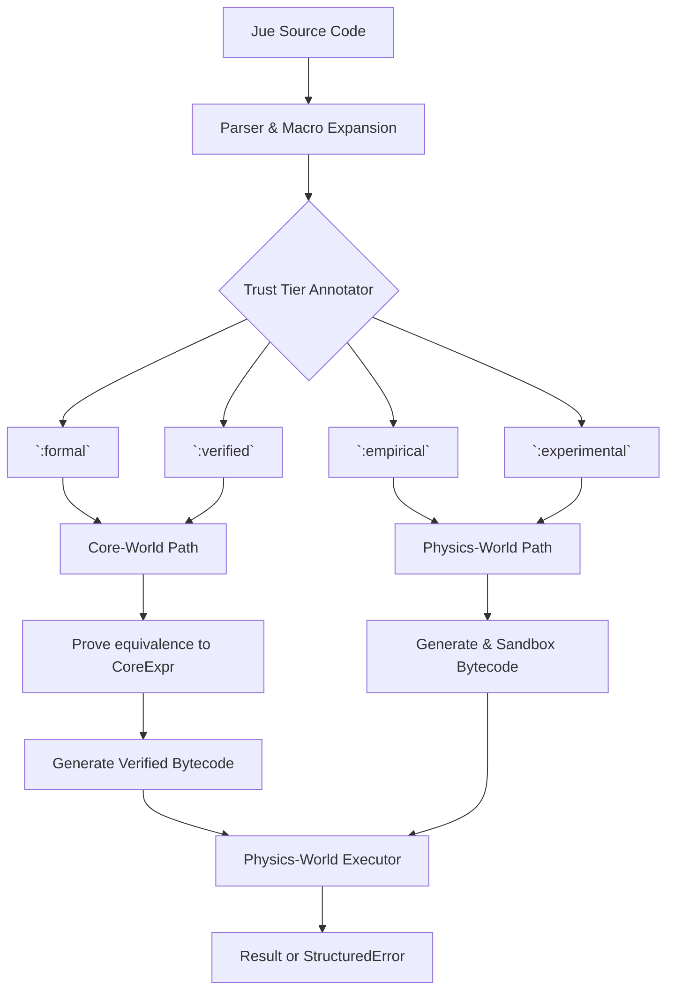

# Jue-World V2.0 Implementation Plan

## Overview

This document outlines the complete implementation plan for Jue-World v2.0, which transforms Jue from a dual-interpretation language into a **capability-aware compiler bridge**. The implementation must strictly adhere to the v2.0 specification and integrate with the existing Physics-World capability system.

## Architecture Overview



## Core Components

### 1. Directory Structure

```
jue_world/
├── Cargo.toml
├── src/
│   ├── lib.rs                # Public API
│   ├── ast.rs                # Abstract Syntax Tree
│   ├── parser.rs             # Parser implementation
│   ├── compiler.rs           # Main compilation pipeline
│   ├── type_system.rs        # Capability-aware types
│   ├── macro_system.rs       # Macro expansion
│   ├── trust_tier.rs         # Trust tier definitions
│   ├── error.rs              # Error handling
│   ├── comptime.rs           # Compile-time execution
│   ├── ffi.rs                # Foreign function interface
│   └── integration/          # Integration modules
│       ├── core.rs           # Core-World integration
│       └── physics.rs        # Physics-World integration
└── tests/                    # Test suite
```

### 2. Core Data Structures

#### TrustTier Enum
```rust
pub enum TrustTier {
    Formal,
    Verified,
    Empirical,
    Experimental
}
```

#### CompilationResult Struct
```rust
pub struct CompilationResult {
    pub bytecode: Vec<physics_world::OpCode>,
    pub constants: Vec<physics_world::Value>,
    pub step_limit: u64,
    pub memory_limit: usize,

    // Formal path results
    pub core_proof: Option<core_world::Proof>,
    pub core_expr: Option<core_world::CoreExpr>,

    // Capability information
    pub required_capabilities: Vec<Capability>,
    pub granted_capabilities: Vec<Capability>,

    // Empirical path results
    pub empirical_check: EmpiricalResult,
    pub sandboxed: bool,

    // Debug information
    pub source_map: SourceMap,
    pub capability_audit: Vec<CapabilityCheck>,
}
```

### 3. Capability-Aware Type System

The type system must integrate with Physics-World capabilities:

```rust
pub struct TypeSignature {
    pub name: String,
    pub parameters: Vec<Type>,
    pub return_type: Box<Type>,
    pub required_capabilities: Vec<Capability>,
    pub proof_obligation: Option<String>,
    pub error_handling: ErrorHandlingStrategy,
}

pub enum ErrorHandlingStrategy {
    Proof,       // Formal tier - proven correct
    Static,      // Verified tier - static contracts
    Runtime,     // Empirical tier - runtime checks
    Documentation, // Experimental tier - no checks
}
```

### 4. Macro System with Capability Requirements

```rust
pub struct MacroDefinition {
    pub name: String,
    pub parameters: Vec<String>,
    pub body: AstNode,
    pub required_capabilities: Vec<Capability>,
    pub declared_tier: TrustTier,
    pub is_hygienic: bool,
}

pub struct MacroContext {
    pub caller_capabilities: Vec<Capability>,
    pub expansion_capabilities: Vec<Capability>,
    pub tier: TrustTier,
    pub hygiene_scope: HygieneScope,
}
```

## Implementation Phases

### Phase 1: Core Infrastructure

**Task 1.1: Create Jue-World Directory Structure**
- Set up Cargo.toml with dependencies on core_world and physics_world
- Create basic module structure

**Task 1.2: Implement Core Data Structures**
- TrustTier enum with capability grant definitions
- CompilationResult struct with all required fields
- SourceMap and CapabilityCheck structures

**Task 1.3: Implement AST and Parser**
- Abstract Syntax Tree for Jue language
- Parser for basic Jue syntax including capability declarations
- Support for trust tier annotations

### Phase 2: Capability Integration

**Task 2.1: Implement Capability-Aware Type System**
- TypeSignature struct with capability requirements
- Type checking logic for each trust tier
- Capability validation against tier grants

**Task 2.2: Implement Macro System**
- MacroDefinition with capability declarations
- Macro expansion with capability inheritance
- Hygiene and scope management

**Task 2.3: Implement Error Handling**
- In-world errors (recoverable)
- Boundary violations (fatal)
- Capability-based error inspection

### Phase 3: Compilation Pipeline

**Task 3.1: Implement Trust Tier Routing**
- Parse trust tier annotations
- Validate capability requirements against tier
- Route to appropriate compilation path

**Task 3.2: Implement Core-World Integration**
- Compile to CoreExpr for formal/verified tiers
- Generate proof obligations
- Verify equivalence proofs

**Task 3.3: Implement Physics-World Integration**
- Generate bytecode for empirical/experimental tiers
- Insert runtime capability checks
- Sandbox wrapper for experimental tier

### Phase 4: Advanced Features

**Task 4.1: Implement Comptime Execution**
- ComptimeEnv with restricted capabilities
- Sandboxed compile-time evaluation
- Resource limit enforcement

**Task 4.2: Implement FFI and Host Calls**
- Capability-mediated foreign functions
- HostCall opcode generation
- Runtime capability checking

**Task 4.3: Implement Public API**
- compile() function with full signature
- Error types and capability violations
- Integration with Physics-World scheduler

## Critical Integration Points

### 1. Physics-World Capability System

Jue-World must integrate with the existing Physics-World capability system:

- Use `physics_world::Capability` enum
- Generate `physics_world::OpCode::HasCap` instructions
- Handle `physics_world::StructuredError` for capability violations

### 2. Core-World Integration

For formal/verified tiers:
- Generate `core_world::CoreExpr` representations
- Create `core_world::Proof` obligations
- Verify proofs using Core-World kernel

### 3. Compilation Pipeline Flow

```rust
pub fn compile(
    source: &str,
    tier: TrustTier,
    default_step_limit: u64,
    default_mem_limit: usize,
) -> Result<CompilationResult, CompilationError> {
    // 1. Parse source to AST
    let ast = parse(source)?;

    // 2. Expand macros (with capability checking)
    let expanded_ast = expand_macros(ast, tier)?;

    // 3. Analyze capability requirements
    let required_caps = analyze_capabilities(&expanded_ast)?;

    // 4. Verify tier allows required capabilities
    validate_tier_capabilities(tier, &required_caps)?;

    // 5. Based on tier:
    match tier {
        Formal | Verified => compile_to_core_and_verify(expanded_ast, tier),
        Empirical | Experimental => compile_to_physics_with_checks(expanded_ast, tier),
    }

    // 6. Package results with capability audit trail
}
```

## Testing Strategy

### Unit Tests
- Parser correctness for capability syntax
- Type system validation
- Macro expansion with capability inheritance
- Trust tier routing logic

### Integration Tests
- Core-World proof generation and verification
- Physics-World bytecode generation with capability checks
- Comptime execution with restricted capabilities
- FFI with capability mediation

### Critical Integration Test

```rust
#[test]
fn test_capability_aware_compilation() {
    let jue = "
      (:empirical
        (require-capability 'io-read-sensor)
        (let ((sensor-val (read-sensor)))
          (if (> sensor-val 50)
              \"high\"
              \"low\")))
    ";

    // 1. Compile in Jue-World (empirical path)
    let compiled = jue_world::compile(jue, Empirical, 1000, 1024).unwrap();

    // 2. Verify capability requirements were analyzed
    assert_eq!(compiled.required_capabilities, vec![IoReadSensor]);
    assert_eq!(compiled.granted_capabilities, vec![IoReadSensor]);

    // 3. Verify runtime capability checks were inserted
    assert!(compiled.bytecode.contains(&OpCode::HasCap(/* sensor cap */)));

    // 4. Execute in Physics-World (with capability grant)
    let mut physics = PhysicsWorld::new();
    physics.grant_capability(1, IoReadSensor, "test sensor");
    let result = physics.execute_actor(1, compiled.bytecode, ...);

    // 5. Verify structured error if capability missing
    physics.revoke_capability(1, IoReadSensor);
    let result2 = physics.execute_actor(1, compiled.bytecode, ...);
    assert!(matches!(result2.error, Some(StructuredError::MissingCapability { .. })));
}
```

## Backward Compatibility

### Compatibility Strategy
- Maintain basic Jue syntax compatibility
- Provide migration path for existing code
- Add capability annotations as optional enhancements
- Support legacy trust tier system with defaults

### Migration Path
1. **Phase 1**: Existing code runs in `:empirical` tier by default
2. **Phase 2**: Add capability annotations incrementally
3. **Phase 3**: Promote proven code to `:formal` or `:verified` tiers

## Implementation Timeline

| Phase                     | Duration | Tasks                                         |
| ------------------------- | -------- | --------------------------------------------- |
| 1. Core Infrastructure    | 2-3 days | Directory setup, data structures, AST, parser |
| 2. Capability Integration | 3-4 days | Type system, macros, error handling           |
| 3. Compilation Pipeline   | 4-5 days | Trust tier routing, Core/Physics integration  |
| 4. Advanced Features      | 3-4 days | Comptime, FFI, public API                     |
| 5. Testing & Validation   | 2-3 days | Unit tests, integration tests, critical test  |
| 6. Documentation          | 1-2 days | API documentation, examples, migration guide  |

## Success Criteria

1. **Specification Compliance**: All requirements from jue_spec_v2.0.md implemented
2. **Critical Test Passes**: The capability-aware compilation test succeeds
3. **Integration Complete**: Works with Core-World and Physics-World
4. **Performance Acceptable**: Compilation time within reasonable bounds
5. **Documentation Complete**: API documented and examples provided

## Risk Assessment

| Risk                           | Mitigation Strategy                                     |
| ------------------------------ | ------------------------------------------------------- |
| Complex capability integration | Start with simple cases, build complexity incrementally |
| Performance issues             | Profile early, optimize hot paths                       |
| Specification ambiguity        | Regular review against spec, clarify with stakeholders  |
| Integration challenges         | Early integration testing, mock dependencies initially  |

This plan provides a comprehensive roadmap for implementing Jue-World v2.0 with strict adherence to the capability-enforced runtime model specified in the v2.0 documentation.