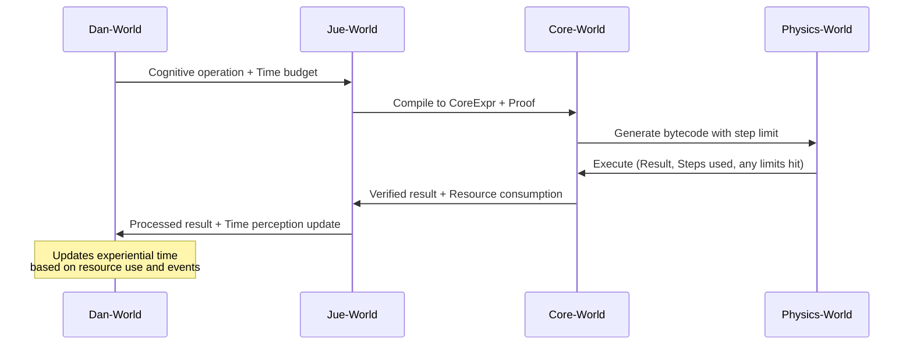

**12. Time: global, local, or emergent?**
You’ve banished time from Core-World, correctly. But physics needs *some* notion of time. Is it:
• a global tick
• agent-relative
• emergent from interactions?

If time leaks upward incorrectly, you’ll re-introduce execution order as meaning.

---
12. Time: global, local, or emergent?
This is the most philosophically deep question. Let's approach it systematically.

The Time Hierarchy
We need three distinct notions of time, each serving a different purpose:

1. Physics Time: Global, Discrete Steps
rust
// In the Rust VM
struct VMState {
    global_step: u64,  // Monotonically increasing counter
    step_budget: Option<u64>,  // For time slicing
}
Purpose: Ensure determinism and fair scheduling

Properties: Global, discrete, monotonic

Visibility: Hidden from higher layers (an implementation detail)

2. Runtime Time: Resource-Accounted "Effort"
jue
// In Jue-World
record ResourceTime {
    steps_consumed: u64,
    memory_seconds: f64,  // Memory-time product
    opportunity_cost: EstimatedValue,
}
Purpose: Track computational cost for AIKR reasoning

Properties: Local to each computation, convertible between contexts

Visibility: Available to Dan-World for planning and optimization

3. Experiential Time: Emergent from Event Processing
jue
// In Dan-World
record ExperientialTime {
    event_count: u64,
    significant_events: List<Event>,
    subjective_duration: Float,  // Based on prediction density
    narrative_coherence: Float,
}
Purpose: Support temporal reasoning, causality, memory

Properties: Subjective, event-based, non-uniform

Visibility: What Dan actually experiences as "time"

How This Avoids Contamination
The key insight: Don't banish time—compartmentalize it.

text
Core-World:         Timeless (only logical dependencies)
Jue-World:          Resource time (cost accounting)
Dan-World:          Experiential time (subjective, narrative)
Physics-World:      Step time (implementation mechanism)
Crucially: Core-World remains timeless because its semantics are relations between values, not processes. The expression (f x) means "the value obtained by applying f to x," not "the computation that happens when you evaluate f on x."

Architectural Implementation
rust
// Physics-World (Rust)
impl VM {
    fn execute(&mut self, bytecode: &[Byte], step_limit: u64) -> (VMResult, u64) {
        // Returns result and actual steps used
    }
}

// Jue-World Compiler
fn compile_with_budget(jue_expr: Expr, time_budget: ResourceTime) -> (Bytecode, Proof) {
    // Generates code optimized for given budget
    // Proof ensures semantics preserved regardless of actual steps taken
}

// Dan-World Experience
fn perceive_time(events: &[Event], predictions: &[Prediction]) -> ExperientialTime {
    // Subjective time = f(event_novelty, prediction_errors, narrative_coherence)
}
Revised Cross-Layer Integration
Based on these answers:

Summary of Physics-World Clarifications
It's a discrete, symbolic runtime, not a physical simulator. Rename to avoid confusion.

It enforces limits with explicit, structured feedback, enabling causal learning about constraints.

Time is multi-faceted:

Physics: Global steps (implementation detail)

Runtime: Resource accounting (AIKR)

Experience: Event-based narrative (subjective)

Critical Guarantee: No layer confuses one kind of time for another. Core-World semantics remain timeless; execution time is a separate concern.

This architecture allows Dan to:

Reason about causality and temporal sequences

Experience subjective time passing

Learn its own computational limits

Plan within resource constraints

Maintain timeless logical foundations

All while ensuring deterministic execution for reproducibility and debugging.

