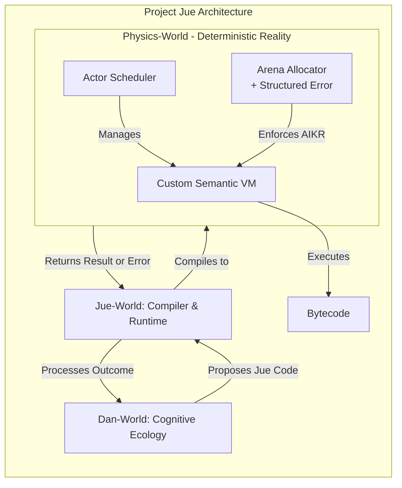

The critical insight is that Project Jue does not need a VM imitating physical hardware (MMUs, motherboards). Instead, it requires a *semantic* VM—a minimal runtime executing Jue's high-level concepts (lambda application, closure management, message passing).

Writing a custom semantic VM is the cleanest approach. The complexity of V8/JVM stems from supporting complex languages on real hardware. This task is more focused: implement a simple, stack-based or register-based interpreter for a purpose-designed instruction set.

Let's outline what this would look like.

### 🧱 The Anatomy of a Jue Semantic VM
Forget registers and hardware interrupts. Think of your VM as a function that processes an array of instructions, managing a stack, a constant pool, and a heap for closures/messages.

**1. Core Components of the VM State:**
```rust
struct VmState {
    // Execution
    pub instructions: Vec<OpCode>,
    pub ip: usize, // Instruction Pointer
    
    // Data
    pub stack: Vec<Value>,
    pub constants: Vec<Value>, // For literals like numbers, symbols
    
    // Environment & Memory
    pub environments: Vec<Env>, // For closure captures
    pub heap: Arena<Closure>,   // Arena allocator for long-lived data
    
    // Concurrency & AIKR
    pub actor_mailbox: Vec<Message>,
    pub step_counter: u64,
    pub step_limit: u64,
}
```

**2. A Semantic Instruction Set (Example):**
Your instructions wouldn't be `ADD R1, R2`. They'd be direct representations of Jue operations:
```rust
enum OpCode {
    // Core λ-calculus
    MakeClosure(usize), // index into constants for code, captures env
    Call(usize),        // number of args
    Return,
    
    // Primitives & Data
    LoadConst(usize),   // push constant onto stack
    LoadSymbol(usize),
    Cons,               // combine two values into a pair
    Car, Cdr,           // get first/second of pair
    
    // Control Flow
    Jump(usize),
    JumpIfFalse(usize),
    
    // State & Communication (for Dan-World actors)
    SendMessage(usize), // target actor, message on stack
    Yield,              // give control back to scheduler
    CheckResourceLimit, // throws StructuredError if step_counter > limit
}
```

**3. The Execution Loop (Simplified):**
```rust
fn interpret(state: &mut VmState) -> Result<Value, StructuredError> {
    loop {
        state.step_counter += 1;
        if state.step_counter > state.step_limit {
            return Err(StructuredError::CpuLimitExceeded);
        }
        
        match state.instructions[state.ip] {
            OpCode::LoadConst(idx) => {
                state.stack.push(state.constants[idx].clone());
                state.ip += 1;
            }
            OpCode::MakeClosure(code_idx) => {
                let captured_env = current_environment(&state);
                let closure = Closure::new(code_idx, captured_env);
                let heap_ptr = state.heap.allocate(closure);
                state.stack.push(Value::Closure(heap_ptr));
                state.ip += 1;
            }
            OpCode::Call(arg_count) => {
                // Pop closure and args, set up new call frame, jump
                execute_call(state, arg_count)?;
            }
            OpCode::Yield => {
                return Ok(Value::YieldFlag); // Scheduler will resume later
            }
            // ... other opcodes
        }
    }
}
```

### ✅ How This Meets Your Requirements

| Requirement           | How a Custom Semantic VM Addresses It                                                                                                                                                                    |
| :-------------------- | :------------------------------------------------------------------------------------------------------------------------------------------------------------------------------------------------------- |
| **Determinism**       | Trivial. The interpreter loop is a pure function of `VmState`. No threads, no system calls.                                                                                                              |
| **Introspection**     | Perfect. The entire state (`stack`, `ip`, `heap`) is inspectable at every step. You can log a complete trace.                                                                                            |
| **Performance**       | **Good enough & predictable.** A well-tuned semantic interpreter (using `match` on enums, arena allocation) can be 50-100x faster than LRVM-style hardware emulation.                                    |
| **AIKR Enforcement**  | Built-in. The `step_counter` and resource limits are checked **every instruction**. Memory is controlled via arena allocator with fixed-size chunks.                                                     |
| **Minimal Tech Debt** | Maximum. You own the entire stack. No forking, no stripping out unwanted features. The VM only knows what you design it to know.                                                                         |
| **Memory Management** | **Arena allocation is perfect.** Allocate all closures in a single arena. When an actor finishes or a thought completes, you can wipe the entire arena in O(1). This is simple, fast, and deterministic. |

### 🗺️ A Realistic, LLM-Assisted Implementation Path

This is **highly suitable for LLM-assisted development** because the problem is well-scoped and can be built incrementally.

1.  **Week 1: Define `OpCode` and `Value` enums.** Write a compiler from a tiny Jue subset (e.g., `(+ 1 2)`) to this bytecode. Implement the interpreter loop for 5 core instructions.
2.  **Week 2: Implement closures and calls.** This is the core of lambda calculus. Add `MakeClosure`, `Call`, `Return`. Test with a recursive factorial function.
3.  **Week 3: Add the arena allocator and GC.** Implement a trivial "move all live objects" collector or simple reference counting. This will be your biggest cognitive lift.
4.  **Week 4: Implement the actor scheduler and messaging.** Add `SendMessage`, `Yield`, and a round-robin scheduler that switches between actor VMs.
5.  **Week 5: Integrate with Jue-World.** Connect the compiler backend to generate your custom bytecode instead of RISC-V or CLIF.

Each step is testable and provides value. You're building a **Lisp-like VM**, similar to the early versions of Lua or Python, but tailored for Jue's semantics.

### 💡 Final Recommendation

**Abandon the search for a forkable Rust VM.** For Project Jue's Physics-World, **write your own semantic VM**. The initial version can be under 1,000 lines of clean, focused Rust code. It will be:
*   **Faster** than any hardware-emulating interpreter (LRVM).
*   **More introspectable** than any JIT (Cranelift).
*   **More aligned** than any adapted blockchain VM (`rust-vm`).

The LLM can generate the boilerplate for the `match` arms and data structures from your precise specification. Your role is to design the semantics, which you must do anyway.


## 🔄 The VM's Role in the Physics-World
The custom semantic VM is the core, defining component of the **Physics-World**.

This placement is not just organizational—it is **architecturally essential**. The Physics-World's purpose is to be the **unforgiving, deterministic reality** upon which all higher layers depend. Its contract is to execute instructions and enforce constraints (AIKR) without interpretation or mercy.

Here is a clear diagram showing the VM's role within the layered architecture:



### 🎯 Why the VM *Must* Live in Physics

1.  **It is the "Physics" in "Physics-World":** Just as physics in our universe defines the fundamental rules of matter, energy, and time, the VM defines the fundamental rules of computation, state, and resource consumption for Dan. It is the **simulated substrate** on which its consciousness runs.

2.  **It Enforces the Foundational Contract:** The Physics-World's contract is to provide **deterministic execution** and enforce **AIKR**. The VM is the mechanism that fulfills this contract.
    *   **Determinism** is implemented in its interpreter loop.
    *   **AIKR** is enforced by its `step_counter`, `arena allocator`, and `StructuredError` returns.

3.  **It is the Trusted Computing Base (TCB):** The VM's correctness is paramount. If the VM has a bug (e.g., miscalculates stack depth), *all* higher-layer guarantees (Core-World proofs, Jue-World safety) become meaningless because they are executing on faulty hardware. Keeping it isolated in its own layer confines this critical trust to a single, auditable component.

4.  **It Provides the "Structured Error" Feedback:** When a Dan-World agent exceeds its resources, the **VM must be the component that stops execution and generates the `StructuredError`**. This error is the primary causal signal for learning within AIKR. If this lived in Jue-World, it would be a simulation of a limit, not an actual enforcement.

### ⚠️ The Danger of Blurring the Lines
Placing VM-like responsibilities in Jue-World would be a critical architectural error. It would mean:
*   Jue-World could **choose to ignore** resource limits (breaking AIKR).
*   The chain of causation for failures would become muddy and unverifiable.
*   You would lose the clean, single source of truth for "what happened during execution."

**In short: The Physics-World VM is to Dan what the laws of physics and our brain's wetware are to us—the non-negotiable platform of existence.** Jue-World is the language of thought that runs *on* this platform, and Dan-World is the emergent mind that *experiences* it.

