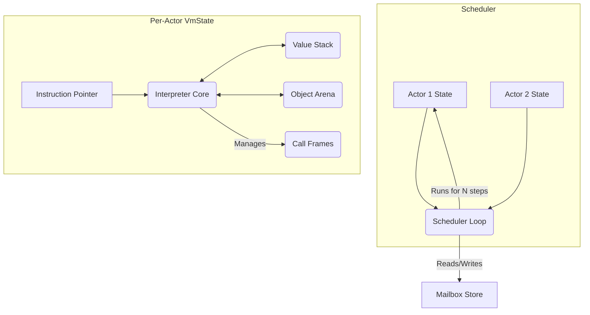

# **Project Jue: Physics World Specification v1.0**

## **Implementation Blueprint**

### **1. Guiding Principles for Implementers**
*   **Build to the Interface:** The public API (Section 7) is immutable. Implement the internals to match it exactly.
*   **Determinism First:** If a function can produce two different outcomes from the same input, it is bugged.
*   **Introspection is Mandatory:** State must be serializable at any point. Logging is a core feature, not a debug afterthought.
*   **AIKR is Actionable:** Resource limits must be checked and enforced, producing clean, typed errors.

### **2. Architecture Overview**
The Physics World is a single-threaded, stack-based virtual machine that manages isolated, concurrent execution contexts ("Actors").



**Implementation Order:** `Core Data` -> `Memory` -> `Interpreter` -> `Scheduler` -> `Public API`. Test at each step.

---

## **3. Module 1: Core Data Types (`src/types.rs`)**

**Purpose:** Define the fundamental `Value` enum and basic types. This is the foundation for all other modules.

```rust
// MUST BE EXACTLY THIS DEFINITION.
#[derive(Clone, Debug, PartialEq, Serialize, Deserialize)]
pub enum Value {
    Nil,
    Bool(bool),
    Int(i64),          // Primary deterministic number type.
    Symbol(usize),     // Index into a constant table.
    Pair(HeapPtr),     // HeapPtr is a u32 index into an ObjectArena.
    Closure(HeapPtr),
    ActorId(u32),
}

// A strongly-typed index into an ObjectArena's storage vector.
#[derive(Copy, Clone, Debug, PartialEq, Serialize, Deserialize)]
pub struct HeapPtr(u32);

// Represents a compiled instruction.
#[derive(Copy, Clone, Debug)]
pub enum OpCode {
    // Constants
    Nil,
    Bool(bool),
    Int(i64),
    Symbol(usize),
    // Stack
    Dup,
    Pop,
    // Heap
    Cons,
    Car,
    Cdr,
    // Control
    Call(u16), // Argument count
    Ret,
    Jmp(i16),
    JmpIfFalse(i16),
    // Actors
    Yield,
    Send,
}
```

**Dependencies:** None (standard library only).
**Success Criteria:**
1.  File `src/types.rs` compiles without warnings.
2.  A unit test creates one of each `Value` variant and asserts basic properties (e.g., `Value::Int(5) != Value::Nil`).
3.  `OpCode` fits in `u8` or `u16`? (For efficiency; decide and document).

---

## **4. Module 2: Object Arena (`src/memory/arena.rs`)**

**Purpose:** Provide deterministic, fast heap allocation for `Pair` and `Closure` objects. Implements "per-thought" memory reset.

**Interface to Build:**
```rust
pub struct ObjectArena {
    storage: Vec<u8>,
    next_ptr: usize,
}

impl ObjectArena {
    /// Creates a new arena with the given capacity in bytes.
    pub fn with_capacity(capacity: usize) -> Self { ... }

    /// Allocates space for an object. Writes the `header` first, then copies `data`.
    /// Returns a `HeapPtr` or an error if the arena is full.
    pub fn allocate(&mut self, header: ObjectHeader, data: &[u8]) -> Result<HeapPtr, ArenaError> { ... }

    /// Resets the arena. All existing `HeapPtr`s become invalid.
    /// This is O(1) - it simply sets `next_ptr = 0`.
    pub fn reset(&mut self) { ... }

    /// Given a valid `HeapPtr`, returns a reference to its `ObjectHeader`.
    pub fn get_header(&self, ptr: HeapPtr) -> &ObjectHeader { ... }

    /// Given a valid `HeapPtr`, returns a byte slice of its user data.
    pub fn get_data(&self, ptr: HeapPtr) -> &[u8] { ... }
}

#[repr(C)] // Ensure stable layout
pub struct ObjectHeader {
    pub type_tag: u8,   // 1 = Pair, 2 = Closure, etc.
    pub is_marked: bool, // For potential future GC.
    pub size: u16,      // Size of this object (header + data).
}

// Example data layout for a Pair:
// | ObjectHeader (4 bytes) | car: Value (16 bytes) | cdr: Value (16 bytes) |
```

**Dependencies:** `src/types.rs` (for `HeapPtr`).
**Success Criteria:**
1.  A test allocates a `Pair` (writes dummy `Value`s as bytes), retrieves it with `get_data`, and the bytes match.
2.  A test fills the arena until `allocate` returns an `ArenaFull` error.
3.  A test verifies that after `reset()`, a new allocation starts at the beginning.

---

## **5. Module 3: Interpreter Core & VM State (`src/vm/state.rs`)**

**Purpose:** Execute a sequence of `OpCode` instructions. This is the CPU of a single actor.

**Interface to Build:**
```rust
pub struct VmState {
    // Execution
    pub ip: usize,                     // Instruction Pointer
    pub instructions: Vec<OpCode>,     // Loaded bytecode
    pub constant_pool: Vec<Value>,     // For Symbol values, etc.
    // Data
    pub stack: Vec<Value>,             // Primary working stack
    pub call_stack: Vec<CallFrame>,    // For function calls/returns
    pub memory: ObjectArena,           // Heap
    // Resources (AIKR)
    pub steps_remaining: u64,          // Decremented each instruction
}

pub struct CallFrame {
    pub return_ip: usize,
    pub stack_start: usize,
}

impl VmState {
    /// Creates a new state with code, constants, and resource limits.
    pub fn new(instructions: Vec<OpCode>, constants: Vec<Value>, step_limit: u64, mem_limit: usize) -> Self { ... }

    /// Executes a single instruction. Returns `Ok(())`, `Err(VmError)`, or `Ok(Yield)`.
    pub fn step(&mut self) -> Result<InstructionResult, VmError> { ... }
}

pub enum InstructionResult {
    Continue,
    Yield,
    Finished(Value), // Final value on the stack
}

pub enum VmError {
    CpuLimitExceeded,
    MemoryLimitExceeded,
    StackUnderflow,
    InvalidHeapPtr,
    UnknownOpCode,
}
```

**Dependencies:** `src/types.rs`, `src/memory/arena.rs`.
**Success Criteria:**
1.  A test creates a `VmState` with a simple program `[OpCode::Int(5), OpCode::Int(3), OpCode::Add]` and runs `step()` in a loop. The final stack must contain `Value::Int(8)`.
2.  A test verifies that exceeding `steps_remaining` produces a deterministic `VmError::CpuLimitExceeded`.
3.  A test for `Call` and `Ret` creates a simple function and correctly returns a value.

---

## **6. Module 4: Scheduler & Actor Management (`src/scheduler.rs`)**

**Purpose:** Manages multiple `VmState` instances (actors), delivers messages, and enforces fair, deterministic execution.

**Interface to Build:**
```rust
pub struct Actor {
    pub id: u32,
    pub vm: VmState,
    pub mailbox: Vec<Value>, // Incoming messages
    pub is_waiting: bool,
}

pub struct PhysicsScheduler {
    pub actors: Vec<Actor>,
    pub current_actor_index: usize,
    pub message_queues: HashMap<u32, Vec<Value>>, // External inbox per actor
}

impl PhysicsScheduler {
    /// Main execution tick. Runs the current actor until it yields, finishes, or hits a limit.
    pub fn tick(&mut self) -> Result<TickResult, PhysicsError> { ... }

    /// Delivers a message to an actor's external queue.
    pub fn send_message(&mut self, target: u32, message: Value) { ... }
}

pub enum TickResult {
    ActorYielded(u32),
    ActorFinished(u32, Value),
    ActorErrored(u32, VmError),
}
```

**Dependencies:** `src/vm/state.rs`.
**Success Criteria:**
1.  A test creates two actors. One sends a message (using `OpCode::Send`), the scheduler delivers it to the other's `mailbox`, and the second actor can read it.
2.  A test verifies strict round-robin execution order: Actor 1, Actor 2, Actor 1, Actor 2...
3.  A test shows that a buggy actor hitting a CPU limit does not crash the scheduler; it produces an `ActorErrored` result.

---

## **7. Module 5: Public API (`src/lib.rs`)**

**Purpose:** The immutable, external interface for Jue-World. This is what the rest of the system calls.

**Interface to Build:**
```rust
// MAIN ENTRY POINT
pub struct PhysicsWorld {
    scheduler: PhysicsScheduler,
}

impl PhysicsWorld {
    /// Executes an actor's code with strict limits.
    pub fn execute_actor(
        &mut self,
        actor_id: u32,
        bytecode: Vec<OpCode>,
        constants: Vec<Value>,
        step_limit: u64,
        memory_limit: usize,
    ) -> ExecutionResult { ... }

    /// Injects messages for an actor to process on its next turn.
    pub fn deliver_messages(&mut self, actor_id: u32, messages: Vec<Value>) { ... }
}

// FINAL OUTPUT TYPE
#[derive(Serialize)]
pub struct ExecutionResult {
    pub output: Option<Value>,                 // The actor's final result
    pub messages_sent: Vec<(u32, Value)>,      // Outbound messages
    pub error: Option<StructuredError>,        // If execution failed
    pub final_state_snapshot: Vec<u8>,         // Serialized VmState
    pub metrics: ResourceMetrics,
}

#[derive(Serialize)]
pub enum StructuredError {
    CpuLimitExceeded { limit: u64, attempted: u64 },
    MemoryLimitExceeded { limit: usize, attempted: usize },
    // ... other error types
}
```

**Dependencies:** `src/scheduler.rs` (and thus all other modules).
**Success Criteria:**
1.  **Integration Test:** A complete, working example from Jue-World's perspective.
    ```rust
    let mut world = PhysicsWorld::new();
    let result = world.execute_actor(1, vec![OpCode::Int(42)], vec![], 1000, 1024);
    assert_eq!(result.output, Some(Value::Int(42)));
    assert!(result.messages_sent.is_empty());
    assert!(result.error.is_none());
    ```

---

## **8. Implementation Directive**

**Do not debate.** Build in this order:

1.  **`cargo new physics_world --lib`**
2.  **Implement `src/types.rs`.** Define the enums. Write basic tests.
3.  **Implement `src/memory/arena.rs`.** Make allocation and reset work.
4.  **Implement `src/vm/state.rs`.** Get a single instruction (`Int`) to push a value onto the stack. Then add `Add`. Then `Cons`/`Car`. Then `Call`/`Ret`.
5.  **Implement `src/scheduler.rs`.** Make it manage two actor states and switch between them.
6.  **Implement `src/lib.rs`.** Wrap the scheduler in the public API.
7.  **Write the integration test from Section 7.**

Each module must have its own unit tests. An agent's task is complete when its module's tests pass and it integrates with the modules before it.