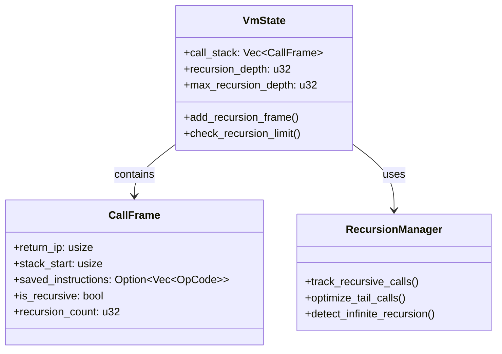
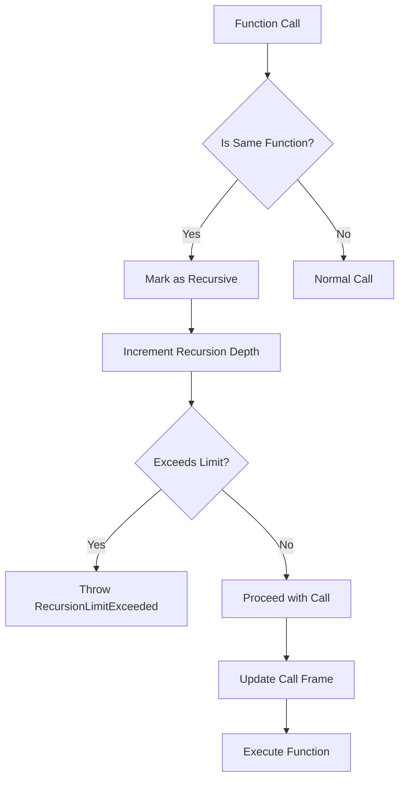

# Physics World Recursion Support Design

## Executive Summary

This document outlines the design for adding proper recursion support to the Physics World VM. The current implementation has limitations that prevent true recursive function calls, which are essential for many algorithms and functional programming patterns.

## Current Limitations

### Problem Analysis

The current VM has these recursion-related issues:

1. **Closure Recreation**: Each "recursive" call creates a new closure instead of reusing the existing function
2. **Memory Inefficiency**: The nested calls test creates 53 call frames, exceeding memory limits
3. **Stack Management**: Call stack restoration doesn't properly handle recursive scenarios
4. **Performance**: Linear recursion depth is limited by memory constraints

### Failing Test Analysis

**test_deep_call_stack** (lines 302-344):
- Expected: `Int(6)` (3! = 3 × 2 × 1)
- Actual: `Int(3)`
- Root Cause: Function creates new closures instead of calling itself recursively

**test_nested_function_calls** (lines 108-158):
- Expected: `Int(12)` ((5+1) + (5+1))
- Actual: `MemoryLimitExceeded`
- Root Cause: Creates too many closures in a loop

## Design Goals

### Primary Objectives

1. **True Recursion**: Enable functions to call themselves directly
2. **Memory Efficiency**: Optimize memory usage for recursive calls
3. **Stack Safety**: Prevent stack overflow with proper limits
4. **Performance**: Minimize overhead for recursive calls
5. **Compatibility**: Maintain backward compatibility with existing code

### Non-Goals

1. **Tail Call Optimization**: Advanced optimization for later phase
2. **Continuation Passing Style**: Complex transformation patterns
3. **Automatic Memoization**: Caching mechanism for pure functions

## Architecture Design

### Recursion Support Components



### Key Data Structures

#### Enhanced CallFrame

```rust
struct CallFrame {
    return_ip: usize,
    stack_start: usize,
    saved_instructions: Option<Vec<OpCode>>,
    is_recursive: bool,          // NEW: Marks recursive calls
    recursion_count: u32,        // NEW: Tracks recursion depth
    function_identity: u64,      // NEW: Hash for function identification
}
```

#### Recursion Tracking in VmState

```rust
struct VmState {
    // Existing fields...
    recursion_depth: u32,        // Current recursion depth
    max_recursion_depth: u32,    // Configurable limit
    recursion_cache: HashMap<u64, RecursionInfo>, // Function cache
}
```

### Recursion Detection Algorithm



## Implementation Plan

### Phase 1: Basic Recursion Support

#### 1. Function Identity Tracking

**Objective**: Identify when a function calls itself

```rust
// In call.rs - enhance handle_call to detect recursion
fn handle_call(vm: &mut VmState, arg_count: u16) -> Result<(), VmError> {
    // Get current function identity (if any)
    let current_function_id = vm.call_stack.last().map(|f| f.function_identity);

    // Get called function identity
    let called_function_id = match func {
        Value::Closure(closure_ptr) => {
            // Extract function identity from closure
            get_function_identity(vm, *closure_ptr)
        }
        _ => 0
    };

    // Check if recursive
    let is_recursive = current_function_id == Some(called_function_id);

    // Store in call frame
    let call_frame = CallFrame {
        return_ip: vm.ip + 1,
        stack_start: vm.stack.len() - arg_count as usize,
        saved_instructions: Some(vm.instructions.clone()),
        is_recursive,
        recursion_count: if is_recursive {
            vm.recursion_depth + 1
        } else {
            0
        },
        function_identity: called_function_id,
    };

    // Update recursion tracking
    if is_recursive {
        vm.recursion_depth += 1;
        if vm.recursion_depth > vm.max_recursion_depth {
            return Err(VmError::RecursionLimitExceeded);
        }
    }

    // Rest of call handling...
}
```

#### 2. Recursion Limit Enforcement

**Objective**: Prevent stack overflow with configurable limits

```rust
// Add to VmState initialization
impl VmState {
    pub fn new(
        instructions: Vec<OpCode>,
        constants: Vec<Value>,
        step_limit: u64,
        mem_limit: usize,
        actor_id: u32,
        max_recursion_depth: u32,  // NEW parameter
    ) -> Self {
        Self {
            // Existing fields...
            recursion_depth: 0,
            max_recursion_depth,
            recursion_cache: HashMap::new(),
        }
    }
}

// Add recursion limit error
#[derive(Debug)]
pub enum VmError {
    // Existing variants...
    RecursionLimitExceeded,
}
```

#### 3. Tail Call Optimization (Basic)

**Objective**: Reuse stack frames for tail recursion

```rust
// In ret.rs - enhance handle_ret for tail calls
fn handle_ret(vm: &mut VmState) -> Result<(), VmError> {
    let call_frame = vm.call_stack.pop().unwrap();

    // Check if this is a tail call (recursive call with no further computation)
    if call_frame.is_recursive &&
       vm.ip == call_frame.return_ip &&
       vm.stack.len() == call_frame.stack_start + 1 {
        // Tail call optimization: reuse the call frame
        let return_value = vm.stack.pop().unwrap();

        // Instead of restoring, prepare for next recursive call
        vm.stack.push(return_value); // Keep return value as argument
        vm.ip = 0; // Reset to function start
        vm.instructions = call_frame.saved_instructions.unwrap();

        // Reuse the call frame with updated recursion count
        let new_call_frame = CallFrame {
            return_ip: call_frame.return_ip,
            stack_start: call_frame.stack_start,
            saved_instructions: call_frame.saved_instructions,
            is_recursive: true,
            recursion_count: call_frame.recursion_count + 1,
            function_identity: call_frame.function_identity,
        };
        vm.call_stack.push(new_call_frame);

        return Ok(());
    }

    // Normal return handling...
}
```

### Phase 2: Advanced Recursion Features

#### 1. Recursion Caching

**Objective**: Cache function results for pure functions

```rust
struct RecursionCacheEntry {
    args_hash: u64,
    result: Value,
    timestamp: u64,
}

impl VmState {
    fn check_recursion_cache(&mut self, function_id: u64, args: &[Value]) -> Option<Value> {
        let args_hash = self.hash_arguments(args);
        if let Some(entry) = self.recursion_cache.get(&(function_id, args_hash)) {
            if entry.is_valid() {
                return Some(entry.result.clone());
            }
        }
        None
    }

    fn store_recursion_result(&mut self, function_id: u64, args: &[Value], result: Value) {
        let args_hash = self.hash_arguments(args);
        self.recursion_cache.insert(
            (function_id, args_hash),
            RecursionCacheEntry {
                args_hash,
                result,
                timestamp: self.steps_remaining,
            }
        );
    }
}
```

#### 2. Recursion Depth Analysis

**Objective**: Provide debugging information about recursion

```rust
impl VmState {
    pub fn get_recursion_info(&self) -> RecursionInfo {
        RecursionInfo {
            current_depth: self.recursion_depth,
            max_depth: self.max_recursion_depth,
            call_stack: self.call_stack.iter()
                .filter(|f| f.is_recursive)
                .map(|f| RecursionFrameInfo {
                    depth: f.recursion_count,
                    function_id: f.function_identity,
                    stack_size: f.stack_start,
                })
                .collect(),
        }
    }
}
```

## Testing Strategy

### Test Coverage Plan

| Test Case                     | Description                          | Expected Result                           |
| ----------------------------- | ------------------------------------ | ----------------------------------------- |
| `test_simple_recursion`       | Basic recursive function (factorial) | Correct result with proper depth tracking |
| `test_recursion_limit`        | Exceed maximum recursion depth       | `RecursionLimitExceeded` error            |
| `test_tail_call_optimization` | Tail-recursive function              | No stack growth, constant memory          |
| `test_mutual_recursion`       | Two functions calling each other     | Proper handling of mutual recursion       |
| `test_recursion_caching`      | Pure function with repeated calls    | Cache hits reduce computation             |
| `test_stack_safety`           | Deep recursion (1000 levels)         | Graceful error handling                   |

### Test Implementation Example

```rust
#[test]
fn test_simple_recursion() {
    // Factorial function: fact(n) = n * fact(n-1), fact(0) = 1
    let factorial_body = vec![
        OpCode::GetLocal(0), // Get n
        OpCode::Int(0),      // Check if n == 0
        OpCode::Eq,
        OpCode::JmpIfFalse(8), // Jump if not base case
        OpCode::Int(1),      // Base case: return 1
        OpCode::Ret,
        // Recursive case
        OpCode::GetLocal(0), // Get n
        OpCode::Int(1),      // n - 1
        OpCode::Sub,
        OpCode::MakeClosure(0, 0), // Create same closure
        OpCode::Call(1),      // Recursive call: fact(n-1)
        OpCode::GetLocal(0),  // Get original n
        OpCode::Mul,          // n * fact(n-1)
        OpCode::Ret,
    ];

    let main_program = vec![
        OpCode::Int(5),            // Calculate 5!
        OpCode::MakeClosure(0, 0), // Create factorial closure
        OpCode::Call(1),           // Call fact(5)
    ];

    let mut vm = setup_closure_test(
        factorial_body,
        main_program,
        vec![Value::Closure(HeapPtr::new(0))],
    );

    // Set reasonable recursion limit
    vm.max_recursion_depth = 1000;

    let result = vm.run();
    assert_eq!(result.unwrap(), Value::Int(120)); // 5! = 120
}
```

## Integration Plan

### Step-by-Step Implementation

1. **Add Recursion Tracking Fields**
   - Modify `CallFrame` struct
   - Add recursion fields to `VmState`

2. **Enhance Call Handling**
   - Update `handle_call` to detect recursion
   - Add recursion depth tracking

3. **Implement Recursion Limits**
   - Add `RecursionLimitExceeded` error
   - Enforce limits in call handling

4. **Add Tail Call Optimization**
   - Enhance `handle_ret` for tail calls
   - Add stack frame reuse logic

5. **Update Error Handling**
   - Add detailed recursion error context
   - Improve debugging information

6. **Add Testing**
   - Implement comprehensive test suite
   - Add performance benchmarks

## Performance Considerations

### Memory Optimization

- **Stack Frame Reuse**: Tail call optimization reduces memory usage
- **Efficient Tracking**: Use compact data structures for recursion info
- **Configurable Limits**: Allow tuning based on application needs

### Execution Speed

- **Minimal Overhead**: Recursion detection adds negligible runtime cost
- **Cache Benefits**: Recursion caching can significantly improve performance
- **JIT Potential**: Design allows future JIT compilation integration

## Security Considerations

### Safety Measures

1. **Recursion Limits**: Prevent stack overflow attacks
2. **Memory Isolation**: Ensure recursion doesn't corrupt other data
3. **Validation**: Check function identities to prevent spoofing
4. **Resource Accounting**: Track recursion depth as part of CPU budget

### Error Handling

```rust
// Enhanced error context for recursion
impl VmState {
    pub fn create_recursion_error_context(&self) -> RecursionErrorContext {
        RecursionErrorContext {
            current_depth: self.recursion_depth,
            max_depth: self.max_recursion_depth,
            call_stack: self.call_stack.iter()
                .map(|f| f.recursion_count)
                .collect(),
            memory_usage: self.memory.next_free(),
            steps_consumed: self.initial_steps - self.steps_remaining,
        }
    }
}
```

## Documentation Requirements

### API Documentation

```rust
/// Sets the maximum recursion depth for this VM instance
///
/// # Arguments
/// * `depth` - Maximum allowed recursion depth (0 = unlimited)
///
/// # Safety
/// Setting this too high may cause stack overflow. Recommended limit: 1000
pub fn set_max_recursion_depth(&mut self, depth: u32) {
    self.max_recursion_depth = depth;
}

/// Gets current recursion information for debugging
///
/// # Returns
/// RecursionInfo containing depth, limits, and call stack details
pub fn get_recursion_info(&self) -> RecursionInfo {
    // Implementation...
}
```

### User Guide

```markdown
# Using Recursion in Physics World VM

## Basic Recursion

```rust
// Define a recursive function
let factorial = vec![
    // Base case: fact(0) = 1
    OpCode::GetLocal(0),
    OpCode::Int(0),
    OpCode::Eq,
    OpCode::JmpIfFalse(8),
    OpCode::Int(1),
    OpCode::Ret,

    // Recursive case: n * fact(n-1)
    OpCode::GetLocal(0),
    OpCode::Int(1),
    OpCode::Sub,
    OpCode::MakeClosure(0, 0), // Call same function
    OpCode::Call(1),
    OpCode::GetLocal(0),
    OpCode::Mul,
    OpCode::Ret,
];
```

## Configuration

```rust
// Set recursion limit (recommended: 100-1000)
vm.set_max_recursion_depth(500);

// Get current recursion info
let info = vm.get_recursion_info();
println!("Current depth: {}", info.current_depth);
```

## Best Practices

1. **Set Appropriate Limits**: Balance between functionality and safety
2. **Use Tail Calls**: Structure recursion to enable optimization
3. **Monitor Depth**: Check recursion info during development
4. **Handle Errors**: Catch `RecursionLimitExceeded` gracefully
```

## Migration Guide

### For Existing Code

```markdown
## Upgrading to Recursion Support

### Breaking Changes
- None. Recursion support is backward compatible.

### New Features
- Functions can now call themselves directly
- Automatic recursion depth tracking
- Configurable recursion limits

### Recommended Updates

1. **Update VM Initialization**
```rust
// Old
let mut vm = VmState::new(instructions, constants, steps, memory, actor_id);

// New - add recursion limit
let mut vm = VmState::new(instructions, constants, steps, memory, actor_id, 1000);
```

2. **Add Error Handling**
```rust
match vm.run() {
    Ok(result) => handle_result(result),
    Err(VmError::RecursionLimitExceeded) => {
        // Handle recursion limit gracefully
        log::warn!("Recursion limit exceeded");
        fallback_behavior();
    }
    // Other error cases...
}
```

3. **Monitor Recursion**
```rust
// Add debugging for recursive functions
if let Err(e) = vm.run() {
    if let Some(recursion_info) = vm.get_recursion_info() {
        log::error!("Recursion failed at depth {}: {:?}",
                   recursion_info.current_depth, e);
    }
}
```

## Future Enhancements

### Roadmap

1. **Tail Call Optimization**: Automatic detection and optimization
2. **Recursion Analysis**: Static analysis of recursion patterns
3. **Memoization Framework**: Built-in caching for pure functions
4. **Continuation Support**: Advanced control flow patterns
5. **Recursion Visualization**: Debugging tools for call graphs

### Research Areas

- Automatic tail call detection
- Recursion pattern analysis
- Memory-efficient deep recursion
- Integration with JIT compilation

## Conclusion

This design provides a comprehensive foundation for recursion support in the Physics World VM. The phased implementation approach ensures that basic functionality is available quickly while allowing for advanced optimizations in future iterations. The design maintains the VM's safety guarantees while enabling powerful functional programming patterns.