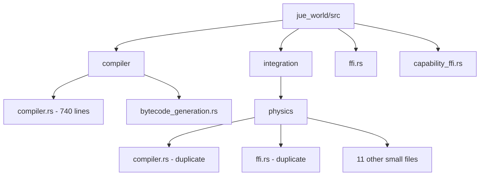
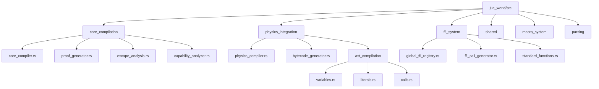

# Jue-World Refactoring and Reorganization Plan

## 1. Current State Analysis

### Issues Identified

**Duplicate Files:**
- `compiler.rs` exists in both `src/compiler/` and `src/integration/physics/`
- `ffi.rs` exists in both root and `src/integration/physics/`
- `capability_ffi.rs` in root vs FFI functionality in integration

**Large Files Needing Splitting:**
- `src/compiler/compiler.rs` (740 lines) - contains multiple responsibilities
- `src/ffi.rs` (271 lines) - contains FFI registry, generator, and standard functions

**Ambiguous Naming:**
- `compiler.rs` doesn't indicate if it's core compiler vs physics compiler
- `ffi.rs` doesn't indicate scope (global vs physics-specific)
- `integration/physics/compiler.rs` - unclear if this is physics-specific compiler

**Poor Organization:**
- `src/integration/physics/` has 13 small files that could be better grouped
- Test files are scattered across multiple directories
- No clear separation between core compilation and physics integration

## 2. Reorganization Strategy

### Naming Conventions

**Clear, Descriptive Names:**
- Use prefixes to indicate scope: `core_`, `physics_`, `global_`
- Use suffixes to indicate purpose: `_compiler`, `_generator`, `_registry`
- Avoid generic names like `compiler.rs` - be specific

**File Size Guidelines:**
- Target: < 300 lines per file
- Maximum: < 500 lines per file
- Split large files into logical components

### Logical Grouping

**Core Compilation Layer:**
- Core expression compilation
- Proof generation and verification
- Trust tier handling
- Capability analysis

**Physics Integration Layer:**
- Physics-World specific compilation
- Bytecode generation
- Runtime capability checks
- Sandboxing

**Shared Infrastructure:**
- AST definitions
- Error handling
- FFI system
- Macro system

## 3. Proposed Directory Structure

### Current Structure (Problematic)

```
jue_world/
├── src/
│   ├── compiler/
│   │   ├── compiler.rs (740 lines - too large)
│   │   ├── bytecode_generation.rs
│   │   ├── capability_analysis.rs
│   │   ├── capability_checking.rs
│   │   ├── core_compilation.rs
│   │   ├── environment.rs
│   │   └── mod.rs
│   ├── integration/
│   │   ├── physics/
│   │   │   ├── compiler.rs (duplicate)
│   │   │   ├── ffi.rs (duplicate)
│   │   │   ├── analysis.rs
│   │   │   ├── calls.rs
│   │   │   ├── capabilities.rs
│   │   │   ├── control_flow.rs
│   │   │   ├── lambdas.rs
│   │   │   ├── lets.rs
│   │   │   ├── literals.rs
│   │   │   ├── symbols.rs
│   │   │   ├── variables.rs
│   │   │   └── mod.rs
│   ├── ffi.rs (271 lines - too large)
│   ├── capability_ffi.rs
│   └── ... (other files)
```

### Proposed Structure (Clean and Logical)

```
jue_world/
├── src/
│   ├── core_compilation/          # Core-World compilation layer
│   │   ├── core_compiler.rs       # Main core compiler (split from large file)
│   │   ├── proof_generator.rs     # Proof generation logic
│   │   ├── proof_verifier.rs      # Proof verification logic
│   │   ├── trust_tier_handler.rs  # Trust tier processing
│   │   ├── capability_analyzer.rs # Capability analysis
│   │   ├── escape_analysis.rs     # Escape analysis (from compiler.rs)
│   │   └── mod.rs
│   │
│   ├── physics_integration/       # Physics-World integration layer
│   │   ├── physics_compiler.rs    # Physics-specific compiler
│   │   ├── bytecode_generator.rs  # Bytecode generation
│   │   ├── runtime_checks.rs      # Runtime capability checks
│   │   ├── sandbox_wrapper.rs     # Sandboxing functionality
│   │   ├── ast_compilation/       # AST node compilation modules
│   │   │   ├── variables.rs
│   │   │   ├── literals.rs
│   │   │   ├── symbols.rs
│   │   │   ├── calls.rs
│   │   │   ├── lambdas.rs
│   │   │   ├── lets.rs
│   │   │   ├── control_flow.rs
│   │   │   ├── capabilities.rs
│   │   │   └── mod.rs
│   │   └── mod.rs
│   │
│   ├── ffi_system/                # Unified FFI system
│   │   ├── global_ffi_registry.rs # Global FFI registry
│   │   ├── ffi_call_generator.rs  # FFI call generation
│   │   ├── capability_mediator.rs # Capability mediation
│   │   ├── standard_functions.rs  # Standard FFI functions
│   │   └── mod.rs
│   │
│   ├── shared/                    # Shared infrastructure
│   │   ├── ast.rs                 # AST definitions
│   │   ├── error.rs               # Error handling
│   │   ├── structured_error.rs    # Structured errors
│   │   ├── source_location.rs     # Source location tracking
│   │   ├── resource_limits.rs     # Resource management
│   │   └── mod.rs
│   │
│   ├── macro_system/              # Macro system
│   │   ├── macro_expander.rs
│   │   ├── macro_ffi.rs
│   │   └── mod.rs
│   │
│   ├── parsing/                   # Parsing infrastructure
│   │   ├── parser.rs
│   │   ├── tokenizer.rs
│   │   ├── expression_parser.rs
│   │   └── mod.rs
│   │
│   ├── lib.rs                     # Main library entry
│   └── mod.rs                     # Root module
```

## 4. Migration Plan

### Step-by-Step Migration

**Phase 1: Create New Directory Structure**
```bash
mkdir -p src/core_compilation
mkdir -p src/physics_integration/ast_compilation
mkdir -p src/ffi_system
mkdir -p src/shared
mkdir -p src/macro_system
mkdir -p src/parsing
```

**Phase 2: Split Large Files**

1. **Split `src/compiler/compiler.rs` (740 lines):**
   - `src/core_compilation/core_compiler.rs` - Main compilation logic
   - `src/core_compilation/proof_generator.rs` - Proof generation
   - `src/core_compilation/proof_verifier.rs` - Proof verification
   - `src/core_compilation/trust_tier_handler.rs` - Trust tier handling
   - `src/core_compilation/escape_analysis.rs` - Escape analysis

2. **Split `src/ffi.rs` (271 lines):**
   - `src/ffi_system/global_ffi_registry.rs` - FFI registry
   - `src/ffi_system/ffi_call_generator.rs` - Call generation
   - `src/ffi_system/capability_mediator.rs` - Capability mediation
   - `src/ffi_system/standard_functions.rs` - Standard functions

**Phase 3: Move and Rename Files**

1. **Move core compilation files:**
   ```bash
   mv src/compiler/core_compilation.rs src/core_compilation/
   mv src/compiler/capability_analysis.rs src/core_compilation/capability_analyzer.rs
   ```

2. **Move physics integration files:**
   ```bash
   mv src/integration/physics/compiler.rs src/physics_integration/physics_compiler.rs
   mv src/integration/physics/ffi.rs src/physics_integration/physics_ffi.rs
   mv src/integration/physics/*.rs src/physics_integration/ast_compilation/
   ```

3. **Move shared infrastructure:**
   ```bash
   mv src/error.rs src/shared/
   mv src/structured_error.rs src/shared/
   mv src/resource_limits.rs src/shared/
   ```

**Phase 4: Update Imports and Dependencies**

1. Update all `use` statements to reflect new paths
2. Update `mod.rs` files to export correct modules
3. Update test files to import from new locations

**Phase 5: Testing and Validation**

1. Run comprehensive test suite
2. Verify all functionality works correctly
3. Fix any import or dependency issues

## 5. Visual Representation

### Current Structure (Before)



### Proposed Structure (After)



## 6. Future-Proofing Recommendations

### Preventing Similar Issues

1. **File Size Monitoring:**
   - Add CI check for file size limits
   - Automatically flag files exceeding 300 lines

2. **Clear Naming Guidelines:**
   - Document naming conventions in CONTRIBUTING.md
   - Use code reviews to enforce naming standards

3. **Modular Design:**
   - Encourage small, focused modules
   - Use feature flags for optional functionality
   - Implement clear module boundaries

4. **Regular Refactoring:**
   - Schedule periodic architecture reviews
   - Address technical debt proactively
   - Use automated tools to detect code smells

5. **Documentation Standards:**
   - Require module-level documentation
   - Document public APIs thoroughly
   - Maintain architecture diagrams

### Benefits of New Structure

1. **Eliminates Ambiguity:** Clear naming prevents confusion
2. **Improves Maintainability:** Small, focused files are easier to understand
3. **Enhances Testability:** Logical grouping makes testing easier
4. **Better LLM Processing:** Smaller files fit better in context windows
5. **Clear Separation of Concerns:** Distinct layers with well-defined boundaries

## 7. Risk Mitigation

### Potential Risks and Solutions

1. **Broken Imports:**
   - Use automated refactoring tools
   - Implement comprehensive test coverage
   - Use gradual migration approach

2. **Performance Impact:**
   - Monitor compilation times
   - Optimize module loading
   - Use lazy loading where appropriate

3. **Learning Curve:**
   - Provide migration documentation
   - Update examples and tutorials
   - Offer training sessions

4. **Backward Compatibility:**
   - Maintain deprecated paths temporarily
   - Provide clear migration guides
   - Use feature flags for breaking changes

## 8. Implementation Timeline

**Phase 1: Preparation (1-2 days)**
- Create new directory structure
- Set up CI checks for file sizes
- Document migration process

**Phase 2: File Splitting (3-5 days)**
- Split large files into logical components
- Update internal references
- Verify functionality

**Phase 3: Migration (5-7 days)**
- Move files to new locations
- Update all imports and dependencies
- Fix any issues

**Phase 4: Testing (3-5 days)**
- Run comprehensive test suite
- Validate all functionality
- Performance testing

**Phase 5: Documentation (2-3 days)**
- Update architecture documentation
- Create migration guides
- Update examples and tutorials

**Total Estimated Time: 2-3 weeks**

## 9. Success Metrics

1. **File Size Reduction:**
   - No files exceed 500 lines
   - Average file size < 200 lines
   - 90% of files < 300 lines

2. **Code Quality:**
   - Improved cyclomatic complexity
   - Better separation of concerns
   - Clearer module boundaries

3. **Developer Productivity:**
   - Faster navigation and understanding
   - Easier debugging and testing
   - Better IDE support and completion

4. **LLM Friendliness:**
   - Files fit comfortably in context windows
   - Clear, descriptive names improve understanding
   - Logical organization aids comprehension

This comprehensive reorganization plan addresses all the current structural issues while providing a clear path forward for maintainable, scalable codebase growth.