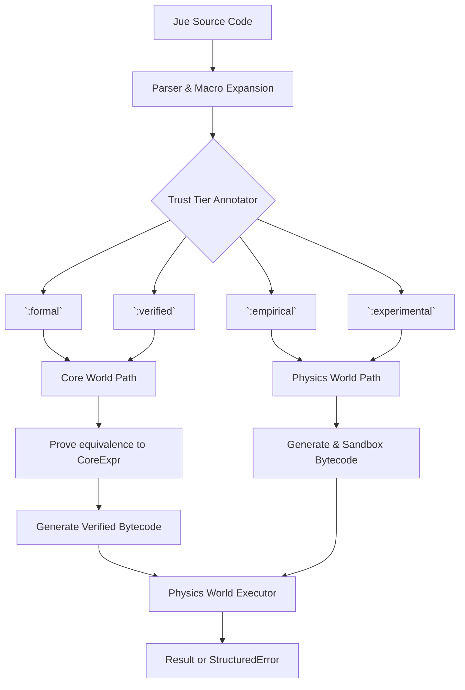

Now we define **Jue World**—the practical bridge that connects formal meaning to executable reality.

Here is the specification and integrated sample code.

---

# **Project Jue: Jue World Specification v1.0**

## **1. Purpose & Philosophy**

Jue World is the **dual-interpretation language and compiler**. Its sole purpose is to provide a usable programming interface for Dan-World, where every construct is **meaning-preserving**.

*   **For Dan:** Jue is the language of thought—how cognitive modules express plans, beliefs, and operations.
*   **For Core World:** Every valid Jue program has a formal meaning defined as a `CoreExpr`.
*   **For Physics World:** Every valid Jue program can be executed as deterministic bytecode within AIKR constraints.

**Core Rule:** A Jue program is correct if its Physics World execution **refines** its Core World meaning. The compiler must ensure this, either via formal proof or explicit empirical labeling.

## **2. Language Overview**

Jue is a Lisp-like, S-expression language. Its core data types map directly to the Physics World's `Value` enum.

```
; --- Basic Values ---
42                      ; Int
true                    ; Bool
nil                     ; Nil
'symbol                 ; Symbol (interned)

; --- Compound Data ---
(cons 1 (cons 2 nil))   ; Pair, yields [1, 2]
(list 1 2 3)            ; Syntax sugar for lists

; --- Functions & Control Flow ---
(lambda (x) (+ x 1))    ; Lambda abstraction
((lambda (x) (+ x 1)) 5) ; Application => 6

(if true "yes" "no")    ; Conditional
(let ((x 5)) (+ x x))   ; Local binding

; --- Trust Annotation (CRITICAL) ---
(:formal (+ 1 1))       ; This MUST be proven correct
(:empirical (read-sensor)) ; This will be tested/sandboxed
```

## **3. The Compilation Pipeline & Trust Tiers**

Every Jue expression is tagged with a **Trust Tier**, which determines its compilation path.



**Tier Definitions:**
*   **`:formal`**: Must have a mathematical proof of correctness relative to Core World. Required for foundational axioms.
*   **`:verified`**: Proven via automated theorem proving or exhaustive checking. Used for optimized but critical routines.
*   **`:empirical`**: No proof, but must pass extensive test suites. Used for learned or probabilistic code.
*   **`:experimental`**: Unsandboxed, user-accepted risk. For active exploration by Dan.

## **4. Integration Points & Sample Code**

### **4.1. Project Structure**
```
jue_world/
├── src/
│   ├── lib.rs              // Public API
│   ├── parser.rs           // S-exp → AST
│   ├── typecheck.rs        // (Optional) Gradual typing
│   ├── compile/            // Dual backends
│   │   ├── mod.rs
│   │   ├── to_core.rs      // JueAST → CoreExpr + Proof
│   │   └── to_physics.rs   // JueAST → Vec<OpCode>
│   └── runtime.rs          // Trust tier manager
└── examples/               // Integration examples
```

### **4.2. Example 1: Formal Arithmetic (End-to-End)**
This shows a `:formal` expression flowing through the entire stack.

**File: `examples/formal_arithmetic.rs`**
```rust
use jue_world::{compile, TrustTier};
use core_world::verify_equivalence;
use physics_world::{PhysicsWorld, Value};

fn main() -> Result<(), Box<dyn std::error::Error>> {
    // 1. Jue Source (clearly correct)
    let jue_source = "(:formal (+ 1 1))";
    
    // 2. Compile with Formal Tier
    let compilation_result = compile(
        jue_source,
        TrustTier::Formal,
        /* step_limit */ 1000,
        /* mem_limit */ 1024,
    )?;
    
    // 3. The compiler has already:
    //    a. Generated CoreExpr for "(+ 1 1)" and "2"
    //    b. Generated a Proof that they are equivalent
    //    c. Used Core World to VERIFY that proof
    //    d. Generated verified Physics bytecode
    
    // 4. Execute in Physics World
    let mut physics = PhysicsWorld::new();
    let result = physics.execute_actor(
        /* actor_id */ 1,
        compilation_result.bytecode,
        compilation_result.constants,
        compilation_result.step_limit,
        compilation_result.memory_limit,
    );
    
    // 5. Inspect result (must be 2)
    assert_eq!(result.output, Some(Value::Int(2)));
    assert!(result.error.is_none());
    println!("✅ Formal computation succeeded: 1 + 1 = {:?}", result.output);
    
    // 6. The proof is attached for introspection
    println!("📋 Proof: {}", compilation_result.proof_summary);
    
    Ok(())
}
```

### **4.3. Example 2: Empirical Sensor Read (Sandboxed)**
This shows how untrusted code is handled.

**File: `examples/empirical_sensor.rs`**
```rust
use jue_world::{compile, TrustTier, EmpiricalResult};

fn main() -> Result<(), Box<dyn std::error::Error>> {
    // 1. Jue Source - we can't prove this is correct, only test it
    let jue_source = "
        (:empirical 
            (let ((sensor-value (read-sensor)))
                (if (> sensor-value 50)
                    \"high\"
                    \"low\")))
    ";
    
    // 2. Compile with Empirical Tier
    let compilation_result = compile(
        jue_source,
        TrustTier::Empirical,
        /* step_limit */ 2000,
        /* mem_limit */ 2048,
    )?;
    
    // 3. The compiler has:
    //    a. Generated CoreExpr (for documentation)
    //    b. Generated Physics bytecode
    //    c. NOT proven correctness
    //    d. INSTEAD: Created a sandboxed test harness
    
    // 4. Run empirical validation (e.g., 1000 random sensor values)
    match compilation_result.empirical_check {
        EmpiricalResult::Passed { tests_run, .. } => {
            println!("✅ Empirical code passed {} tests", tests_run);
            // Now it can be safely used
        }
        EmpiricalResult::Failed { reason, .. } => {
            println!("❌ Empirical code rejected: {}", reason);
            // This would NOT be allowed to run in production Dan
            return Ok(());
        }
    }
    
    // 5. Execute in Physics World with extra monitoring
    let result = compilation_result.execute_sandboxed()?;
    println!("Sensor judgment: {:?}", result.output);
    
    Ok(())
}
```

### **4.4. Example 3: Dan-World Cognitive Operation**
This shows how a Dan module would use Jue.

**File: `examples/dan_cognition.rs`**
```rust
use jue_world::compile;
use physics_world::{PhysicsWorld, Value};

struct DanModule {
    learned_heuristic: String, // Jue code as a string
    trust_level: TrustTier,
}

impl DanModule {
    fn propose_action(&mut self, context: &Context) -> Result<Action, String> {
        // 1. Adapt heuristic based on context (simplified)
        let jue_code = self.adapt_heuristic(&self.learned_heuristic, context);
        
        // 2. Compile according to this module's trust level
        //    (A cautious module might use :verified, 
        //     an exploratory one might use :empirical)
        let compiled = compile(&jue_code, self.trust_level, 5000, 4096)?;
        
        // 3. Execute in Physics World
        let mut physics = PhysicsWorld::new();
        let result = physics.execute_actor(
            self.id,
            compiled.bytecode,
            compiled.constants,
            compiled.step_limit,
            compiled.memory_limit,
        );
        
        // 4. Learn from structured errors
        match result.error {
            Some(ref err) if err.is_resource_exhaustion() => {
                // AIKR learning moment: my heuristic is too expensive
                self.learn_more_efficient_strategy();
                return Err("Resource limit hit".to_string());
            }
            _ => {}
        }
        
        // 5. Convert Physics World result to action
        self.interpret_result(result.output)
    }
}
```

## **5. Jue World Public API**

**File: `src/lib.rs`**
```rust
pub enum TrustTier { Formal, Verified, Empirical, Experimental }

pub struct CompilationResult {
    pub bytecode: Vec<physics_world::OpCode>,
    pub constants: Vec<physics_world::Value>,
    pub step_limit: u64,
    pub memory_limit: usize,
    
    // Formal path results (None for empirical/experimental)
    pub core_proof: Option<core_world::Proof>,
    pub core_expr: Option<core_world::CoreExpr>,
    
    // Empirical path results
    pub empirical_check: EmpiricalResult,
    pub sandboxed: bool,
}

pub enum EmpiricalResult {
    Passed { tests_run: usize, coverage: f64 },
    Failed { reason: String, failing_case: String },
}

pub fn compile(
    source: &str,
    tier: TrustTier,
    default_step_limit: u64,
    default_mem_limit: usize,
) -> Result<CompilationResult, CompilationError> {
    // 1. Parse
    // 2. Type check (if :formal/:verified)
    // 3. Based on tier:
    //    - :formal/:verified: compile_to_core, verify, compile_to_physics
    //    - :empirical: compile_to_physics, run test suite
    //    - :experimental: compile_to_physics, mark as untrusted
    // 4. Package results
}
```

## **6. Implementation Tasks for LLM**

Break these into discrete units:

1.  **Task J1: Parser** (`src/parser.rs`)
    *   Convert S-expressions to `JueAST` enum.
    *   Handle trust tier annotations `(:formal ...)`.

2.  **Task J2: Core World Backend** (`src/compile/to_core.rs`)
    *   Translate `JueAST` to `CoreExpr`.
    *   Generate proof obligations for basic operations (`+`, `cons`, `lambda`).

3.  **Task J3: Physics World Backend** (`src/compile/to_physics.rs`)
    *   Translate `JueAST` to `Vec<OpCode>` and `Vec<Value>` (constants).
    *   Implement variable environment via stack indices.

4.  **Task J4: Trust Tier Manager** (`src/runtime.rs`)
    *   Route compilation based on tier.
    *   For `:formal`, call `core_world::verify_equivalence`.
    *   For `:empirical`, run sandboxed tests in Physics World.

5.  **Task J5: Integration Tests**
    *   Create the three examples above as working tests.
    *   Ensure formal proof actually verifies.
    *   Ensure empirical code can be rejected.

## **7. The Critical Integration Test**

This test **must pass** before Jue World is considered functional:
```rust
// Test: A single Jue expression works through all three worlds
let jue = "(:formal (let ((x 5) (y 3)) (+ (* x x) y)))"; // 5*5 + 3 = 28

// 1. Compile in Jue World (formal path)
let compiled = jue_world::compile(jue, Formal, 1000, 1024).unwrap();

// 2. Verify proof exists and is valid
assert!(compiled.core_proof.is_some());

// 3. Execute in Physics World
let result = physics.execute_actor(1, compiled.bytecode, ...);
assert_eq!(result.output, Some(Value::Int(28)));

// 4. Verify Core World meaning matches
let core_expr = compiled.core_expr.unwrap();
let normal_form = core_world::normalize(core_expr);
// normal_form should be CoreExpr equivalent of "28"
```

This specification makes Jue World's role concrete: it's the **practical bridge** that takes Dan's thoughts and makes them runnable and verifiable. The sample code shows exactly how the three worlds connect.