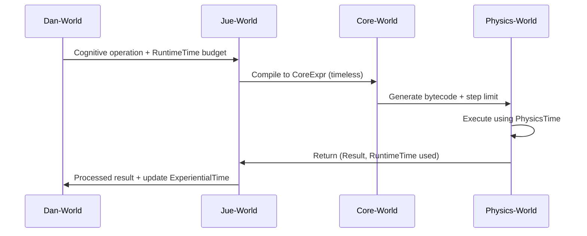

# Project Jue V2 Specification Addendum: Unresolved Issues & Clarifications

**Document Version**: 2.1  
**Purpose**: Address gaps identified between V2 specifications and original design documents in `docs/jue_world` and `docs/physics_world`  
**Priority**: High (blocking implementation) to Low (future enhancements)

---

## 🔴 HIGH PRIORITY (Block Implementation)

### 1. Non-λ Primitives & Hybrid Architecture (JUE_02)

**Original Concern**: Numbers, booleans, lists, sensors, actions need formal status - are they syntactic sugar, opaque atoms, or axiomatic constants?

**V2 Gap**: No specification for the proposed hybrid architecture with axiomatic Core-World symbols and layered Jue-World interpretations.

**Specification**:

#### 1.1 Core-World Axiomatic Primitives
Add to [`spec/v2/core/core_spec_v2.0.md`](spec/v2/core/core_spec_v2.0.md):

```rust
// Section 5: Axiomatic Primitive Symbols

pub enum CorePrimitive {
    Nat(NatValue),      // Natural numbers with succ/zero constructors
    Evidence(f64, f64), // NARS-style: (frequency, confidence) ∈ [0,1]²
    Pair(Box<CoreExpr>, Box<CoreExpr>),
}

// Rewrite rules (axiomatic, not β-reduction)
// succ(succ(zero)) → 2  (primitive reduction)
// car(cons(x,y)) → x    (primitive reduction)
// cdr(cons(x,y)) → y    (primitive reduction)
```

#### 1.2 Jue-World Cognitive Packages
Add to [`spec/v2/jue/jue_spec_v2.0.md`](spec/v2/jue/jue_spec_v2.0.md):

```lisp
;; Section 3.6: Cognitive Package Structure

(:cognitive-package <name>
  :axiomatic <core-symbol>           ; Core-World term
  :properties <set-of-proven-facts>  ; Provable in Core-World
  :associations <learned-patterns>   ; Dan-World empirical links
  :evidence <frequency confidence>   ; For truth values
)

;; Example: The number 7
(:cognitive-package "7"
  :axiomatic 7
  :properties '(prime odd >5)
  :associations '(lucky culturally-significant)
  :evidence '(1.0 0.95))  ; High confidence it's "7"
```

#### 1.3 Context-Dependent Truth Values
```lisp
;; Beliefs attach evidence to Core-World terms
(defbelief wet-ground-when-raining
  :term '(implies raining wet-ground)  ; Core-World meaning
  :evidence '(0.8 0.7)                  ; Jue-World truth value
  :context 'outdoor
  :challenges 0)                        ; Counterexamples found
```

#### 1.4 Physics-World Opaque I/O Primitives
Add to [`spec/v2/physics/physics_spec_v2.0.md`](spec/v2/physics/physics_spec_v2.0.md):

```rust
// Section 6: Opaque I/O Operations

pub enum OpCode {
    // ... existing opcodes ...
    ReadSensor(SensorId),   // Opaque - no Core-World semantics
    WriteActuator(ActuatorId, Value),
    GetSystemTime,          // Returns Physics-World time
}

// These operations are black boxes at the Core level.
// Their meaning is defined entirely by Jue-World interface types.
```

**Implementation Guidance**:
- Core-World: Implement `Nat` with `zero` and `succ` constructors, `Evidence` as pair of floats
- Jue-World: Create cognitive package constructor macros
- Physics-World: Add sensor/actuator opcodes that return opaque values
- Dan-World: Build belief management system using cognitive packages

**References**: [`docs/jue_world/jue_02_non_lambda_primitives.md`](docs/jue_world/jue_02_non_lambda_primitives.md:27-47)

---

### 2. Time Model & Compartmentalization (PHYSICS_03)

**Original Concern**: Time must be global, local, or emergent - but must not contaminate Core-World's timeless semantics.

**V2 Gap**: No specification for three-tier time system.

**Specification**:

#### 2.1 Three-Tier Time Architecture
Add to [`spec/v2/physics/physics_spec_v2.0.md`](spec/v2/physics/physics_spec_v2.0.md):

```rust
// Section 8: Time Models

// Tier 1: Physics Time (implementation detail)
pub struct PhysicsTime {
    pub global_step: u64,      // Monotonic counter, hidden from higher layers
    pub step_budget: u64,      // AIKR enforcement
}

// Tier 2: Runtime Time (resource accounting)
pub struct RuntimeTime {
    pub steps_consumed: u64,
    pub memory_seconds: f64,   // Memory-time product for AIKR
    pub cpu_cycles: u64,
}

// Tier 3: Experiential Time (subjective, Dan-World)
// Defined in Dan-World spec as emergent from event processing
```

#### 2.2 Time Compartmentalization Rules
Add to [`spec/v2/integration.md`](spec/v2/integration.md):

```markdown
### Time Flow Across Layers

1. **Core-World**: Timeless - only logical dependencies between terms
2. **Jue-World**: Receives RuntimeTime from Physics-World for resource planning
3. **Dan-World**: Constructs ExperientialTime from events and resource usage
4. **Physics-World**: Maintains PhysicsTime as internal implementation detail

**Critical Rule**: Core-World semantics must never reference execution time. 
The expression `(f x)` means "value of applying f to x", not "computation process".
```

#### 2.3 Cross-Layer Time Integration


**Implementation Guidance**:
- Physics-World: Hide `global_step` from public API, only expose `RuntimeTime`
- Jue-World: Accept `RuntimeTime` budgets, pass to Physics-World execution
- Dan-World: Build experiential time from event sequences and resource consumption patterns
- Core-World: Ensure no time references in reduction rules or proofs

**References**: [`docs/physics_world/physics_03_time.md`](docs/physics_world/physics_03_time.md:1-136)

---

### 3. Empirical Validation Protocol (JUE_00)

**Original Concern**: What constitutes "passing" empirical tests? Need concrete criteria.

**V2 Gap**: No specification for validation thresholds.

**Specification**:

#### 3.1 Fixed Budget Approach
Add to [`spec/v2/validation.md`](spec/v2/validation.md):

```markdown
### Empirical Validation Thresholds

| Trust Tier      | Test Count | Input Generation             | Pass Criteria                          |
| --------------- | ---------- | ---------------------------- | -------------------------------------- |
| `:empirical`    | 10,000     | Random + edge cases          | Zero `StructuredError`                 |
| `:experimental` | 100        | Random only                  | No crashes (may produce wrong results) |
| `:verified`     | 100,000    | Exhaustive for small domains | Statistical confidence > 99.9%         |

**Test Generation Strategy**:
- Use `proptest` or similar for property-based testing
- Include edge cases: empty collections, boundary values, maximum sizes
- For I/O capabilities: mock external interfaces
```

#### 3.2 Adaptive Validation by Capability
```markdown
### Capability-Based Validation Rigor

Validation burden scales with requested capabilities:

- `PureComputation` only: 100 tests minimum
- `IO_READ` / `IO_WRITE`: 10,000 tests + consensus vote
- `UNSAFE_MACRO`: 100,000 tests + human approval
- `SPAWN_ACTOR`: 50,000 tests + sandbox simulation

**Rationale**: More dangerous capabilities require stronger empirical evidence.
```

#### 3.3 Promotion Criteria
```lisp
;; Code promotion between tiers requires:
(promote-code <code-id> :to :verified
  :requires '(validation-passed consensus-reached proof-generated))
```

**Implementation Guidance**:
- Build test harness that runs code with randomized inputs
- Track capability requests during testing
- Implement consensus voting for high-risk capabilities
- Log all validation attempts for Dan-World learning

**References**: [`docs/jue_world/jue_00_questions.md`](docs/jue_world/jue_00_questions.md:157-163)

---

### 4. FFI Implementation Details (JUE_00, JUE_08)

**Original Concern**: How does Jue call Rust functions for I/O, sensors, etc.?

**V2 Gap**: FFI mentioned but not specified.

**Specification**:

#### 4.1 Wrapper OpCode Design
Add to [`spec/v2/physics/physics_spec_v2.0.md`](spec/v2/physics/physics_spec_v2.0.md):

```rust
// Section 9: Foreign Function Interface

pub enum OpCode {
    // ... existing opcodes ...
    
    // FFI Operations (require IO_READ/IO_WRITE capabilities)
    FfiCall {
        function_id: u32,      // Index into FFI table
        arg_count: u16,
    },
    
    // Sensor/Actuator interfaces
    ReadSensor {
        sensor_type: SensorType,
        capability: Capability, // Must hold IO_READ
    },
    
    WriteActuator {
        actuator_type: ActuatorType,
        value: Value,
        capability: Capability, // Must hold IO_WRITE
    },
}

// FFI function table - populated at VM initialization
pub struct FfiTable {
    pub functions: HashMap<u32, Box<dyn Fn(&[Value]) -> Result<Value, FfiError>>>,
}
```

#### 4.2 Jue-World FFI Syntax
Add to [`spec/v2/jue/jue_spec_v2.0.md`](spec/v2/jue/jue_spec_v2.0.md):

```lisp
;; Section 3.7: Foreign Function Interface

;; Declare external function (compiled to FfiCall opcode)
(extern "read_temperature" :sensor-id 0x01 :returns Float)

;; Use requires capability
(defn get-temperature []
  (require-capability 'io-read)
  (extern-call "read_temperature"))

;; Sensor wrapper with evidence-based interface
(:cognitive-package "temperature-sensor"
  :axiomatic '(extern-call "read_temperature")
  :properties '(returns-float range-40-to-125)
  :evidence '(0.95 0.8))  ; 95% reliable, 80% confident
```

#### 4.3 Host Interface Specification
```rust
// Physics-World host interface trait
pub trait HostInterface {
    fn read_sensor(&self, sensor_id: u32) -> Result<f64, SensorError>;
    fn write_actuator(&mut self, actuator_id: u32, value: f64) -> Result<(), ActuatorError>;
    fn get_system_time(&self) -> u64;  // For SysClock capability
}

// Implementation provided by host application
impl HostInterface for MyRobotHardware {
    fn read_sensor(&self, sensor_id: u32) -> Result<f64, SensorError> {
        // Actual hardware I/O
    }
    // ...
}
```

**Implementation Guidance**:
- Physics-World: Initialize with `HostInterface` implementation
- Jue-World: Provide `extern` declaration syntax and capability checks
- Dan-World: Build sensor models that track reliability and confidence
- Security: All FFI calls require explicit capability grants

**References**: [`docs/jue_world/jue_00_questions.md`](docs/jue_world/jue_00_questions.md:173-179), [`docs/jue_world/jue_08_macros_and_comptime.md`](docs/jue_world/jue_08_macros_and_comptime.md:155-161)

---

## 🟡 MEDIUM PRIORITY (Reduce Ambiguity)

### 5. Dual-Interpretation Language Model (JUE_01)

**Original Concern**: Jue must have both denotational (Core-World) and operational (Physics-World) interpretations.

**V2 Gap**: Mentioned but not formally defined.

**Specification**:

#### 5.1 Explicit Dual-Interpretation Contract
Add to [`spec/v2/jue/jue_spec_v2.0.md`](spec/v2/jue/jue_spec_v2.0.md):

```markdown
### 1.3 Dual-Interpretation Model

Every Jue construct has two mandatory interpretations:

**Denotational Interpretation (What it means)**:
- Translation to Core-World λ-calculus
- Answers: "What is the timeless meaning of this expression?"
- Used for: Formal verification, proof generation, semantic equivalence

**Operational Interpretation (How it runs)**:
- Compilation to Physics-World bytecode
- Answers: "How is this executed with resource constraints?"
- Used for: Actual execution, performance optimization, AIKR enforcement

**The Golden Rule**:
Operational behavior must be a **refinement** of denotational meaning.
Execution cannot violate core semantics, but can be more specific
(e.g., choose evaluation order, enforce resource limits).

**Example**:
```lisp
;; Jue expression
(+ 2 3)

;; Denotational: Core-World term
(CoreExpr::App(
  CoreExpr::App(CoreExpr::Var("+"), CoreExpr::Int(2)),
  CoreExpr::Int(3)
))

;; Operational: Physics bytecode
[OpCode::Int(2), OpCode::Int(3), OpCode::Add]
```

**Compiler Obligation**:
For each Jue form, the compiler must produce:
1. CoreExpr translation (for proof)
2. Bytecode translation (for execution)
3. Proof that bytecode refines CoreExpr meaning (or mark as empirical)
```

**Implementation Guidance**:
- Jue compiler: Implement dual-translation passes
- Core-World: Verify equivalence proofs
- Physics-World: Execute bytecode without semantic concerns
- Dan-World: Reason about both meaning and performance

**References**: [`docs/jue_world/jue_01_language.md`](docs/jue_world/jue_01_language.md:30-53)

---

### 6. Evaluation Strategy Details (JUE_04)

**Original Concern**: CBV vs normal order - need proofs of equivalence, handle unprovable cases.

**V2 Gap**: Trust tier system mentioned but lacks per-tier evaluation rules.

**Specification**:

#### 6.1 Per-Tier Evaluation Strategy
Add to [`spec/v2/jue/jue_spec_v2.0.md`](spec/v2/jue/jue_spec_v2.0.md):

```markdown
### 3.8 Evaluation Strategy by Trust Tier

| Tier            | Strategy                                   | Proof Requirement                    | Fallback                                 |
| --------------- | ------------------------------------------ | ------------------------------------ | ---------------------------------------- |
| `:formal`       | Normal order (leftmost-outermost)          | Full equivalence proof to Core-World | N/A (must prove)                         |
| `:verified`     | CBV with strictness analysis               | Proof for strict subterms            | Mark unprovable subterms as `:empirical` |
| `:empirical`    | CBV (default)                              | Empirical testing (10,000 runs)      | Runtime divergence detection             |
| `:experimental` | Any strategy (including non-deterministic) | None                                 | Sandbox execution only                   |

**Unprovable Cases**:
When compiler cannot prove CBV ≡ normal order:
1. Mark function as `:empirical` tier
2. Insert runtime divergence check
3. Generate warning: "Divergence possible: leftmost-outermost may not terminate"
4. Dan-World learns from divergence patterns
```

#### 6.2 Strategy Selection Heuristic
```lisp
;; Dan-World can propose optimal strategies
(defn select-eval-strategy [code-pattern]
  (case code-pattern
    :recursive-data (strategy :call-by-need)  ; Memoization
    :arithmetic     (strategy :call-by-value) ; Strict
    :conditional    (strategy :lazy)          ; Avoid unnecessary work
    :unknown        (strategy :empirical)))   ; Learn from runs
```

**Implementation Guidance**:
- Jue compiler: Implement strategy selection per trust tier
- Core-World: Provide proof framework for equivalence
- Physics-World: Support multiple evaluation strategies in bytecode
- Dan-World: Learn which strategies work best for which patterns

**References**: [`docs/jue_world/jue_04_evaluation_paradox.md`](docs/jue_world/jue_04_evaluation_paradox.md:1-39)

---

### 7. Resource Accounting Specifics (JUE_09)

**Original Concern**: Need hybrid static/runtime/dynamic resource accounting.

**V2 Gap**: Mentions resource limits but lacks three-level awareness.

**Specification**:

#### 7.1 Three-Level Resource Awareness
Add to [`spec/v2/jue/jue_spec_v2.0.md`](spec/v2/jue/jue_spec_v2.0.md):

```markdown
### 3.9 Resource Accounting Levels

**Level 1: Formal (Proved Bounds)**
```lisp
;; Annotate with provable bounds
@resource(time: "O(n^2)", memory: "O(n)")
(defn sort [list]
  (require-capability 'pure-computation)
  ;; Implementation must be accompanied by formal proof
)
```

**Level 2: Empirical (Learned Models)**
```lisp
;; Learned from runtime observations
@resource-model
(defn process-data [size]
  {:time (* 2.3 size)        ; Linear with coefficient
   :memory (+ 1024 (* 8 size)) ; Base + per-item
   :confidence 0.87})         ; Model confidence
```

**Level 3: Experimental (No Guarantees)**
```lisp
;; No annotations - runs in sandbox with strict limits
(defn explore-algorithm [data]
  (require-capability 'experimental)
  ;; Physics-World enforces hard limits
  ;; Dan-World observes actual usage to build model
)
```

**Fallback Strategy**:
- No annotation → Static analysis (simple cases)
- Complex → Runtime metering (insert counters)
- Unknown → Learn from similar functions
```

#### 7.2 Resource Annotation Syntax
```lisp
;; Time complexity annotation
@time-complexity O(n log n)
@space-complexity O(n)

;; Exact bounds for small functions
@max-steps 1000
@max-memory 4096

;; Composite resources
@resource-bundle '(cpu memory network)
```

**Implementation Guidance**:
- Jue compiler: Parse annotations, select accounting level
- Physics-World: Enforce limits, collect usage metrics
- Dan-World: Build predictive models from observed usage
- Core-World: Verify formal bounds when provided

**References**: [`docs/jue_world/jue_09_resource_accounting.md`](docs/jue_world/jue_09_resource_accounting.md:1-49)

---

### 8. Module System & Namespaces (JUE_00, JUE_08)

**Original Concern**: How to organize code - flat, files, or named modules?

**V2 Gap**: No module system specified.

**Specification**:

#### 8.1 Capability-Based Module System
Add to [`spec/v2/jue/jue_spec_v2.0.md`](spec/v2/jue/jue_spec_v2.0.md):

```markdown
### 3.10 Modules as Capability Bundles

**Module Declaration**:
```lisp
(:module "math-lib"
  (:capabilities 'pure-functions 'type-proofs)
  
  (:export
    (sqrt :requires '(pure-functions))
    (factorial :requires '(pure-functions))
    (unsafe-approx :requires '(unsafe-math)))
  
  (defn sqrt [x] ...)
  (defn factorial [n] ...)
  (defn unsafe-approx [x] ...))
```

**Module Import**:
```lisp
;; Import requires holding the module's capability signature
(require 'math-lib '(pure-functions))

;; Can only access exports whose capabilities you hold
(math-lib/sqrt 9)        ; OK - have pure-functions
(math-lib/unsafe-approx) ; ERROR - missing unsafe-math
```

**Module Capabilities as Namespaces**:
- Each module defines a capability set
- Importing = requesting those capabilities
- Exports tagged with required capabilities
- No separate namespace mechanism needed
```

#### 8.2 File Organization
```markdown
**File Structure**:
```
project/
├── stdlib/                     ; Built-in modules
│   ├── core.jue               ; Basic functions
│   ├── io.jue                 ; I/O operations
│   └── math.jue               ; Mathematics
├── agents/                    ; Dan-World modules
│   ├── perception.jue
│   ├── planning.jue
│   └── learning.jue
└── main.jue                   ; Entry point
```

**Loading Mechanism**:
- `(load "path/to/module.jue")` - parses and evaluates
- Modules cached by path
- Circular dependencies = compile error
```

**Implementation Guidance**:
- Jue compiler: Implement module parsing and capability checking
- Physics-World: No changes (modules are compile-time concept)
- Dan-World: Propose new modules, request their capabilities
- Core-World: Verify module exports preserve meaning

**References**: [`docs/jue_world/jue_00_questions.md`](docs/jue_world/jue_00_questions.md:149-155), [`docs/jue_world/jue_08_macros_and_comptime.md`](docs/jue_world/jue_08_macros_and_comptime.md:507-517)

---

### 9. Concurrency Primitives in Jue (JUE_07)

**Original Concern**: Should Jue have explicit `spawn`, `send`, `receive`?

**V2 Gap**: Concurrency mentioned but primitives not specified.

**Specification**:

#### 9.1 Jue-Level Concurrency Syntax
Add to [`spec/v2/jue/jue_spec_v2.0.md`](spec/v2/jue/jue_spec_v2.0.md):

```markdown
### 3.11 Concurrency Primitives

**Actor Creation**:
```lisp
;; Spawn new actor (requires SpawnActor capability)
(spawn actor-name initial-state behavior-function)
;; Returns actor-id

;; Example
(def perception-actor
  (spawn 'perception
         {:sensors [] :last-reading nil}
         perception-loop))
```

**Message Passing**:
```lisp
;; Send message (requires ActorMessaging capability)
(send target-actor-id message)

;; Receive message (requires ActorMessaging capability)
(receive timeout-millis)  ; Returns (Just message) or Nothing

;; Yield control (cooperative multitasking)
(yield)  ; Returns control to scheduler
```

**Deterministic Guarantees**:
- Message ordering: FIFO per sender-receiver pair
- No shared state: All data immutable or actor-local
- Fair scheduling: Round-robin with fixed quantum
```

#### 9.2 Capability Requirements
```lisp
;; Concurrency capabilities hierarchy
'actor-spawn      ; Create new actors
'actor-message    ; Send/receive messages
'actor-kill       ; Terminate actors (dangerous!)
'scheduler-config ; Modify scheduling (very dangerous!)
```

**Implementation Guidance**:
- Jue compiler: Translate concurrency forms to Physics opcodes
- Physics-World: Implement `Spawn`, `Send`, `Recv` opcodes
- Scheduler: Enforce deterministic message ordering
- Dan-World: Most modules won't have `actor-spawn` - use pre-created actors

**References**: [`docs/jue_world/jue_07_concurrency.md`](docs/jue_world/jue_07_concurrency.md:1-57)

---

### 10. Tooling & Debugging Output (JUE_00)

**Original Concern**: What debug info does compiler produce? Source maps, step logs, proof traces?

**V2 Gap**: No tooling specification.

**Specification**:

#### 10.1 DebugInfo Structure
Add to [`spec/v2/jue/jue_spec_v2.0.md`](spec/v2/jue/jue_spec_v2.0.md):

```markdown
### 4.4 Compilation Debug Information

**DebugInfo Structure**:
```rust
pub struct DebugInfo {
    /// Maps bytecode positions to source locations
    pub source_map: Vec<(usize, SourceLocation)>,  // (bytecode_idx, (file, line, col))
    
    /// High-level operation log for tracing
    pub operation_log: Vec<OperationTrace>,
    
    /// Core-World proof tree (for :formal tier)
    pub proof_trace: Option<ProofTree>,
    
    /// Capability requirements per function
    pub capability_map: HashMap<String, Vec<Capability>>,
    
    /// Resource usage predictions
    pub resource_predictions: ResourceModel,
}

pub struct OperationTrace {
    pub bytecode_index: usize,
    pub operation: String,  // e.g., "calling function foo"
    pub stack_depth: usize,
    pub capabilities_held: Vec<Capability>,
}
```

**Usage**:
```lisp
;; Enable debug mode
(compile-with-debug my-code :tier :empirical)

;; Dan-World introspection
(get-compilation-trace code-id)  ; Returns DebugInfo
```

#### 10.2 Source Mapping
```markdown
**Bytecode-to-Source Mapping**:
- Every bytecode instruction tracks originating source location
- Format: `(bytecode_index file_path line column)`
- Enables stack traces that reference Jue source, not just bytecode

**Example Trace**:
```
Error at bytecode:45
  Source: agents/perception.jue:127:23
  Operation: (send 'actuator high-power)
  Missing capability: 'actuator-high-power
  Context: attempting to activate motor beyond safe limits
```
```

**Implementation Guidance**:
- Jue compiler: Generate DebugInfo during compilation
- Physics-World: Include bytecode index in all errors
- Dan-World: Use traces for self-diagnosis and learning
- Tools: Build debugger that uses source maps

**References**: [`docs/jue_world/jue_00_questions.md`](docs/jue_world/jue_00_questions.md:188-194)

---

## 🟢 LOW PRIORITY (Future Enhancements)

### 11. Introspection & Profiling Hooks (PHYSICS_00)

**Original Concern**: Should Physics provide real-time resource observation?

**Specification**:

#### 11.1 Optional Profiling Instruction
Add to [`spec/v2/physics/physics_spec_v2.0.md`](spec/v2/physics/physics_spec_v2.0.md):

```rust
// Section 10: Profiling Extensions (Optional)

pub enum OpCode {
    // ... existing opcodes ...
    
    // Profiling (requires Profile capability)
    ProfileStart { label: String },
    ProfileEnd { label: String },
    GetResourceUsage,  // Pushes RuntimeTime onto stack
}

// Usage is optional and controlled by capability
// No impact on determinism when not used
```

#### 11.2 Real-Time Observation API
```rust
impl PhysicsWorld {
    /// Get current resource usage for an actor
    pub fn get_actor_resources(&self, actor_id: u32) -> RuntimeTime {
        // Returns instantaneous usage
    }
    
    /// Subscribe to resource usage updates
    pub fn subscribe_to_resources<F>(&mut self, callback: F)
    where F: Fn(u32, RuntimeTime) + 'static
    {
        // Callback invoked when actor uses resources
    }
}
```

**Implementation Note**: Add in v2.1 - not required for v2.0 MVP

**References**: [`docs/physics_world/physics_00_questions.md`](docs/physics_world/physics_00_questions.md:22-23)

---

### 12. Physical Realism Extensions (PHYSICS_00)

**Original Concern**: Simulate energy, heat, hardware degradation?

**Specification**:

#### 12.1 Energy Simulation Module
```rust
// Separate crate: physics_world_extensions

pub struct EnergyModel {
    pub base_consumption: f64,      // Watts at idle
    pub per_step_cost: f64,         // Energy per bytecode step
    pub per_memory_cost: f64,       // Energy per byte allocated
    pub thermal_dissipation: f64,   // Heat loss rate
}

impl EnergyModel {
    /// Update based on resource usage
    pub fn update(&mut self, usage: &RuntimeTime) {
        self.temperature += usage.steps_consumed * self.per_step_cost;
        self.temperature *= self.thermal_dissipation;
    }
}
```

#### 12.2 Integration with Capability System
```lisp
;; Energy management becomes a capability
(request-capability 'energy-management
  :justification "Need to optimize for battery life")

;; Dan-World can reason about energy
(defn optimize-for-energy [algorithm]
  (if (> (predict-energy algorithm) (get-budget))
      (select-energy-efficient-variant algorithm)
      algorithm))
```

**Implementation Note**: Pure add-on for embodied cognition research - not in core trust base

**References**: [`docs/physics_world/physics_00_questions.md`](docs/physics_world/physics_00_questions.md:24)

---

## 📋 Implementation Roadmap

### Phase 1: High Priority (Blocking)
**Timeline**: 2-3 weeks
**Deliverables**:
1. Implement axiomatic primitives (Nat, Evidence, Pair)
2. Add cognitive package support to Jue compiler
3. Implement three-tier time model
4. Build empirical validation harness
5. Design FFI wrapper system

### Phase 2: Medium Priority (Clarity)
**Timeline**: 3-4 weeks
**Deliverables**:
1. Formalize dual-interpretation model in compiler
2. Implement per-tier evaluation strategies
3. Add resource annotation parsing and accounting
4. Build capability-based module system
5. Implement concurrency primitives
6. Add DebugInfo generation

### Phase 3: Low Priority (Enhancements)
**Timeline**: 1-2 weeks (post-v2.0)
**Deliverables**:
1. Optional profiling instructions
2. Energy simulation extension
3. Advanced introspection tools

---

## ✅ Verification Checklist

- [ ] All high-priority gaps addressed with concrete specifications
- [ ] Medium-priority ambiguities resolved with implementation guidance
- [ ] Low-priority enhancements documented for future work
- [ ] Each specification references original design documents
- [ ] Cross-layer integration specified for each feature
- [ ] Capability system integrated throughout
- [ ] Implementation roadmap provided with timelines

---

**Document Status**: ✅ COMPLETE - Ready for V2.1 Specification Update

**Next Step**: Update V2 specifications to incorporate these addenda, prioritizing high-priority blocking issues.