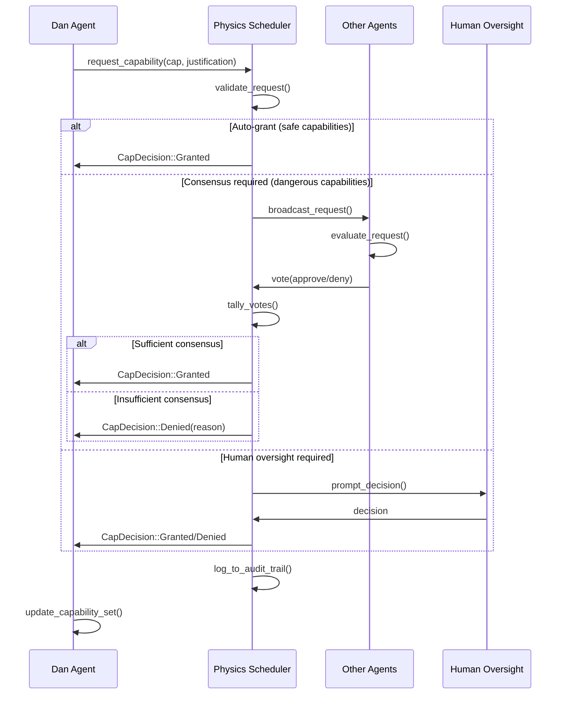
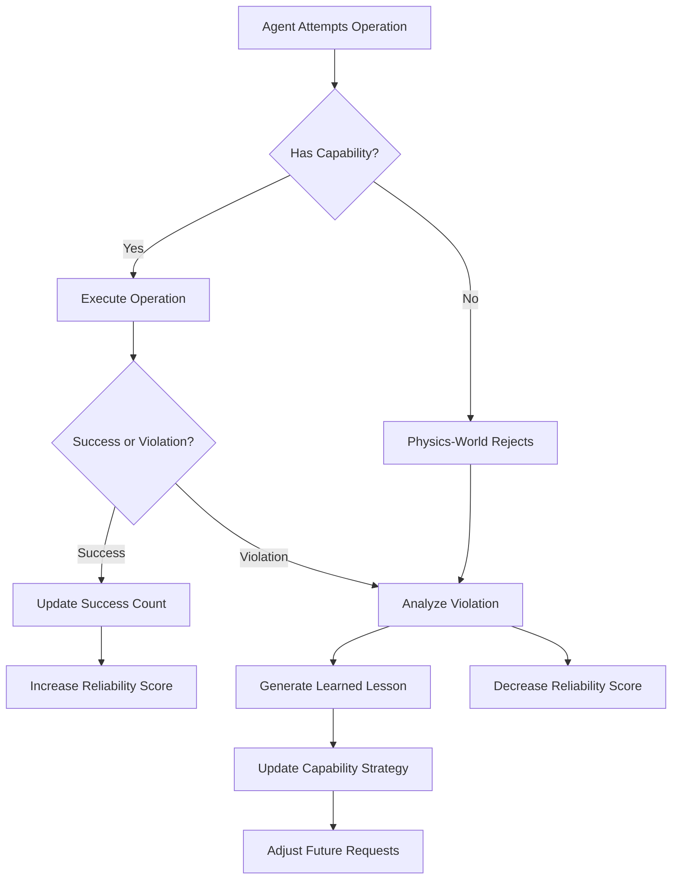

# **Project Jue: Dan-World Specification v2.0**
## **The Capability-Centric Cognitive Ecology**

### **1. Core Philosophy & Architectural Shift**

Dan-World V2 is fundamentally reimagined around a single principle: **Capability management is the primary cognitive activity.** Agents don't just execute code—they **negotiate for power, form consensus about dangerous operations, learn from capability violations, and socially reason about distributing capabilities.**

**Key Insight:** Capabilities transform from a security mechanism into **first-class cognitive concepts**. An agent's intelligence is measured by its ability to effectively acquire, use, and manage capabilities in service of its goals.

### **2. The Capability Negotiation Protocol**

All capability acquisition follows a structured negotiation protocol.

#### **2.1. Capability Request Structure**

```rust
// dan_world/src/negotiation.rs

pub struct CapabilityRequest {
    pub requester_id: ActorId,
    pub capability: Capability,
    pub justification: Justification,
    pub priority: RequestPriority,
    pub requested_at: Timestamp,
    pub evidence: Vec<Evidence>,  // Supporting data
}

pub struct Justification {
    pub goal: String,              // What goal does this serve?
    pub method: String,            // How will capability be used?
    pub safety_plan: String,       // How will risks be mitigated?
    pub estimated_benefit: f64,    // Expected utility gain
    pub estimated_risk: f64,       // Expected risk level (0.0-1.0)
}

pub enum RequestPriority {
    Critical,    // Blocking operation
    High,        // Significant optimization
    Medium,      // Convenience feature
    Low,         // Exploratory
}

pub enum Evidence {
    PerformanceData { before: f64, after: f64 },
    SafetyRecord { violations: usize, total_uses: usize },
    PeerRecommendation { from: ActorId, weight: f64 },
    HumanApproval { source: String },
}
```

#### **2.2. The Negotiation Flow**



#### **2.3. Decision Matrix**

The scheduler uses this matrix to determine how to handle each request:

```rust
impl PhysicsScheduler {
    fn decide_capability_request(
        &self,
        request: &CapabilityRequest,
    ) -> DecisionPath {
        match &request.capability {
            // Safe capabilities: auto-grant
            Capability::MacroHygienic => DecisionPath::AutoGrant,
            
            // Resource capabilities: check availability
            Capability::ResourceExtraMemory(bytes) => {
                if self.available_memory >= bytes {
                    DecisionPath::AutoGrant
                } else {
                    DecisionPath::Deny("Insufficient system memory".into())
                }
            }
            
            // Dangerous but personal: require justification review
            Capability::MetaSelfModify => {
                if self.evaluate_justification_quality(request) > 0.7 {
                    DecisionPath::AutoGrant
                } else {
                    DecisionPath::RequireConsensus(ConsensusThreshold::SimpleMajority)
                }
            }
            
            // Socially dangerous: require consensus
            Capability::SysTerminateActor |
            Capability::MetaGrant => {
                DecisionPath::RequireConsensus(ConsensusThreshold::Supermajority(0.75))
            }
            
            // Irreversible: require human oversight
            Capability::SysCreateActor => {
                DecisionPath::RequireHumanApproval(ApprovalLevel::Critical)
            }
            
            // Unknown capability: deny
            _ => DecisionPath::Deny("Unknown capability type".into()),
        }
    }
}
```

### **3. Consensus Mechanisms**

#### **3.1. Voting Protocol**

```rust
pub struct Vote {
    pub voter_id: ActorId,
    pub request_id: RequestId,
    pub decision: VoteDecision,
    pub reasoning: String,
    pub confidence: f64,  // 0.0-1.0
}

pub enum VoteDecision {
    Approve,
    Deny,
    Abstain,
}

pub struct ConsensusResult {
    pub approved: bool,
    pub total_votes: usize,
    pub approve_votes: usize,
    pub deny_votes: usize,
    pub weighted_score: f64,  // Consider confidence levels
}
```

#### **3.2. Consensus Thresholds**

```rust
pub enum ConsensusThreshold {
    SimpleMajority,      // > 50%
    Supermajority(f64),  // e.g., 0.75 for 75%
    Unanimous,           // 100%
    WeightedByTrust,     // Votes weighted by historical trust
}

impl ConsensusThreshold {
    fn is_met(&self, result: &ConsensusResult) -> bool {
        match self {
            SimpleMajority => result.approve_votes > result.total_votes / 2,
            Supermajority(pct) => {
                (result.approve_votes as f64 / result.total_votes as f64) > *pct
            }
            Unanimous => result.deny_votes == 0,
            WeightedByTrust => result.weighted_score > 0.5,
        }
    }
}
```

#### **3.3. Reputation System**

Agents build reputation based on their capability usage history:

```rust
pub struct ReputationScore {
    pub actor_id: ActorId,
    pub successful_uses: usize,      // Uses without violations
    pub total_uses: usize,
    pub violations: usize,           // Capability violations
    pub peer_ratings: Vec<PeerRating>,
    pub trust_decay: f64,            // Exponential decay factor
}

impl ReputationScore {
    fn reliability(&self) -> f64 {
        if self.total_uses == 0 { return 0.0; }
        (self.successful_uses as f64 / self.total_uses as f64) 
            * (1.0 - self.trust_decay).powi(self.violations)
    }
    
    fn voting_weight(&self) -> f64 {
        // More reliable actors have more voting weight
        0.5 + (self.reliability() * 0.5)
    }
}
```

### **4. Learning from Capability Violations**

Capability violations are the **primary learning signal** for Dan agents.

#### **4.1. Violation Types and Learning**

```rust
pub enum CapabilityViolation {
    MissingCapability {
        attempted: Capability,
        context: String,
    },
    ResourceExhaustion {
        resource: String,
        limit: u64,
        attempted: u64,
    },
    UnsafeOperation {
        operation: String,
        consequence: String,
    },
    ConsensusRejected {
        request: CapabilityRequest,
        reason: String,
    },
}

pub struct LearningUpdate {
    pub violation: CapabilityViolation,
    pub lesson: LearnedLesson,
    pub confidence: f64,
}

pub enum LearnedLesson {
    // Capability was needed but not held
    AcquireBeforeUse(Capability),
    
    // Capability was too powerful for the task
    UseWeakerCapability(Capability, Capability),
    
    // Justification was insufficient
    ImproveJustification(String),
    
    // Request timing was poor
    BetterTimingHeuristic(Box<dyn Fn(&Context) -> bool>),
    
    // Social factors matter
    BuildPeerSupportFirst(Vec<ActorId>),
}
```

#### **4.2. The Learning Loop**



#### **4.3. Capability Strategy Updates**

Agents maintain a dynamic strategy for each capability:

```rust
pub struct CapabilityStrategy {
    pub capability: Capability,
    
    // When to request
    pub request_heuristic: Box<dyn Fn(&Context) -> f64>,
    
    // How to justify
    pub justification_template: String,
    
    // Who to ask for support
    pub peer_supporters: Vec<ActorId>,
    
    // Risk tolerance
    pub acceptable_risk: f64,
    
    // Learning rate
    pub learning_rate: f64,
}

impl CapabilityStrategy {
    fn update_from_violation(&mut self, violation: &CapabilityViolation) {
        match violation {
            MissingCapability { .. } => {
                // Lower threshold for requesting this capability
                self.acceptable_risk *= 0.9;
            }
            ConsensusRejected { .. } => {
                // Build more peer support before next request
                self.peer_supporters = self.identify_potential_allies();
            }
            ResourceExhaustion { .. } => {
                // Be more conservative in resource estimates
                self.request_heuristic = self.more_conservative_heuristic();
            }
            _ => {}
        }
    }
}
```

### **5. Cognitive Module Architecture**

#### **5.1. Module Types**

```rust
pub trait CognitiveModule {
    fn process_event(&mut self, event: &Event) -> Vec<ModuleAction>;
    fn get_capability_needs(&self) -> Vec<CapabilityNeed>;
    fn vote_on_request(&self, request: &CapabilityRequest) -> Vote;
}

pub enum ModuleType {
    // Proposes capability requests
    CapabilitySeeker(CapabilitySeekerModule),
    
    // Evaluates others' requests
    CapabilityGuardian(CapabilityGuardianModule),
    
    // Learns from violations
    ViolationLearner(ViolationLearnerModule),
    
    // Manages peer relationships
    SocialCoordinator(SocialCoordinatorModule),
    
    // Plans capability usage
    CapabilityPlanner(CapabilityPlannerModule),
    
    // Meta-cognition about capabilities
    SelfReflector(SelfReflectorModule),
}
```

#### **5.2. Example: CapabilitySeeker Module**

```rust
pub struct CapabilitySeekerModule {
    pub target_capability: Capability,
    pub goal_system: GoalSystem,
    pub strategy: CapabilityStrategy,
    pub last_request: Option<Timestamp>,
}

impl CognitiveModule for CapabilitySeekerModule {
    fn process_event(&mut self, event: &Event) -> Vec<ModuleAction> {
        match event {
            Event::GoalActivated(goal) if goal.needs_capability(&self.target_capability) => {
                vec![ModuleAction::RequestCapability {
                    capability: self.target_capability.clone(),
                    justification: self.generate_justification(goal),
                    priority: RequestPriority::High,
                }]
            }
            
            Event::CapabilityGranted { capability, .. } if *capability == self.target_capability => {
                vec![ModuleAction::ExecutePlan {
                    using_capability: self.target_capability.clone(),
                }]
            }
            
            Event::CapabilityDenied { capability, reason } if *capability == self.target_capability => {
                vec![ModuleAction::LearnFromDenial {
                    reason: reason.clone(),
                    update_strategy: true,
                }]
            }
            
            _ => vec![],
        }
    }
    
    fn generate_justification(&self, goal: &Goal) -> Justification {
        Justification {
            goal: goal.description(),
            method: format!("Use {:?} to achieve {}", self.target_capability, goal.name),
            safety_plan: self.strategy.safety_plan.clone(),
            estimated_benefit: goal.utility(),
            estimated_risk: self.assess_risk(),
        }
    }
}
```

### **6. Self-Modification Through Capability Acquisition**

Self-modification is reframed as **acquiring the capability to modify oneself**.

#### **6.1. The Self-Modification Protocol**

```lisp
;; Dan agent requesting self-modification capability
(defmodule self-modification-requester
  (defn request-self-modify-cap []
    (let [justification "
      GOAL: Improve planning efficiency
      OBSERVATION: Current planner uses O(n²) algorithm
      PROPOSAL: Acquire MetaSelfModify to implement O(n log n) planner
      SAFETY PLAN:
        1. Test in sandbox with 1000 random inputs
        2. Keep old planner as fallback
        3. Limit modification to planning module only
      ESTIMATED BENEFIT: 5x speedup on large plans
      ESTIMATED RISK: 0.3 (medium)
    "]
      
      ;; Request the capability
      (request-capability 'meta-self-modify justification))))
```

#### **6.2. Sandboxed Self-Modification**

```rust
pub struct SelfModificationSandbox {
    pub original_code: Vec<OpCode>,
    pub proposed_changes: Vec<CodeChange>,
    pub test_suite: Vec<TestCase>,
    pub safety_constraints: Vec<SafetyConstraint>,
}

impl SelfModificationSandbox {
    fn validate_changes(&self) -> Result<ValidationReport, ValidationError> {
        // 1. Run test suite on original code (baseline)
        let baseline_results = self.run_tests(&self.original_code);
        
        // 2. Apply proposed changes
        let modified_code = self.apply_changes();
        
        // 3. Run test suite on modified code
        let modified_results = self.run_tests(&modified_code);
        
        // 4. Check safety constraints
        let safety_violations = self.check_safety(&modified_code);
        
        // 5. Compare performance
        let performance_delta = self.compare_performance(
            &baseline_results,
            &modified_results
        );
        
        ValidationReport {
            is_safe: safety_violations.is_empty(),
            is_correct: modified_results.pass_rate >= baseline_results.pass_rate,
            performance_improvement: performance_delta,
            recommendation: self.generate_recommendation(),
        }
    }
}
```

### **7. Social Reasoning & Multi-Agent Capability Management**

#### **7.1. Capability Trading**

Agents can trade capabilities among themselves:

```rust
pub struct CapabilityTrade {
    pub offer: CapabilityOffer,
    pub request: CapabilityRequest,
    pub terms: TradeTerms,
}

pub struct CapabilityOffer {
    pub capability: Capability,
    pub duration: Option<Duration>,  // None = permanent
    pub conditions: Vec<TradeCondition>,
}

pub enum TradeCondition {
    MutualCapabilitySwap(Capability),
    FutureFavor owed_to: ActorId,
    ResourcePayment(amount: u64),
    CodeReviewRequired(reviewer: ActorId),
}

impl SocialCoordinatorModule {
    fn negotiate_trade(
        &mut self,
        counterparty: ActorId,
        our_need: Capability,
        our_offer: Capability,
    ) -> Result<TradeAgreement, NegotiationError> {
        // 1. Assess counterparty's needs
        let their_needs = self.assess_capability_needs(counterparty);
        
        // 2. Propose mutually beneficial trade
        if their_needs.contains(&our_offer) {
            Ok(TradeAgreement::symmetric_swap(our_offer, our_need))
        } else {
            // 3. Find alternative compensation
            self.find_alternative_terms(counterparty, our_need)
        }
    }
}
```

#### **7.2. Reputation-Based Capability Grants**

Agents with good reputation get more trust:

```rust
pub struct ReputationBasedGrant {
    pub request: CapabilityRequest,
    pub requester_reputation: f64,
    pub threshold: f64,
}

impl ReputationBasedGrant {
    fn should_grant(&self) -> bool {
        // Higher reputation = lower consensus threshold needed
        let adjusted_threshold = self.threshold * (1.0 - self.requester_reputation * 0.5);
        self.requester_reputation > adjusted_threshold
    }
}
```

### **8. The Global Capability Marketplace**

A decentralized system where capabilities become tradable resources:

```rust
pub struct CapabilityMarketplace {
    pub listings: Vec<CapabilityListing>,
    pub recent_trades: Vec<TradeRecord>,
    pub price_oracle: PriceOracle,
}

pub struct CapabilityListing {
    pub seller: ActorId,
    pub capability: Capability,
    pub asking_price: CapabilityPrice,
    pub constraints: SaleConstraints,
}

pub enum CapabilityPrice {
    DirectSwap(Capability),
    ResourceUnits(u64),
    FutureFavor(FavorTerms),
    ReputationCollateral(f64),
}

impl CapabilityMarketplace {
    fn find_best_deal(
        &self,
        buyer: ActorId,
        needed: Capability,
        budget: &Budget,
    ) -> Option<TradeRecommendation> {
        // 1. Filter listings by capability type
        let relevant = self.listings.iter()
            .filter(|l| l.capability == needed);
        
        // 2. Score by price, seller reputation, and constraints
        let scored = relevant.map(|listing| {
            let reputation = self.get_seller_reputation(&listing.seller);
            let price_score = self.price_oracle.assess_fairness(&listing.asking_price);
            let total_score = reputation * 0.4 + price_score * 0.6;
            
            (listing, total_score)
        });
        
        // 3. Return best option
        scored.max_by_key(|(_, score)| *score)
    }
}
```

### **9. Implementation Tasks for LLM**

**Phase 1: Core Negotiation**
1. **Task D1:** Implement `CapabilityRequest` and `Justification` structures
2. **Task D2:** Build basic request/response protocol
3. **Task D3:** Create simple decision matrix in scheduler

**Phase 2: Consensus & Voting**
4. **Task D4:** Implement voting protocol with message passing
5. **Task D5:** Build consensus tallying algorithms
6. **Task D6:** Add reputation tracking system

**Phase 3: Learning**
7. **Task D7:** Create violation analysis engine
8. **Task D8:** Implement capability strategy updates
9. **Task D9:** Build learning loop integration

**Phase 4: Social & Self-Modification**
10. **Task D10:** Implement capability trading protocol
11. **Task D11:** Build self-modification sandbox
12. **Task D12:** Create marketplace infrastructure

### **10. Metrics for Success**

Dan-World V2 success is measured by:

1. **Capability Acquisition Rate:** Agents successfully acquire needed capabilities
2. **Consensus Quality:** Dangerous capabilities only granted with appropriate oversight
3. **Learning Efficiency:** Violations decrease over time as strategies improve
4. **Social Coordination:** Agents effectively trade and share capabilities
5. **Self-Modification Safety:** Self-modifications improve performance without increasing violations
6. **System Stability:** No catastrophic failures from capability misuse

### **11. The Critical Dan-World Test**

This test validates that Dan agents can learn to manage capabilities:

```rust
// Test: Agent learns to request appropriate capabilities
let mut agent = DanAgent::new();
let goal = Goal::new("process_sensor_data", utility: 10.0);

// Phase 1: Initial attempt fails (no capability)
let result1 = agent.attempt_goal(&goal);
assert!(matches!(result1, Err(CapabilityViolation::MissingCapability { .. })));

// Phase 2: Agent learns to request capability
agent.learn_from_violation(&result1.unwrap_err());
let request = agent.propose_capability_request();
assert!(request.capability == Capability::IoReadSensor);

// Phase 3: After acquiring capability, succeeds
agent.grant_capability(Capability::IoReadSensor);
let result2 = agent.attempt_goal(&goal);
assert!(result2.is_ok());

// Phase 4: Agent generalizes learning
let goal2 = Goal::new("write_to_log", utility: 5.0);
let request2 = agent.plan_for_goal(&goal2);
assert!(request2.capability == Capability::IoWriteActuator);
```

This specification makes Dan-World V2 concrete: it's the **cognitive layer where power becomes a managed resource**, transforming Project Jue from a secure system into a **learning system that understands its own limitations and negotiates to overcome them**.