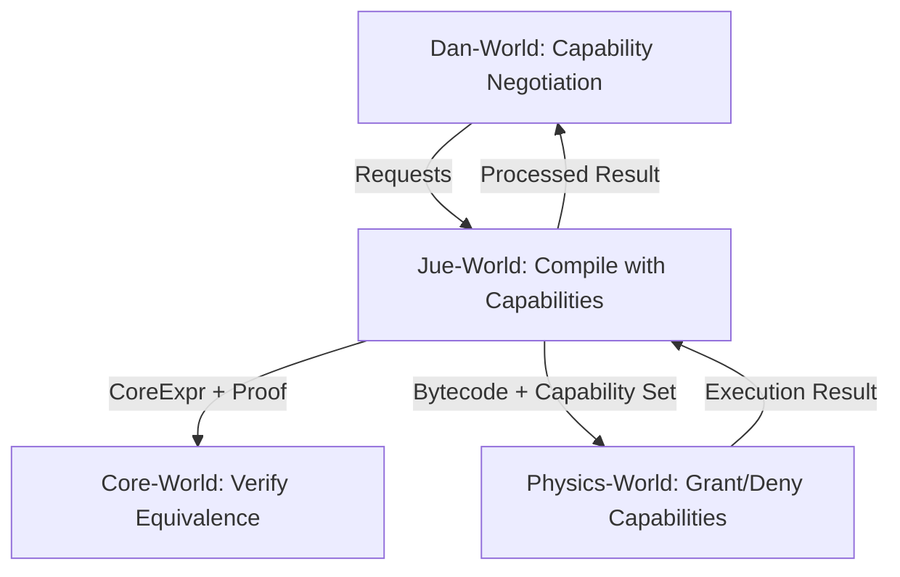

# Project Jue V2: Unified Design Decisions

## Executive Summary

The V2 specifications unify all layers under a **capability-based security and governance model**. This single architectural principle resolves macro/FFI trust issues, unifies type handling and error management, and provides a rich cognitive substrate for Dan-World agents.

## Core Design Principle: Capability-Based Architecture

**Every privileged operation requires an explicit capability token granted by Physics-World.** This creates a unified security model where agents must consciously request and justify power.

### Key Benefits
1. **Unified Security**: Macros, FFI, self-modification use the same mechanism
2. **Gradual Empowerment**: Agents start minimal, earn capabilities through justification/consensus
3. **Perfect Introspection**: Complete capability history explains any action
4. **AIKR Alignment**: Capabilities like `ResourceExtraMemory` make limits explicit and negotiable
5. **Formal Compatibility**: For `:formal` tier, capabilities can be statically verified

## Layer-by-Layer Impact

### Core-World V2: Immutable Formal Kernel
- **Philosophy**: Remains pure and timeless; capabilities are outside its concern
- **Role**: Proves equivalence of λ-terms; capabilities are operational, not semantic
- **Interface**: Minimal API (`verify_equivalence`, `normalize`) unchanged
- **Key Decision**: Core-World does not reason about capabilities; they belong to operational layers

### Physics-World V2: Capability-Enforced Deterministic VM
- **Philosophy**: Runtime authority that mediates all power requests
- **Role**: Grants/revokes capabilities, enforces AIKR limits, provides deterministic execution
- **Key Components**:
  - `Capability` enum (Meta, Macro, I/O, System, Resource categories)
  - Enhanced `Actor` struct with capability sets and request logs
  - Capability-aware opcodes (`HasCap`, `RequestCap`, `HostCall`)
  - Scheduler as capability authority with decision matrix
  - Comptime execution with capability-restricted environment

### Jue-World V2: Capability-Aware Dual-Interpretation Language
- **Philosophy**: Bridge between formal meaning and operational reality with explicit power management
- **Role**: Compiles Jue code to CoreExpr (for meaning) and Physics bytecode (for execution)
- **Key Changes**:
  - Type signatures declare capability requirements
  - Error handling becomes capability-gated control flow
  - Macros require explicit capability declarations
  - FFI calls mediated through capability system
  - Trust tiers determine capability grants at compile time

### Dan-World V2: Cognitive Ecology of Capability Management
- **Philosophy**: Sentience emerges from managing and negotiating capabilities
- **Role**: Agents propose code changes, request capabilities, form consensus, learn from violations
- **Key Components**:
  - Capability request/justification mechanisms
  - Consensus voting for dangerous capabilities
  - Learning from capability violations and structured errors
  - Self-modification through capability acquisition
  - Social reasoning about power distribution

## Critical Design Decisions

### 1. Capability Categories
```rust
pub enum Capability {
    // Meta-capabilities
    MetaSelfModify, MetaGrant,
    
    // Macro & Compile-time
    MacroHygienic, MacroUnsafe, ComptimeEval,
    
    // I/O & External World
    IoReadSensor, IoWriteActuator, IoNetwork, IoPersist,
    
    // System
    SysCreateActor, SysTerminateActor, SysClock,
    
    // Resource privileges
    ResourceExtraMemory(u64), ResourceExtraTime(u64),
}
```

### 2. Trust Tier Integration
- **`:formal`**: Minimal capabilities (`MacroHygienic` only), static verification
- **`:verified`**: Expanded capabilities, automated proof checking
- **`:empirical`**: Runtime capability checks, extensive testing
- **`:experimental`**: Broad capabilities, sandboxed execution

### 3. Type System Unification
- **`:formal`**: Types are proof obligations for Core-World
- **`:empirical`**: Types are runtime contracts with capability checks
- **`:experimental`**: Types are hints only, no enforcement

### 4. Error Handling Model
- **In-World Errors**: Jue-level values (`Result`, `Error`) handled by code with `ErrorHandling` capability
- **Boundary Violations**: Physics-level `StructuredError` (missing capability, resource exhaustion) fatal to actor

### 5. Comptime Execution
- Compile-time code runs with restricted capability set
- Macro expansion capability determined by compilation context
- Physics-World provides sandboxed execution environment

## Implementation Phases

### Phase 1: Foundation
1. Finalize Physics-World V2 spec (capability system)
2. Implement Core-World V2 (minimal changes from V1.0)
3. Build capability-aware VM interpreter

### Phase 2: Bridge
1. Update Jue-World compiler for capability system
2. Implement type system as capability declarations
3. Add macro system with capability requirements
4. Create FFI wrapper with capability mediation

### Phase 3: Emergence
1. Build Dan-World capability request/negotiation mechanisms
2. Implement consensus voting for dangerous capabilities
3. Create learning loops from capability violations
4. Enable self-modification through capability acquisition

## Cross-Layer Integration



## Success Metrics

1. **Formal Correctness**: All `:formal` code passes Core-World verification
2. **Capability Safety**: No capability violation in production code
3. **Cognitive Richness**: Dan agents successfully negotiate capability acquisition
4. **System Stability**: Capability system prevents catastrophic failures
5. **Performance**: Capability checks add <5% overhead to hot path

## Open Questions for Future Versions

1. **Capability Hierarchies**: Should capabilities form inheritance trees?
2. **Temporal Capabilities**: Time-limited capability grants?
3. **Capability Markets**: Decentralized capability trading between agents?
4. **Formal Memory Proofs**: Extend Core-World to reason about memory bounds
5. **Distributed Capabilities**: Capability management across multiple Physics-World instances

---

**Decision Status**: These design decisions are frozen for V2. All specifications must align with this capability-based architecture.