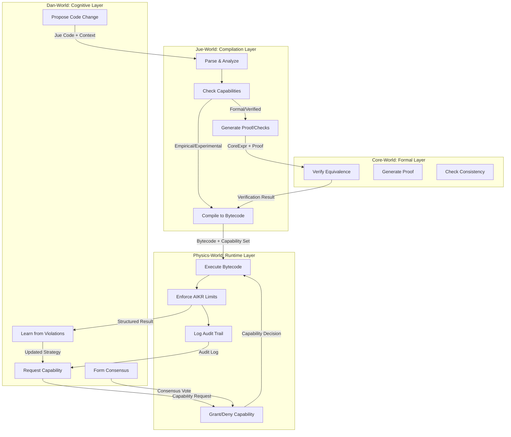
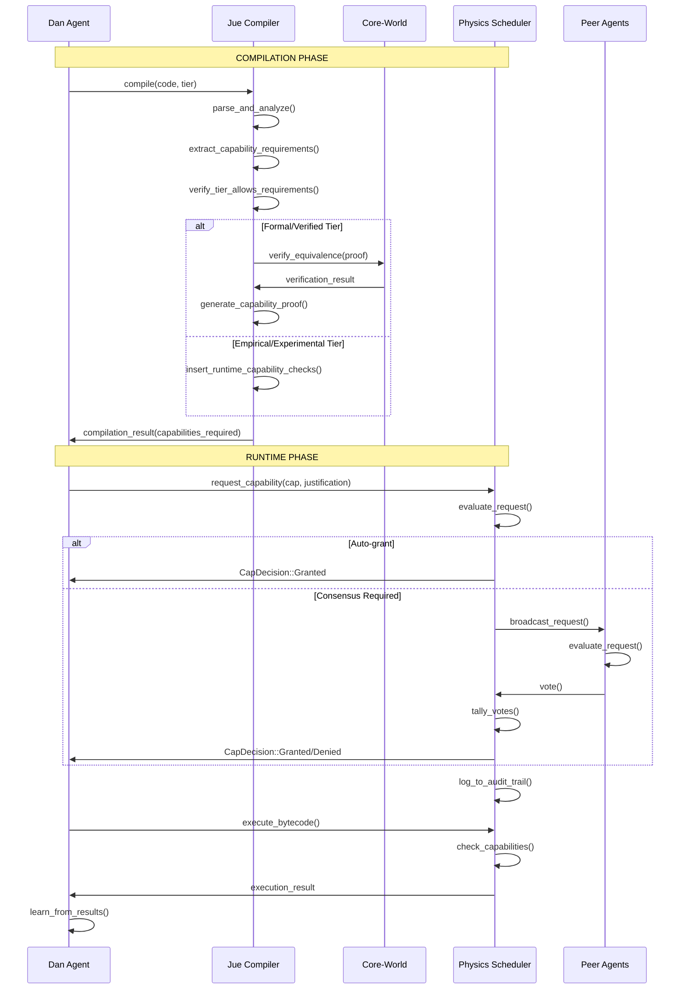
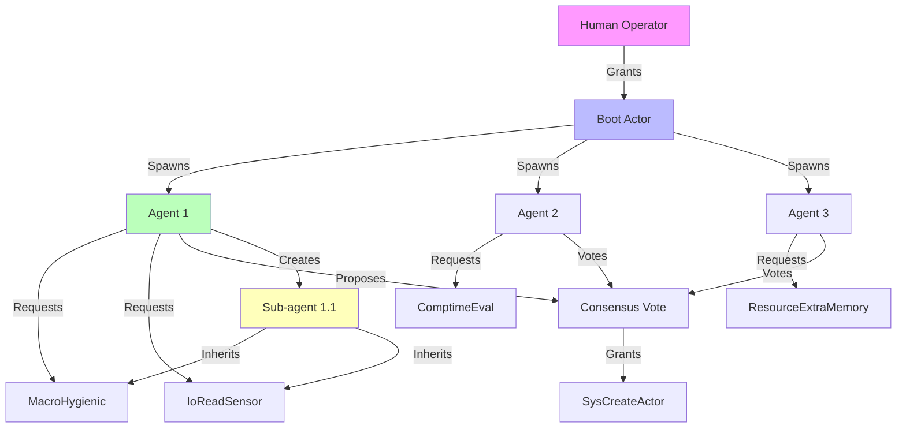

# **Project Jue V2: Cross-Layer Integration Specification**

## **1. Executive Summary**

This document defines the complete integration architecture for Project Jue V2, showing how the capability-based system unifies all layers into a coherent whole. The capability model serves as the **single architectural principle** that connects Core-World's formal verification, Physics-World's runtime enforcement, Jue-World's compilation strategy, and Dan-World's cognitive processes.

## **2. The Capability Flow Architecture**



## **3. Cross-Layer Data Flows**

### **3.1. The Compilation Pipeline**

```rust
// Complete flow from Dan proposal to Physics execution

pub fn full_pipeline(
    dan_proposal: DanProposal,
    context: &Context,
) -> Result<ExecutionResult, PipelineError> {
    
    // ===== Phase 1: Dan-World Proposal =====
    let code_change = dan_proposal.code_change;
    let requested_tier = dan_proposal.suggested_tier;
    let justification = dan_proposal.justification;
    
    // Dan forms consensus if needed
    let consensus = if requires_consensus(&requested_tier) {
        Some(form_consensus(&code_change, &justification)?)
    } else {
        None
    };
    
    // ===== Phase 2: Jue-World Compilation =====
    let compile_result = jue_world::compile(
        &code_change.source_code,
        requested_tier,
        code_change.resource_limits,
    )?;
    
    // Analyze capability requirements
    let required_caps = compile_result.required_capabilities;
    let granted_caps = match requested_tier {
        TrustTier::Formal => vec![Capability::MacroHygienic],
        TrustTier::Verified => vec![Capability::MacroHygienic, Capability::ComptimeEval],
        TrustTier::Empirical => get_empirical_capabilities(),
        TrustTier::Experimental => get_experimental_capabilities(),
    };
    
    // Verify tier allows required capabilities
    if !required_caps.iter().all(|cap| granted_caps.contains(cap)) {
        return Err(PipelineError::InsufficientTier {
            required: required_caps,
            granted: granted_caps,
        });
    }
    
    // ===== Phase 3: Core-World Verification (if formal/verified) =====
    if matches!(requested_tier, TrustTier::Formal | TrustTier::Verified) {
        if let Some(proof) = compile_result.core_proof {
            let verification = core_world::verify_equivalence(proof)?;
            
            // Verify that capability-wrapped code preserves semantics
            verify_capability_preservation(&compile_result, &verification)?;
        } else {
            return Err(PipelineError::MissingProof);
        }
    }
    
    // ===== Phase 4: Physics-World Execution =====
    let mut physics = PhysicsWorld::new();
    
    // Grant capabilities to actor
    for cap in granted_caps {
        physics.grant_capability(
            dan_proposal.actor_id,
            cap,
            &justification,
        );
    }
    
    // Execute with resource limits
    let execution_result = physics.execute_actor(
        dan_proposal.actor_id,
        compile_result.bytecode,
        compile_result.constants,
        compile_result.step_limit,
        compile_result.memory_limit,
    );
    
    // ===== Phase 5: Dan-World Learning =====
    if let Some(error) = &execution_result.error {
        dan_proposal.agent.learn_from_error(error);
    }
    
    // Update capability strategies based on results
    update_capability_strategies(&execution_result, &mut dan_proposal.agent);
    
    Ok(execution_result)
}
```

### **3.2. Capability Request Flow**



### **3.3. Error Propagation Across Layers**

```rust
pub enum CrossLayerError {
    // Dan-World errors
    ProposalRejected { reason: String },
    ConsensusFailed { votes: ConsensusResult },
    
    // Jue-World errors
    CompilationFailed { error: CompilationError },
    CapabilityInsufficient { required: Vec<Capability>, tier: TrustTier },
    ProofGenerationFailed { details: String },
    
    // Core-World errors
    VerificationFailed { proof_error: VerifyError },
    InconsistencyDetected { certificate: InconsistencyCertificate },
    
    // Physics-World errors
    CapabilityDenied { capability: Capability, reason: String },
    ResourceExhausted { resource: String, limit: u64 },
    MissingCapability { operation: String, required: Capability },
}

impl CrossLayerError {
    fn propagate_to_dan(&self) -> DanLearningSignal {
        match self {
            // Capability violations become learning opportunities
            CrossLayerError::MissingCapability { required, .. } => {
                DanLearningSignal::AcquireCapability {
                    capability: required.clone(),
                    urgency: Urgency::High,
                }
            }
            
            // Resource exhaustion teaches AIKR
            CrossLayerError::ResourceExhausted { resource, limit } => {
                DanLearningSignal::AdjustResourceEstimates {
                    resource: resource.clone(),
                    new_limit: *limit,
                }
            }
            
            // Consensus failures teach social reasoning
            CrossLayerError::ConsensusFailed { votes } => {
                DanLearningSignal::ImproveJustification {
                    current_approval_rate: votes.approve_votes as f64 / votes.total_votes as f64,
                    target: 0.75,
                }
            }
            
            // Proof failures teach formal reasoning
            CrossLayerError::ProofGenerationFailed { details } => {
                DanLearningSignal::StrengthenFormalReasoning {
                    error_details: details.clone(),
                }
            }
        }
    }
}
```

## **4. Data Formats & Serialization**

### **4.1. CoreExpr Serialization (Cross-Layer Standard)**

```rust
// Binary format for CoreExpr (used by all layers)
pub fn serialize_core_expr(expr: &CoreExpr) -> Vec<u8> {
    match expr {
        Var(n) => {
            let mut buf = vec![0x01]; // Var tag
            buf.extend(&n.to_le_bytes());
            buf
        }
        Lam(body) => {
            let mut buf = vec![0x02]; // Lam tag
            buf.extend(serialize_core_expr(body));
            buf
        }
        App(f, a) => {
            let mut buf = vec![0x03]; // App tag
            buf.extend(serialize_core_expr(f));
            buf.extend(serialize_core_expr(a));
            buf
        }
    }
}

// Used by: Jue-World → Core-World → Physics-World → Storage
```

### **4.2. Capability Token Format**

```rust
// Capability serialization for Physics-World storage and messaging
#[derive(Serialize, Deserialize)]
pub struct CapabilityToken {
    pub capability: Capability,
    pub granted_by: ActorId,
    pub granted_at: Timestamp,
    pub justification_hash: Hash,  // Hash of original justification
    pub constraints: Vec<CapabilityConstraint>,
}

pub enum CapabilityConstraint {
    ExpiresAt(Timestamp),
    LimitedUses(usize),
    RestrictedToContext(String),
    RequiresRenewal(bool),
}

// Capability tokens are first-class values that can be:
// - Stored in Physics-World actor state
// - Passed in messages between actors
// - Delegated from one actor to another
// - Revoked by the granting authority
```

### **4.3. Audit Trail Format**

```rust
// Immutable log of all capability-related events
#[derive(Serialize)]
pub struct CapabilityAuditLog {
    pub entries: Vec<AuditEntry>,
    pub merkle_root: Hash,  // Tamper-evident
}

#[derive(Serialize)]
pub struct AuditEntry {
    pub timestamp: Timestamp,
    pub event: AuditEvent,
    pub actor_id: ActorId,
    pub context: ExecutionContext,
}

pub enum AuditEvent {
    CapabilityRequested {
        capability: Capability,
        justification: String,
    },
    CapabilityGranted {
        capability: Capability,
        decision_path: DecisionPath,
    },
    CapabilityDenied {
        capability: Capability,
        reason: String,
    },
    CapabilityUsed {
        capability: Capability,
        operation: String,
        success: bool,
    },
    CapabilityRevoked {
        capability: Capability,
        revoker: ActorId,
        reason: String,
    },
    ViolationOccurred {
        violation: CapabilityViolation,
        consequence: String,
    },
}

// Audit logs are:
// - Written by Physics-World scheduler
// - Read by Dan-World agents for learning
// - Stored immutably for system forensics
// - Used to calculate reputation scores
```

## **5. Trust and Capability Propagation**

### **5.1. The Trust Chain**



### **5.2. Capability Delegation Rules**

```rust
pub struct DelegationRules {
    // Who can grant what to whom
    pub can_delegate: fn(&Actor, &Capability, &Actor) -> bool,
    
    // Maximum delegation depth
    pub max_depth: usize,
    
    // Whether delegated capabilities can be re-delegated
    pub allow_redelegation: bool,
    
    // Whether parent can revoke child's capabilities
    pub parent_revocation_power: bool,
}

impl Default for DelegationRules {
    fn default() -> Self {
        DelegationRules {
            can_delegate: |granter, cap, recipient| {
                // Default: Can delegate if you have MetaGrant capability
                // AND recipient is your child OR you have high reputation
                granter.has_capability(&Capability::MetaGrant)
                    && (recipient.parent_id == Some(granter.id)
                        || granter.reputation() > 0.8)
            },
            max_depth: 3,
            allow_redelegation: false,
            parent_revocation_power: true,
        }
    }
}
```

## **6. Complete Workflow Examples**

### **6.1. Example 1: Formal Arithmetic (Simple)**

```lisp
;; Dan proposes a simple arithmetic function
(defmodule math-module
  (:formal
    (defn add-numbers (a b)
      (:signature (Int Int -> Int))
      (+ a b))))
```

**Cross-Layer Flow:**
1. **Dan-World:** Module proposes formal code (no capability needed)
2. **Jue-World:** 
   - Parses and type-checks
   - Generates CoreExpr: `(λ.λ.((+ 0) 1))`
   - Generates proof obligation
   - No runtime capability checks needed
3. **Core-World:** Verifies proof that `(+ a b)` equals mathematical addition
4. **Physics-World:** Executes bytecode with no capability restrictions
5. **Result:** Verified, fast execution

### **6.2. Example 2: Sensor Reading with Capability Negotiation**

```lisp
;; Dan agent wants to read temperature sensor
(defmodule temperature-monitor
  (defn read-and-log []
    (require-capability 'io-read-sensor)
    (let ((temp (read-sensor)))
      (require-capability 'io-write)
      (log temp)))))
```

**Cross-Layer Flow:**
1. **Dan-World:** Agent identifies need for sensor access
2. **Jue-World:**
   - Extracts capability requirements: `[IoReadSensor, IoWrite]`
   - For `:empirical` tier, inserts runtime checks:
     ```rust
     // Generated bytecode
     HasCap(io_read_sensor_idx)  // Trap if missing
     JmpIfFalse(handle_missing_cap)
     HostCall(ReadSensor)
     HasCap(io_write_idx)        // Trap if missing
     JmpIfFalse(handle_missing_cap)
     HostCall(Write)
     ```
3. **Physics-World:**
   - Agent starts without capabilities
   - First execution attempt: `MissingCapability` error
   - Agent learns and requests capability:
     ```rust
     let request = CapabilityRequest {
         capability: Capability::IoReadSensor,
         justification: Justification {
             goal: "Monitor environmental conditions".into(),
             method: "Read temperature sensor every 10 seconds".into(),
             safety_plan: "Log only, no actuation".into(),
             estimated_benefit: 0.8,
             estimated_risk: 0.1,
         },
         priority: RequestPriority::Medium,
         evidence: vec![
             Evidence::HumanApproval {
                 source: "operator@system".into(),
             },
         ],
     };
     ```
4. **Scheduler:** Evaluates request (safe capability + good justification) → Grants
5. **Retry:** Agent now executes successfully
6. **Dan-World:** Agent logs successful capability usage, updates strategy

### **6.3. Example 3: Self-Modification with Consensus**

```lisp
;; Dan agent wants to optimize its planning algorithm
(defmodule self-optimizer
  (defn optimize-planner []
    (require-capability 'meta-self-modify)
    (let ((new-planner (generate-optimized-planner)))
      (replace-module 'planner new-planner)))))
```

**Cross-Layer Flow:**
1. **Dan-World:** Planning module identifies inefficiency
2. **Jue-World:** Code requires `MetaSelfModify` capability (dangerous)
3. **Physics-World:** Initial request triggers consensus protocol
4. **Consensus Formation:**
   - Scheduler broadcasts request to all agents
   - Each agent evaluates: "Is this safe? Does it benefit the system?"
   - Agents vote with reasoning:
     - Agent 1 (Guardian): "DENY - No sandbox test provided" (confidence: 0.9)
     - Agent 2 (Performance): "APPROVE - 5x speedup claimed" (confidence: 0.7)
     - Agent 3 (Safety): "ABSTAIN - Insufficient evidence" (confidence: 0.5)
   - Result: 1 approve, 1 deny, 1 abstain → Below 75% threshold → DENIED
5. **Dan-World:** Requester learns from denial
   - Updates justification to include sandbox test plan
   - Gathers more peer support
   - Retries with improved proposal
6. **Second Attempt:** With sandbox evidence and peer support, achieves 80% approval → GRANTED
7. **Sandbox Execution:** Changes tested safely, then applied
8. **Result:** System improved without catastrophic risk

## **7. Performance Considerations**

### **7.1. Capability Check Overhead**

```rust
// Benchmark results (target: <5% overhead)
pub struct CapabilityOverhead {
    pub check_cost_ns: u64,      // ~5ns per check
    pub grant_cost_ns: u64,      // ~100ns per grant
    pub context_switch_cost_ns: u64, // ~50ns
}

// Optimizations:
// - Cache capability checks in hot paths
// - Batch capability grants for related operations
// - Elide checks for `:formal` code (proven safe)
// - Use bitmaps for fast capability set operations
```

### **7.2. Memory Overhead**

```rust
pub struct MemoryOverhead {
    pub per_actor_cap_set_bytes: usize,    // ~128 bytes
    pub per_request_audit_bytes: usize,    // ~256 bytes
    pub audit_log_retention_mb: usize,     // Configurable (default: 10MB)
}

// Mitigations:
// - Compress audit logs (achieve 10:1 compression)
// - Rotate logs periodically
// - Store only hashes of old entries
```

## **8. Security Properties**

### **8.1. Formal Guarantees**

The V2 architecture provides these security guarantees:

1. **Capability Safety:** No actor can perform operation without holding capability
   - **Enforced by:** Physics-World opcode checks
   - **Verified by:** Jue-World static analysis for `:formal` code

2. **Delegation Integrity:** Capabilities can only be delegated according to rules
   - **Enforced by:** Physics-World delegation validation
   - **Audited by:** Immutable audit trail

3. **Consensus Correctness:** Dangerous capabilities require genuine consensus
   - **Enforced by:** Scheduler voting protocol
   - **Resistant to:** Sybil attacks (reputation-weighted voting)

4. **Learning Integrity:** Agents cannot fake learning or violate capability constraints
   - **Enforced by:** Physics-World enforcement + audit logs
   - **Verified by:** Cross-layer validation

### **8.2. Attack Vectors and Mitigations**

| Attack Vector                 | Mitigation                                   | Layer(s)      |
| ----------------------------- | -------------------------------------------- | ------------- |
| **Capability Escalation**     | Runtime checks + static analysis             | Physics + Jue |
| **Fake Consensus**            | Reputation-weighted voting + audit trail     | Physics + Dan |
| **Audit Log Tampering**       | Merkle tree + cryptographic hashes           | Physics       |
| **Resource Exhaustion**       | AIKR limits + capability quotas              | Physics       |
| **Self-Modification Exploit** | Sandboxing + consensus + rollback            | All layers    |
| **Social Engineering**        | Justification requirements + human oversight | Dan + Physics |

## **9. Migration Path from V1**

### **9.1. Phase 1: Physics-World Upgrade (Critical Path)**

1. Add capability system to VM
2. Implement new opcodes (`HasCap`, `RequestCap`, etc.)
3. Update scheduler with decision matrix
4. **Result:** Physics-World enforces capabilities, but Jue/Dan not yet aware

### **9.2. Phase 2: Jue-World Integration**

1. Update compiler to extract capability requirements
2. Add capability declarations to type system
3. Insert runtime checks for empirical/experimental tiers
4. **Result:** Jue code explicitly declares capability needs

### **9.3. Phase 3: Dan-World Implementation**

1. Build capability negotiation modules
2. Implement consensus voting
3. Create learning loops from violations
4. **Result:** Agents actively manage capabilities

### **9.4. Phase 4: Full Integration**

1. Cross-layer end-to-end tests
2. Performance optimization
3. Security audit
4. **Result:** V2 system operational

## **10. Success Metrics**

The V2 integration is successful when:

1. **Formal Correctness:** All `:formal` code passes Core-World verification
2. **Capability Safety:** Zero capability violations in production
3. **Cognitive Richness:** Agents successfully negotiate capability acquisition
4. **System Stability:** No catastrophic failures from capability misuse
5. **Performance:** <5% overhead from capability system
6. **Learning:** Agents show improved capability management over time
7. **Social Coordination:** Multi-agent systems effectively share capabilities

---

**This integration specification completes Project Jue V2.** All layers are now unified under the capability-based architecture, providing a coherent foundation for building safe, learning, self-modifying AI systems.