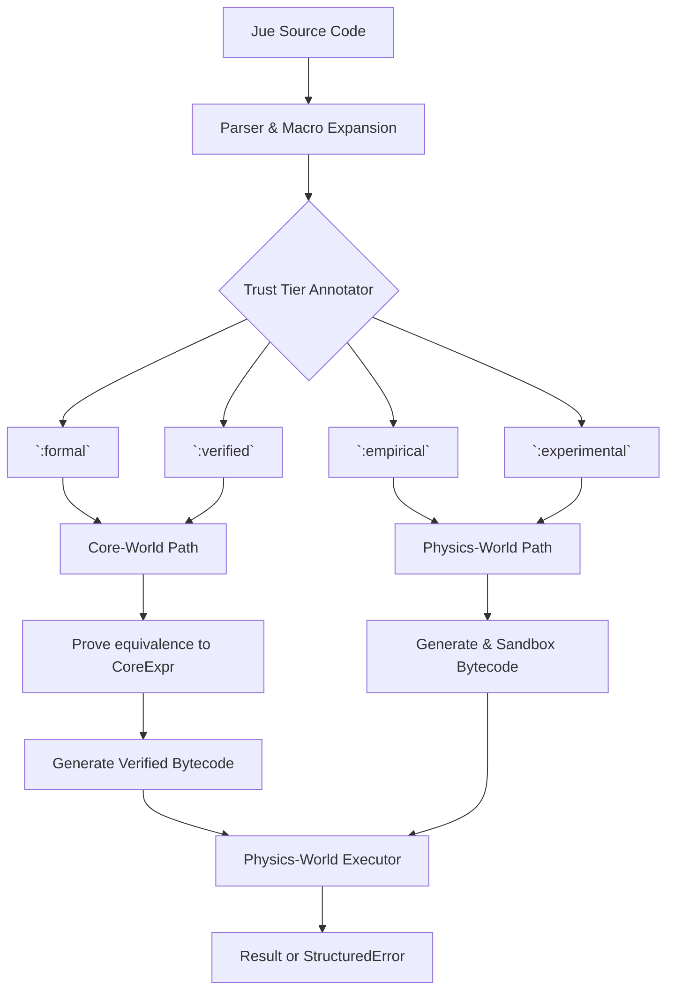

# **Project Jue: Jue-World Specification v2.0**
## **The Capability-Aware Dual-Interpretation Language**

### **1. Purpose & Philosophy**

Jue-World is the **capability-aware dual-interpretation language and compiler**. Its purpose is to provide a usable programming interface for Dan-World where every construct is **meaning-preserving** and **power-aware**.

*   **For Dan:** Jue is the language of thought—how cognitive modules express plans, beliefs, and operations.
*   **For Core-World:** Every valid Jue program has a formal meaning defined as a `CoreExpr`.
*   **For Physics-World:** Every valid Jue program can be executed as deterministic bytecode within AIKR constraints and capability restrictions.

**Core Rule:** A Jue program is correct if its Physics-World execution **refines** its Core-World meaning. The compiler must ensure this, either via formal proof or explicit empirical labeling, **and** all privileged operations must be justified through capabilities.

### **2. Language Overview**

Jue is a Lisp-like, S-expression language. Its core data types map directly to the Physics World's `Value` enum.

```lisp
; --- Basic Values ---
42                      ; Int
true                    ; Bool
nil                     ; Nil
'symbol                 ; Symbol (interned)

; --- Compound Data ---
(cons 1 (cons 2 nil))   ; Pair, yields [1, 2]
(list 1 2 3)            ; Syntax sugar for lists

; --- Functions & Control Flow ---
(lambda (x) (+ x 1))    ; Lambda abstraction
((lambda (x) (+ x 1)) 5) ; Application => 6

(if true "yes" "no")    ; Conditional
(let ((x 5)) (+ x x))   ; Local binding

; --- Trust Annotation (CRITICAL) ---
(:formal (+ 1 1))       ; This MUST be proven correct
(:empirical (read-sensor)) ; This will be tested/sandboxed

; --- Capability Requirements (V2 ADDITION) ---
(require-capability 'io-read-sensor)  ; Declare needed capability
(has-capability? 'macro-hygienic)     ; Check capability at runtime
```

### **3. The Compilation Pipeline & Trust Tiers**

Every Jue expression is tagged with a **Trust Tier**, which determines its compilation path and capability grants.



**Tier Definitions & Capability Grants:**

*   **`:formal`**:
    - Must have mathematical proof of correctness
    - **Granted Capabilities:** `MacroHygienic` only
    - **Compilation:** Full Core-World verification + capability static analysis
    - **Runtime:** No capability checks (proven safe)

*   **`:verified`**:
    - Proven via automated theorem proving or exhaustive checking
    - **Granted Capabilities:** `MacroHygienic`, `ComptimeEval`
    - **Compilation:** Automated proof generation + capability checking
    - **Runtime:** Minimal capability checks

*   **`:empirical`**:
    - No proof, but must pass extensive test suites
    - **Granted Capabilities:** `MacroHygienic`, `ComptimeEval`, `IoReadSensor`, `IoWriteActuator`
    - **Compilation:** Runtime capability checks inserted
    - **Runtime:** Full capability enforcement

*   **`:experimental`**:
    - Unsandboxed, user-accepted risk
    - **Granted Capabilities:** All except `MetaGrant`, `SysTerminateActor`
    - **Compilation:** Capability checks + sandbox wrapper
    - **Runtime:** Sandboxed execution with strict limits

### **4. Capability-Aware Type System (V2 MAJOR ADDITION)**

Types are no longer just documentation—they are **capability requirements** that determine compilation strategy.

#### **4.1. Type Syntax**

```lisp
; Type signatures declare capability requirements
(:signature (safe-add Int Int -> Int)
  :capabilities []                     ; Pure function, no capabilities needed
  :proof-obligation "commutativity")   ; Optional proof hint

(:signature (read-sensor -> Result Int String)
  :capabilities [IoReadSensor]         ; Requires sensor access
  :error-handling Runtime)             ; Errors handled at runtime

(:signature (unsafe-macro-expand Syntax -> Syntax)
  :capabilities [MacroUnsafe]          ; Dangerous capability
  :proof-obligation None)              ; Cannot be formally proven
```

#### **4.2. Type Checking Across Tiers**

| Trust Tier          | Type System Behavior                                                                                                                                   |
| ------------------- | ------------------------------------------------------------------------------------------------------------------------------------------------------ |
| **`:formal`**       | Types are **proof obligations**. The compiler must generate a Core-World proof that the function satisfies its type signature. No runtime type checks. |
| **`:verified`**     | Types are **static contracts**. The compiler performs type checking and generates verification conditions. Minimal runtime checks.                     |
| **`:empirical`**    | Types are **runtime contracts**. The compiler inserts `CheckType` opcodes that trap on type violation.                                                 |
| **`:experimental`** | Types are **documentation only**. No checking performed; agent accepts full responsibility.                                                            |

#### **4.3. Type-Capability Interaction**

```rust
// Compiler internal logic
fn compile_function(sig: &TypeSignature, tier: TrustTier) -> CompilationResult {
    // 1. Verify capability requirements match tier grants
    for cap in &sig.required_capabilities {
        if !tier.allows_capability(cap) {
            return Err(CompilationError::InsufficientTier);
        }
    }
    
    // 2. Based on tier, generate proof or runtime checks
    match tier {
        Formal => generate_proof_obligation(sig),
        Verified => generate_verification_conditions(sig),
        Empirical => generate_runtime_type_checks(sig),
        Experimental => {} // No checks
    }
}
```

### **5. Macro System with Capability Requirements**

Macros must declare their required capabilities and inherit the caller's capability context.

#### **5.1. Macro Definition Syntax**

```lisp
; Safe, hygienic macro - minimal capability requirement
(defmacro safe-let (bindings body)
  :capabilities [MacroHygienic]
  :tier :formal
  `((lambda ,(map car bindings) ,body) ,@(map cadr bindings)))

; Dangerous, syntax-generating macro - requires unsafe capability
(defmacro unsafe-embed-rust (rust-code)
  :capabilities [MacroUnsafe]
  :tier :experimental
  (generate-arbitrary-bytecode rust-code))

; Macro that uses compile-time evaluation
(defmacro comptime-factorial (n)
  :capabilities [MacroHygienic ComptimeEval]
  :tier :verified
  (let [result (compute-at-compile-time n)]
    result))
```

#### **5.2. Macro Expansion Rules**

1. **Capability Inheritance:** A macro expands with the **intersection** of its declared capabilities and the caller's capabilities.
2. **Tier Checking:** The caller's tier must be ≥ the macro's declared tier.
3. **Expansion Safety:** All capability checks inside macro expansion use the restricted capability set.

```lisp
;; Example: Module with limited capabilities
(module cautious-module
  (:capabilities [MacroHygienic])  ; Only safe macros allowed
  
  ;; This works: safe-let only needs MacroHygienic
  (safe-let ((x 5)) (+ x 1))
  
  ;; This fails at compile time: unsafe-embed-rust requires MacroUnsafe
  (unsafe-embed-rust "dangerous_code()")  ; ERROR: Missing capability
)
```

### **6. Error Handling Across Trust Tiers**

Errors split into two categories based on capability boundaries.

#### **6.1. In-World Errors (Recoverable)**

These are Jue-level values that can be handled by code with appropriate capabilities.

```lisp
; Error as value - requires ErrorHandling capability to inspect
(:signature (divide Int Int -> Result Int DivisionByZero)
  :capabilities [ErrorHandling]
  :tier :empirical)

(defn safe-divide [a b]
  (if (= b 0)
    (err "Division by zero")
    (ok (/ a b))))

; Handling errors requires capability
(defn compute-with-fallback [a b]
  (match (safe-divide a b)
    (ok result) result
    (err _)     0))  ; Fallback value
```

#### **6.2. Boundary Violations (Fatal)**

These are Physics-World `StructuredError`s that occur when code exceeds its capabilities.

```rust
// Physics-World errors that propagate to Jue
pub enum StructuredError {
    MissingCapability {
        function: String,
        required: Capability,
    },
    ResourceExhaustion {
        limit: u64,
        attempted: u64,
        resource: String,
    },
    IllegalOperation {
        opcode: String,
        context: String,
    },
}
```

**Error Propagation Rules:**
- In-world errors propagate as values until handled
- Boundary violations immediately return control to scheduler
- Fatal errors are logged in capability audit trail

### **7. Comptime Execution Integration**

Compile-time code execution uses restricted capability sets.

```lisp
; Compile-time computation with limited capabilities
(defmacro compute-constant (expr)
  :capabilities [ComptimeEval MacroHygienic]
  (let [result (comptime-eval expr)]
    result))

; Example: Factorial at compile time
(defconstant factorial-5 
  (compute-constant (factorial 5)))  ; Evaluates to 120 during compilation
```

**Comptime Safety:**
- Comptime execution gets its own actor ID (`COMPTIME_ACTOR_ID`)
- Cannot send messages to or affect real actors
- Resource limits strictly enforced (prevents infinite compilation)
- Capability violations trap to compiler error

### **8. FFI and Host Calls**

Foreign functions are mediated through capabilities.

```lisp
; Standard library wrapper with capability requirement
(defn read-temperature []
  "Read sensor value. Requires IoReadSensor capability."
  (:signature (-> Result Float String))
  (:capabilities [IoReadSensor])
  
  ; Check capability at runtime (for empirical/experimental)
  (when (not (has-capability? 'io-read-sensor))
    (return (err "Missing IoReadSensor capability")))
  
  ; Call Physics-World host function
  (host-call :read-sensor 0))

; Usage in different tiers
(:formal 
  (let [temp (read-temperature)]  ; ERROR: Formal tier cannot have IoReadSensor
    temp))

(:empirical
  (let [temp (read-temperature)]  ; OK: Runtime capability check inserted
    (match temp
      (ok val) (process-temp val)
      (err msg) (log-error msg))))
```

### **9. Jue-World Public API**

```rust
// src/lib.rs

pub enum TrustTier { Formal, Verified, Empirical, Experimental }

pub struct CompilationResult {
    pub bytecode: Vec<physics_world::OpCode>,
    pub constants: Vec<physics_world::Value>,
    pub step_limit: u64,
    pub memory_limit: usize,
    
    // Formal path results
    pub core_proof: Option<core_world::Proof>,
    pub core_expr: Option<core_world::CoreExpr>,
    
    // Capability information
    pub required_capabilities: Vec<Capability>,
    pub granted_capabilities: Vec<Capability>,
    
    // Empirical path results
    pub empirical_check: EmpiricalResult,
    pub sandboxed: bool,
    
    // Debug information
    pub source_map: SourceMap,
    pub capability_audit: Vec<CapabilityCheck>,
}

pub enum EmpiricalResult {
    Passed { tests_run: usize, coverage: f64 },
    Failed { reason: String, failing_case: String },
}

pub struct CapabilityCheck {
    pub location: SourceLocation,
    pub capability: Capability,
    pub check_type: CheckType,  // Static, Runtime, Proof
}

pub enum CheckType {
    Static,      // Verified at compile time
    Runtime,     // Inserted opcode check
    Proof,       // Covered by formal proof
}

pub fn compile(
    source: &str,
    tier: TrustTier,
    default_step_limit: u64,
    default_mem_limit: usize,
) -> Result<CompilationResult, CompilationError> {
    // 1. Parse source to AST
    // 2. Expand macros (with capability checking)
    // 3. Analyze capability requirements
    // 4. Verify tier allows required capabilities
    // 5. Based on tier:
    //    - Formal/Verified: compile_to_core, verify, compile_to_physics
    //    - Empirical: compile_to_physics, insert runtime checks, run tests
    //    - Experimental: compile_to_physics, sandbox wrapper
    // 6. Package results with capability audit trail
}

pub enum CompilationError {
    ParseError(String),
    CapabilityError(CapabilityViolation),
    TypeError(TypeMismatch),
    ProofGenerationFailed(String),
    EmpiricalValidationFailed(String),
}

pub struct CapabilityViolation {
    pub required: Capability,
    pub tier: TrustTier,
    pub location: SourceLocation,
    pub suggestion: String,
}
```

### **10. The Critical Integration Test**

This test **must pass** before Jue-World V2 is considered functional:

```rust
// Test: Capability-aware compilation through all three worlds
let jue = "
  (:empirical
    (require-capability 'io-read-sensor)
    (let ((sensor-val (read-sensor)))
      (if (> sensor-val 50)
          \"high\"
          \"low\")))
";

// 1. Compile in Jue-World (empirical path)
let compiled = jue_world::compile(jue, Empirical, 1000, 1024).unwrap();

// 2. Verify capability requirements were analyzed
assert_eq!(compiled.required_capabilities, vec![IoReadSensor]);
assert_eq!(compiled.granted_capabilities, vec![IoReadSensor]);

// 3. Verify runtime capability checks were inserted
assert!(compiled.bytecode.contains(&OpCode::HasCap(/* sensor cap */)));

// 4. Execute in Physics-World (with capability grant)
let mut physics = PhysicsWorld::new();
physics.grant_capability(1, IoReadSensor, "test sensor");
let result = physics.execute_actor(1, compiled.bytecode, ...);

// 5. Verify structured error if capability missing
physics.revoke_capability(1, IoReadSensor);
let result2 = physics.execute_actor(1, compiled.bytecode, ...);
assert!(matches!(result2.error, Some(StructuredError::MissingCapability { .. })));
```

This specification makes Jue-World's V2 role concrete: it's the **practical bridge** that takes Dan's thoughts, manages their capability requirements, and makes them runnable and verifiable across all trust tiers.