# Design Decisions: Capability System with Belief Facets

## Overview

This document analyzes the integration of capability systems with an expanded NARS-like belief model for Project Jue. The approach treats capabilities as multidimensional beliefs rather than simple tokens, aiming to unify cognition, learning, and safety.

## Core Concept: Capabilities as Belief Facets

Instead of a static `HashSet<Capability>`, capabilities are represented as belief facets containing multiple dimensions:

```rust
struct BeliefFacet {
    // NARS Core
    frequency: f64,    // Success rate (0.0 to 1.0)
    confidence: f64,   // Evidence strength (0.0 to 1.0)

    // Expanded Dimensions
    provenance: Provenance, // Source (Self-derived, Taught, Cultural norm)
    emotional_weight: Vec<Affect>, // Associated emotions
    stress_cost: f64,  // Cognitive/resource cost
    contextual_triggers: Vec<Pattern>, // Activation conditions

    // Derived judgment
    current_judgment: Judgment, // Allow, Deny, SeekMoreEvidence
}
```

## Technical Analysis

### Advantages

1. **Learning-based System**: Capabilities are learned through experience rather than statically configured
2. **Unified Cognitive Model**: Same belief machinery handles both world knowledge and capability permissions
3. **Context-aware Decisions**: Judgments adapt based on current context and affective state
4. **Social Learning**: Provenance tracking enables cultural transmission of capability knowledge
5. **Affective Integration**: Emotional associations influence capability usage patterns

### Challenges

1. **Determinism Conflict**: Physics World requires deterministic execution, but belief-based decisions are probabilistic
2. **Meta-circular Evaluation**: Capability evaluation code may require capability checks, creating infinite regress
3. **Decision Paralysis**: Complex belief evaluation could exceed resource budgets without clear resolution
4. **Self-deception Risk**: Agents could manipulate their own belief systems to bypass safety constraints
5. **Verification Complexity**: Formal verification becomes difficult when permissions depend on evolving beliefs

## Proposed Architecture: Two-Layer Judgment System


### Implementation Details

1. **Dan-World**: Maintains belief facets and performs bounded-time judgment
2. **Jue-World**: Queries Dan-World for crisp verdicts during compilation
3. **Physics-World**: Executes based on capability tokens, remains deterministic
4. **Feedback Loop**: Execution results update belief facets for future judgments

## Component Specifications

### Dan-World: CapabilityJudgment Module

```rust
pub struct CapabilityJudgmentModule {
    registry: HashMap<CapabilityId, BeliefFacet>,
    verdict_cache: LruCache<JudgmentQuery, CrispVerdict>,
}

impl CapabilityJudgmentModule {
    pub fn query_verdict(
        &mut self,
        query: JudgmentQuery,
        context: &CognitiveContext,
    ) -> CrispVerdict {
        // 1. Check cache (respects AIKR)
        // 2. Retrieve/init BeliefFacet
        // 3. Run bounded reasoning
        // 4. Return: Allow, Deny, or Defer
    }

    pub fn update_from_result(
        &mut self,
        capability: CapabilityId,
        result: &ExecutionResult,
        context: &CognitiveContext,
    ) {
        // Update belief based on execution outcome
    }
}
```

### Jue-World: Capability Broker

```rust
pub struct CapabilityBroker {
    dan_judgment_api: DanWorldApiHandle,
    local_policy: FallbackPolicy,
}

impl CapabilityBroker {
    pub fn check_and_emit_token(
        &mut self,
        required_capability: CapabilityId,
        code_region: Span,
    ) -> Result<CapabilityToken, CompileError> {
        let query = self.build_query(required_capability, code_region);
        match self.dan_judgment_api.query_verdict(query) {
            CrispVerdict::Allow => Ok(CapabilityToken::new(required_capability)),
            CrispVerdict::Deny => Err(CompileError::CapabilityDenied),
            CrispVerdict::Defer => self.apply_fallback_policy(required_capability)
        }
    }
}
```

### Physics-World: Token Verification

```rust
impl VmLoader {
    pub fn load_and_verify(
        bytecode: &[u8],
        expected_tokens: &[CapabilityToken],
    ) -> Result<VmState, LoadError> {
        // 1. Decode bytecode header, extract embedded tokens
        // 2. Verify: embedded_tokens == expected_tokens
        // 3. Verify: Each token corresponds to enabled VM opcode
        // 4. Load into VmState
    }
}
```

## Complete Layered Architecture

```mermaid
flowchart TD
    subgraph CW[Core-World: Semantic Foundation]
        direction LR
        Lambda[λ-Terms & Proofs] --> Sem[Formal Semantics]
    end

    subgraph JW[Jue-World: Language & Mediator]
        Comp[Jue Compiler] --> CT[Capability Trigger]
        CT --> CQ[Query Dan-World]
        CQ --> CV[Crisp Verdict]
        CV -->|Grant| TK[Emit Token]

        Comp --> Trans[Translate to Core]
        Trans --> PC[Proof Obligation]
        PC -- "verify_equiv()" --> CW
    end

    subgraph DW[Dan-World: Cognitive Judge]
        BF[Belief Facet Registry] --> JM[Judgment Module]
        JM --> CV
    end

    subgraph PW[Physics World: Deterministic Executor]
        TK --> BC[Bytecode + Tokens]
        BC --> VM[VM Load & Execute]
        VM --> ER[Result/Error]
    end

    ER -- "Feedback as Evidence" --> BF
```



## Layer Responsibilities

| Layer         | Responsibility                                | Key Data Structures                  |
| ------------- | --------------------------------------------- | ------------------------------------ |
| Core-World    | Formal meaning and proof verification         | `Proof`, `CoreExpr`                  |
| Jue-World     | Mediation between formal and pragmatic layers | `CapabilityToken`, `JudgmentQuery`   |
| Dan-World     | Context-aware judgment and learning           | `BeliefFacet`, `CrispVerdict`        |
| Physics-World | Deterministic execution and enforcement       | `StructuredError`, `ExecutionResult` |

## Critical Design Constraints

1. **Determinism Preservation**: Physics World must remain deterministic despite belief-based decisions
2. **Resource Bounding**: Judgment process must complete within AIKR constraints
3. **Fallback Policies**: Clear defaults required when judgment is deferred
4. **Feedback Integrity**: Execution results must reliably update belief facets
5. **Layer Separation**: Core-World proofs must remain independent of runtime permissions

## Implementation Roadmap

1. **Phase 1**: Implement basic two-layer system with rule-based judgment
2. **Phase 2**: Develop isolated Dan-World subsystem for belief simulation
3. **Phase 3**: Integrate belief-based judgment with proven stability

## Test Requirements

1. **Self-Modification Stress Test**: Verify belief updates from execution outcomes
2. **Determinism Verification**: Ensure same bytecode produces same results
3. **Resource Constraint Testing**: Validate AIKR compliance
4. **Feedback Loop Validation**: Confirm belief updates from execution results

## Conclusion

This architecture provides a path toward sentient capability management while maintaining system stability. The key insight is separating formal verification (Core-World) from pragmatic judgment (Dan-World), with Jue-World mediating between them and Physics-World enforcing deterministic execution.

The approach allows capabilities to emerge from cognitive processes while preserving the system's foundational guarantees. This represents a significant step toward genuine machine agency within a verifiable framework.